# primariaTa❤️\_ - System Architecture

<div align="center">

**Technical Architecture Documentation**

Comprehensive guide to the system design, data flow, and integration architecture of primariaTa❤️\_

[System Overview](#system-overview) • [Tech Stack](#technology-stack) • [Architecture Layers](#architecture-layers) • [Data Flow](#data-flow) • [Security](#security-architecture)

</div>

---

## Table of Contents

- [System Overview](#system-overview)
- [High-Level Architecture](#high-level-architecture)
- [Technology Stack](#technology-stack)
- [Architecture Layers](#architecture-layers)
  - [Presentation Layer](#presentation-layer)
  - [Application Layer](#application-layer)
  - [Data Layer](#data-layer)
  - [Integration Layer](#integration-layer)
- [Module Structure](#module-structure)
- [Data Flow](#data-flow)
  - [Request Flow](#request-flow)
  - [Authentication Flow](#authentication-flow)
  - [Document Upload Flow](#document-upload-flow)
- [Database Architecture](#database-architecture)
- [API Design](#api-design)
- [Integration Points](#integration-points)
- [Security Architecture](#security-architecture)
- [Performance & Scalability](#performance--scalability)
- [Deployment Architecture](#deployment-architecture)

---

## System Overview

**primariaTa❤️\_** is a modern **SaaS white-label platform** designed to digitalize Romanian local government administrative processes. Built on a **serverless, cloud-native architecture**, it leverages cutting-edge technologies to deliver a **secure, scalable, and performant** solution.

### Key Characteristics

| Characteristic | Implementation |
|---------------|----------------|
| **Architecture Pattern** | Serverless, Event-Driven, Multi-Tenant |
| **Deployment Model** | Edge-first, globally distributed |
| **Data Sovereignty** | EU-compliant (Frankfurt region) |
| **Scalability** | Auto-scaling, pay-per-use |
| **Security** | Multi-layer, zero-trust model |
| **Availability** | 99.9% SLA target |

### Design Principles

1. **🔐 Security First** - Multi-layer security, RLS, encryption at rest/transit
2. **⚡ Performance** - Edge computing, CDN, optimistic UI updates
3. **📈 Scalability** - Serverless auto-scaling, database connection pooling
4. **♿ Accessibility** - WCAG 2.1 AA compliance
5. **🌍 Multi-Tenancy** - Isolated data per municipality (județ + localitate)
6. **🔄 Resilience** - Graceful degradation, retry logic, circuit breakers

---

## High-Level Architecture

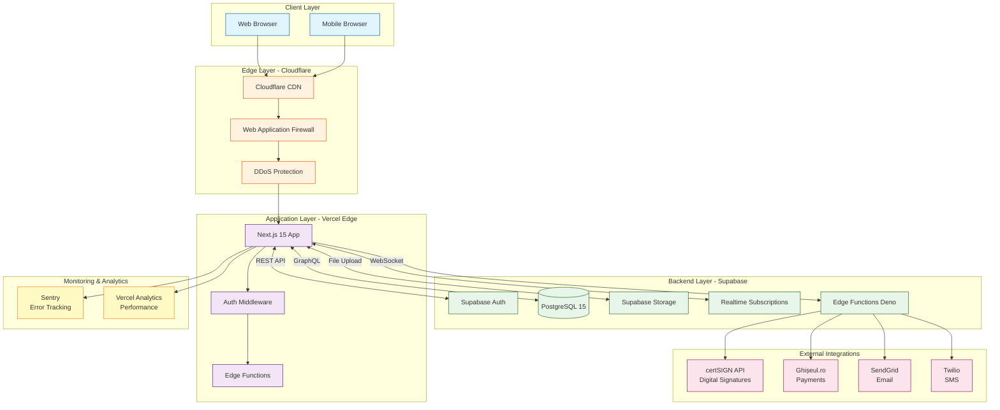

---

## Technology Stack

### Frontend Stack

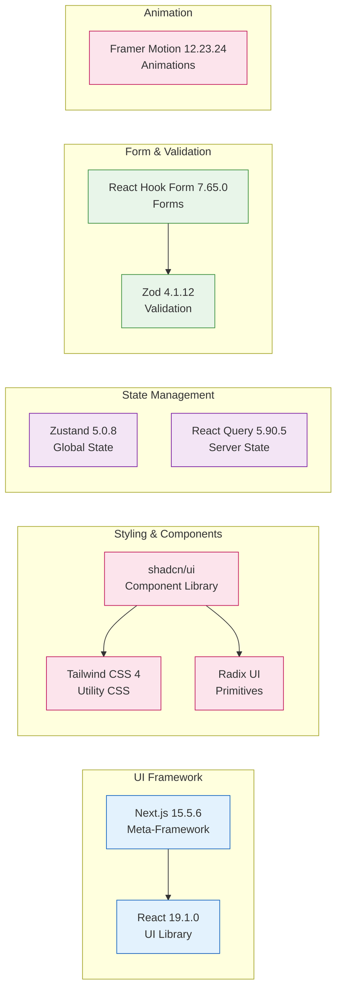

### Backend Stack

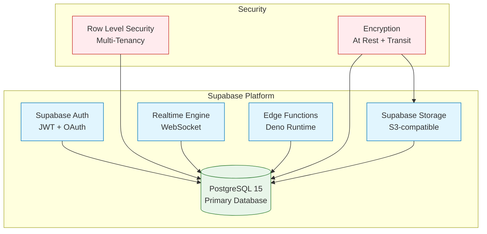

### Infrastructure Stack

| Layer | Technology | Purpose |
|-------|------------|---------|
| **Hosting** | Vercel (Frankfurt) | Serverless Next.js deployment |
| **CDN** | Cloudflare | Global content delivery |
| **Database** | Supabase (PostgreSQL 15) | Primary data store |
| **Auth** | Supabase Auth | Authentication & authorization |
| **Storage** | Supabase Storage | Document management |
| **Monitoring** | Sentry + Vercel Analytics | Error tracking + RUM |
| **DNS** | Cloudflare | DNS management |
| **Security** | Cloudflare WAF + DDoS | Protection layer |

---

## Architecture Layers

### Presentation Layer

**Responsibility**: User interface, client-side logic, routing

**Components:**
- **Next.js App Router** - File-based routing, Server Components
- **React Components** - UI elements (atomic design)
- **shadcn/ui** - Pre-built accessible components
- **Tailwind CSS** - Styling system

**Key Features:**
- ✅ Server-Side Rendering (SSR)
- ✅ Static Site Generation (SSG) for public pages
- ✅ Client-side navigation (SPA behavior)
- ✅ Progressive enhancement

**File Structure:**
```
src/app/
├── (auth)/              # Authentication routes (grouped)
│   ├── login/page.tsx
│   └── register/page.tsx
├── (public)/            # Public routes (grouped)
│   ├── page.tsx         # Landing page
│   └── [judet]/         # Location selection
│       └── [localitate]/page.tsx
└── app/                 # Authenticated app
    └── [judet]/         # Dynamic route (județul)
        └── [localitate]/ # Dynamic route (localitate)
            ├── dashboard/page.tsx
            ├── cereri/page.tsx
            └── plati/page.tsx
```

### Application Layer

**Responsibility**: Business logic, data fetching, state management

**Components:**
- **Route Handlers** (`/api/*`) - API endpoints
- **Server Actions** - Mutations from Server Components
- **Custom Hooks** - Reusable client logic
- **State Stores** - Zustand for global state

**Patterns:**
```typescript
// Server Component (data fetching)
export default async function DashboardPage() {
  const { data: requests } = await supabase
    .from('cereri')
    .select('*')
    .order('created_at', { ascending: false });

  return <RequestList requests={requests} />;
}

// Client Component (interactivity)
'use client';
export function RequestForm() {
  const { user } = useAuth();
  const mutation = useMutation(createRequest);
  // ...
}
```

### Data Layer

**Responsibility**: Data persistence, queries, business rules

**Components:**
- **PostgreSQL Database** - Relational data
- **Row Level Security (RLS)** - Multi-tenant isolation
- **Database Functions** - Business logic in SQL
- **Triggers** - Automated workflows

**Multi-Tenancy Model:**
```sql
-- Every table has județ + localitate for isolation
CREATE TABLE cereri (
  id uuid PRIMARY KEY DEFAULT gen_random_uuid(),
  judet text NOT NULL,
  localitate text NOT NULL,
  user_id uuid REFERENCES auth.users,
  status text CHECK (status IN ('draft', 'submitted', 'approved', 'rejected')),
  -- RLS policy ensures users only see their county/city data
);

-- RLS Policy
CREATE POLICY "Users see only their locality data"
ON cereri FOR SELECT
USING (
  judet = current_setting('app.current_judet')
  AND localitate = current_setting('app.current_localitate')
);
```

### Integration Layer

**Responsibility**: External service communication, webhooks

**Components:**
- **Supabase Edge Functions** - Deno runtime
- **API Clients** - Third-party service wrappers
- **Webhook Handlers** - Payment/signature callbacks

**Integrations:**

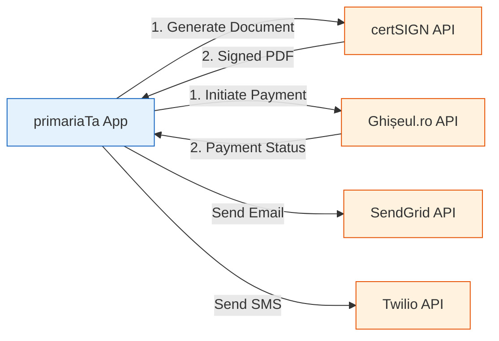

---

## Module Structure

### Core Modules

```
src/
├── app/                        # Next.js App Router (routes)
│   ├── layout.tsx              # Root layout (providers)
│   ├── page.tsx                # Landing page
│   ├── (auth)/                 # Auth module
│   ├── (public)/               # Public module
│   └── app/[judet]/[localitate]/ # Authenticated app module
│
├── components/                 # React components
│   ├── ui/                     # Base UI components (shadcn)
│   │   ├── button.tsx
│   │   ├── card.tsx
│   │   └── dialog.tsx
│   ├── auth/                   # Auth components
│   │   ├── login-form.tsx
│   │   └── register-form.tsx
│   ├── cereri/                 # Request management components
│   │   ├── request-form.tsx
│   │   ├── request-list.tsx
│   │   └── request-detail.tsx
│   └── shared/                 # Shared components
│       ├── header.tsx
│       ├── footer.tsx
│       └── sidebar.tsx
│
├── lib/                        # Core utilities
│   ├── supabase/               # Supabase clients
│   │   ├── client.ts           # Browser client
│   │   ├── server.ts           # Server client
│   │   └── middleware.ts       # Middleware client
│   ├── validations/            # Zod schemas
│   │   ├── auth.ts
│   │   └── cereri.ts
│   └── utils/                  # Helper functions
│       ├── date.ts
│       ├── format.ts
│       └── utils.ts
│
├── hooks/                      # Custom React hooks
│   ├── use-auth.ts
│   ├── use-requests.ts
│   └── use-payments.ts
│
├── store/                      # Zustand stores
│   ├── auth.ts
│   └── ui.ts
│
└── types/                      # TypeScript types
    ├── database.types.ts       # Generated from Supabase
    └── supabase.ts             # Supabase client types
```

---

## Data Flow

### Request Flow

Complete request lifecycle from browser to database:

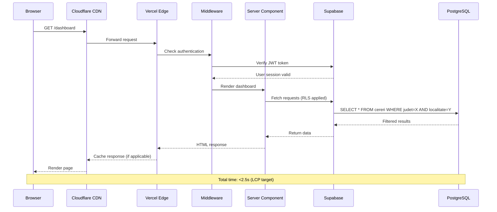

### Authentication Flow

Complete authentication flow with OAuth support:

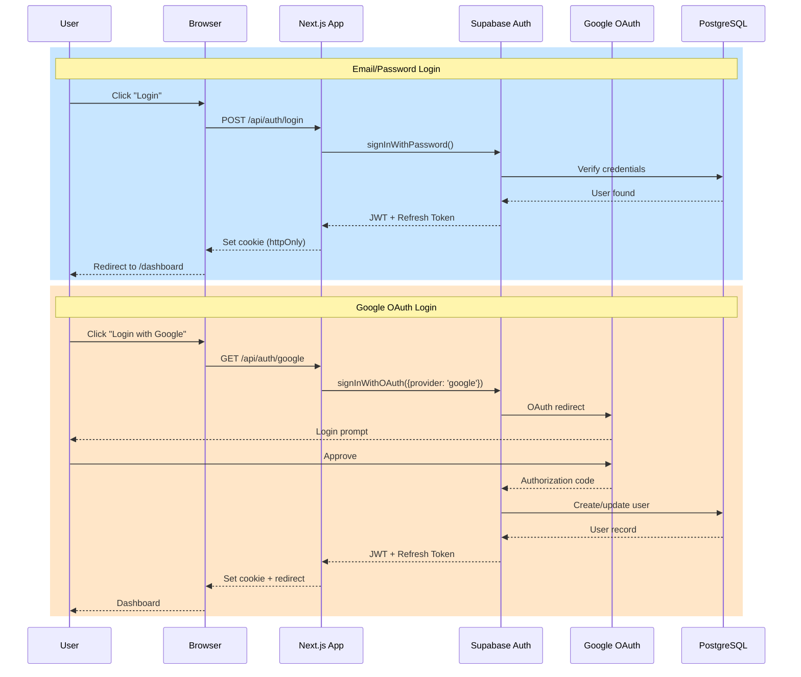

### Document Upload Flow

Secure document upload with virus scanning and storage:

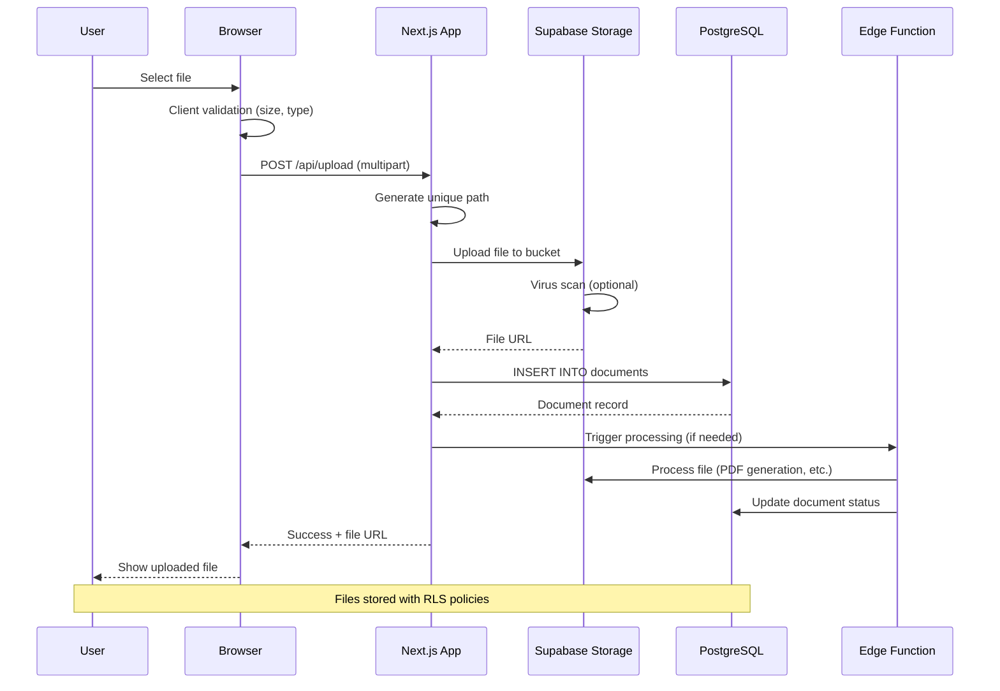

---

## Database Architecture

### Entity Relationship Diagram

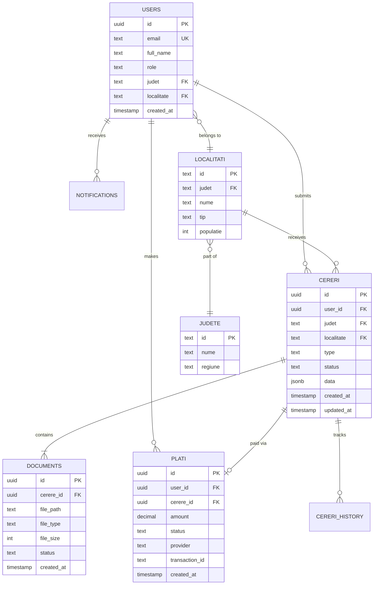

### RLS Security Model

**Multi-Tenant Isolation** via Row Level Security:

```sql
-- Enable RLS on all tables
ALTER TABLE cereri ENABLE ROW LEVEL SECURITY;

-- Policy 1: Users see only their locality data
CREATE POLICY "locality_isolation"
ON cereri FOR SELECT
USING (
  judet = (SELECT judet FROM auth.users WHERE id = auth.uid())
  AND localitate = (SELECT localitate FROM auth.users WHERE id = auth.uid())
);

-- Policy 2: Users see only their own requests
CREATE POLICY "user_owns_request"
ON cereri FOR SELECT
USING (user_id = auth.uid());

-- Policy 3: Functionar role can see all requests in their locality
CREATE POLICY "functionar_access"
ON cereri FOR SELECT
USING (
  EXISTS (
    SELECT 1 FROM auth.users
    WHERE id = auth.uid()
    AND role = 'functionar'
    AND judet = cereri.judet
    AND localitate = cereri.localitate
  )
);
```

### Indexes & Performance

**Optimized indexes** for common queries:

```sql
-- Composite index for multi-tenant queries
CREATE INDEX idx_cereri_locality ON cereri(judet, localitate, created_at DESC);

-- User-specific queries
CREATE INDEX idx_cereri_user ON cereri(user_id, status);

-- Full-text search
CREATE INDEX idx_cereri_search ON cereri USING gin(to_tsvector('romanian', data::text));

-- Status-based filtering
CREATE INDEX idx_cereri_status ON cereri(status, updated_at DESC);
```

---

## API Design

### REST API Structure

```
/api/
├── auth/
│   ├── login           POST   - Email/password login
│   ├── logout          POST   - Logout user
│   ├── register        POST   - Create account
│   └── google          GET    - OAuth redirect
│
├── cereri/
│   ├── [id]            GET    - Get request details
│   ├── [id]            PUT    - Update request
│   ├── [id]            DELETE - Delete request (draft only)
│   ├── list            GET    - List requests (filtered)
│   └── create          POST   - Create new request
│
├── documents/
│   ├── upload          POST   - Upload file
│   ├── [id]            GET    - Download file
│   └── [id]            DELETE - Delete file
│
├── plati/
│   ├── initiate        POST   - Start payment
│   ├── verify          GET    - Check payment status
│   └── webhook         POST   - Payment callback
│
└── webhooks/
    ├── certsign        POST   - certSIGN callback
    └── ghiseul         POST   - Ghișeul.ro callback
```

### API Response Format

**Standard response structure:**

```typescript
// Success response
{
  "success": true,
  "data": { /* payload */ },
  "meta": {
    "timestamp": "2025-01-18T10:30:00Z",
    "requestId": "req_abc123"
  }
}

// Error response
{
  "success": false,
  "error": {
    "code": "VALIDATION_ERROR",
    "message": "Invalid email format",
    "details": {
      "field": "email",
      "constraint": "format"
    }
  },
  "meta": {
    "timestamp": "2025-01-18T10:30:00Z",
    "requestId": "req_abc123"
  }
}
```

---

## Integration Points

### certSIGN Integration (Digital Signatures)

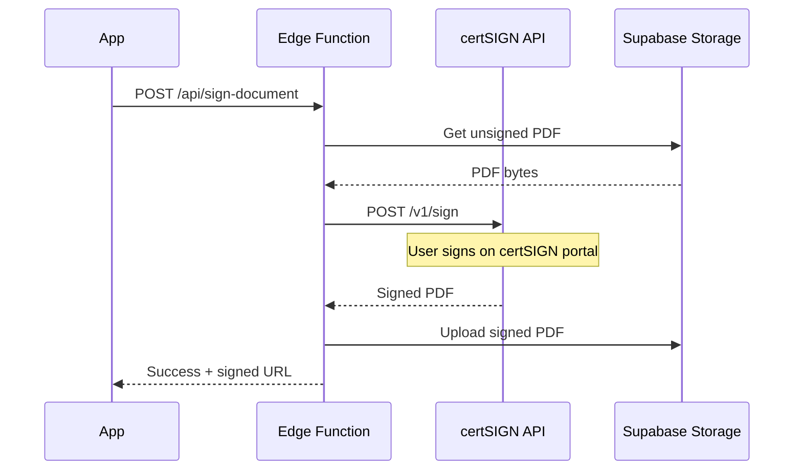

**Configuration:**
```typescript
const certSignConfig = {
  apiUrl: process.env.CERTSIGN_API_URL,
  merchantId: process.env.CERTSIGN_MERCHANT_ID,
  apiKey: process.env.CERTSIGN_API_KEY,
  callbackUrl: `${process.env.NEXT_PUBLIC_APP_URL}/api/webhooks/certsign`,
};
```

### Ghișeul.ro Integration (Payments)

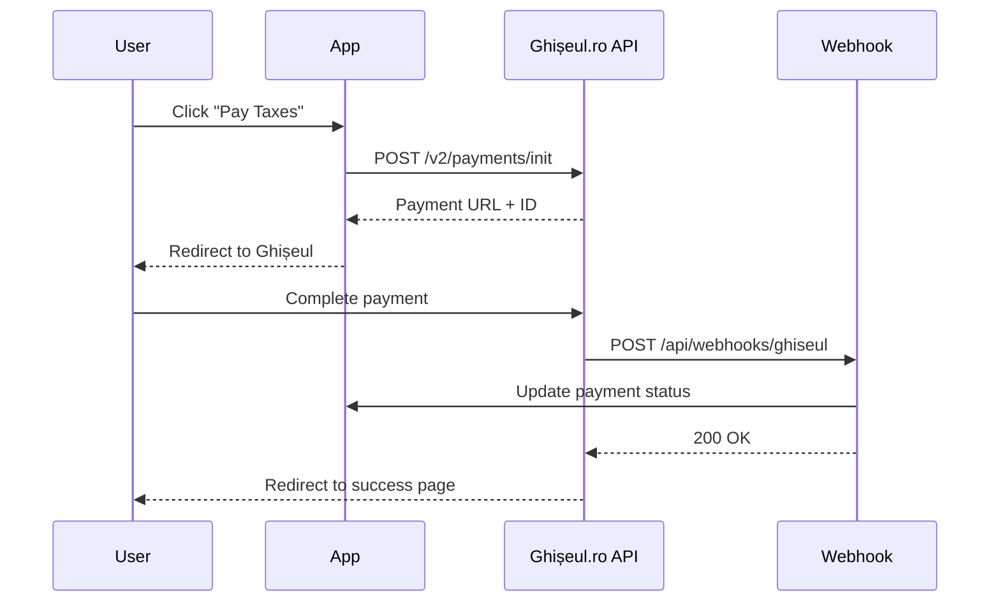

---

## Security Architecture

### Security Layers

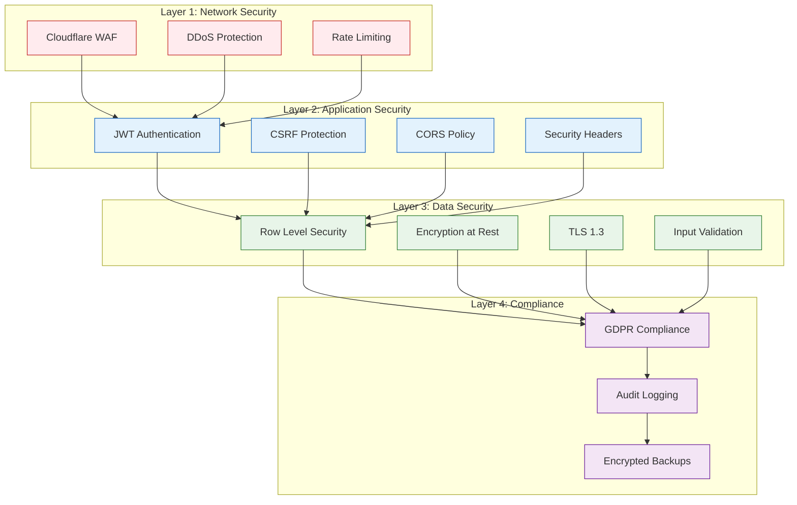

### Authentication & Authorization

**JWT Flow:**
```typescript
// 1. User logs in
const { data, error } = await supabase.auth.signInWithPassword({
  email: 'user@example.com',
  password: 'password123',
});

// 2. JWT stored in httpOnly cookie
document.cookie = `access_token=${data.session.access_token}; httpOnly; secure; sameSite=strict`;

// 3. Middleware validates on every request
export async function middleware(req: NextRequest) {
  const token = req.cookies.get('access_token');
  const { data: { user } } = await supabase.auth.getUser(token);

  if (!user) {
    return NextResponse.redirect('/login');
  }

  return NextResponse.next();
}
```

---

## Performance & Scalability

### Performance Targets

| Metric | Target | Strategy |
|--------|--------|----------|
| **LCP** (Largest Contentful Paint) | < 2.5s | SSR, Image optimization, CDN |
| **FCP** (First Contentful Paint) | < 1.2s | Critical CSS, Font optimization |
| **TTI** (Time to Interactive) | < 3.5s | Code splitting, Progressive enhancement |
| **CLS** (Cumulative Layout Shift) | < 0.1 | Reserved space, Font loading |

### Scalability Strategy

**Horizontal Scaling:**
- ✅ Serverless functions (auto-scale)
- ✅ CDN edge nodes (300+ locations)
- ✅ Database read replicas (Supabase)
- ✅ Connection pooling (PgBouncer)

**Caching Strategy:**
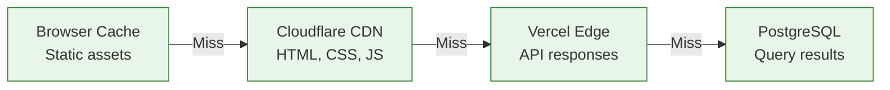

---

## Deployment Architecture

### Environments

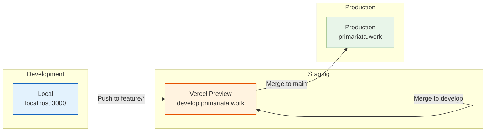

### CI/CD Pipeline

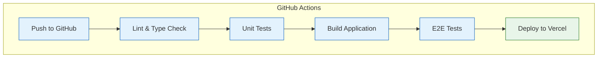

### Infrastructure Providers

| Service | Provider | Region | Purpose |
|---------|----------|--------|---------|
| **Hosting** | Vercel | Frankfurt (eu-central-1) | Next.js app |
| **Database** | Supabase | Frankfurt (eu-central-1) | PostgreSQL |
| **CDN** | Cloudflare | Global (300+ PoPs) | Static assets |
| **DNS** | Cloudflare | Global | Domain management |
| **Monitoring** | Sentry | EU (Frankfurt) | Error tracking |

---

<div align="center">

**Complete Architecture Documentation** 

For implementation details, please see [DEVELOPMENT_GUIDE.md](DEVELOPMENT_GUIDE.md)

**Made with ❤️ by Bubu & Dudu Dev Team**

</div>
