# primariaTa❤️\_ - System Architecture

<div align="center">

**Technical Architecture Documentation**

Comprehensive guide to the system design, data flow, and integration architecture of primariaTa❤️\_

[System Overview](#system-overview) • [Tech Stack](#technology-stack) • [Architecture Layers](#architecture-layers) • [Admin Architecture](#admin-architecture) • [Data Flow](#data-flow) • [Security](#security-architecture)

</div>

---

## Table of Contents

- [System Overview](#system-overview)
- [High-Level Architecture](#high-level-architecture)
- [Technology Stack](#technology-stack)
- [Architecture Layers](#architecture-layers)
  - [Presentation Layer](#presentation-layer)
  - [Application Layer](#application-layer)
  - [Data Layer](#data-layer)
  - [Integration Layer](#integration-layer)
- [Module Structure](#module-structure)
- [Admin Architecture](#admin-architecture)
  - [Global Admin](#1-global-admin-super_admin)
  - [Primărie Admin](#2-primărie-admin-admin)
  - [Survey Admin](#3-survey-admin-adminsuper_admin)
- [Data Flow](#data-flow)
  - [Request Flow](#request-flow)
  - [Authentication Flow](#authentication-flow)
  - [Document Upload Flow](#document-upload-flow)
- [Database Architecture](#database-architecture)
- [API Design](#api-design)
- [Integration Points](#integration-points)
- [Security Architecture](#security-architecture)
- [Performance & Scalability](#performance--scalability)
- [Deployment Architecture](#deployment-architecture)

---

## System Overview

**primariaTa❤️\_** is a modern **SaaS white-label platform** designed to digitalize Romanian local government administrative processes. Built on a **serverless, cloud-native architecture**, it leverages cutting-edge technologies to deliver a **secure, scalable, and performant** solution.

### Key Characteristics

| Characteristic           | Implementation                         |
| ------------------------ | -------------------------------------- |
| **Architecture Pattern** | Serverless, Event-Driven, Multi-Tenant |
| **Deployment Model**     | Edge-first, globally distributed       |
| **Data Sovereignty**     | EU-compliant (Frankfurt region)        |
| **Scalability**          | Auto-scaling, pay-per-use              |
| **Security**             | Multi-layer, zero-trust model          |
| **Availability**         | 99.9% SLA target                       |

### Design Principles

1. **🔐 Security First** - Multi-layer security, RLS, encryption at rest/transit
2. **⚡ Performance** - Edge computing, CDN, optimistic UI updates
3. **📈 Scalability** - Serverless auto-scaling, database connection pooling
4. **♿ Accessibility** - WCAG 2.1 AA compliance
5. **🌍 Multi-Tenancy** - Isolated data per municipality (județ + localitate)
6. **🔄 Resilience** - Graceful degradation, retry logic, circuit breakers

---

## High-Level Architecture


---

## Technology Stack

### Frontend Stack


### Backend Stack


### Infrastructure Stack

| Layer          | Technology                | Purpose                        |
| -------------- | ------------------------- | ------------------------------ |
| **Hosting**    | Vercel (Frankfurt)        | Serverless Next.js deployment  |
| **CDN**        | Cloudflare                | Global content delivery        |
| **Database**   | Supabase (PostgreSQL 15)  | Primary data store             |
| **Auth**       | Supabase Auth             | Authentication & authorization |
| **Storage**    | Supabase Storage          | Document management            |
| **Monitoring** | Sentry + Vercel Analytics | Error tracking + RUM           |
| **DNS**        | Cloudflare                | DNS management                 |
| **Security**   | Cloudflare WAF + DDoS     | Protection layer               |

---

## Architecture Layers

### Presentation Layer

**Responsibility**: User interface, client-side logic, routing

**Components:**

- **Next.js App Router** - File-based routing, Server Components
- **React Components** - UI elements (atomic design)
- **shadcn/ui** - Pre-built accessible components
- **Tailwind CSS** - Styling system

**Key Features:**

- ✅ Server-Side Rendering (SSR)
- ✅ Static Site Generation (SSG) for public pages
- ✅ Client-side navigation (SPA behavior)
- ✅ Progressive enhancement

**File Structure:**

```
src/app/
├── (auth)/              # Authentication routes (grouped)
│   ├── login/page.tsx
│   └── register/page.tsx
├── (public)/            # Public routes (grouped)
│   ├── page.tsx         # Landing page
│   └── [judet]/         # Location selection
│       └── [localitate]/page.tsx
└── app/                 # Authenticated app
    └── [judet]/         # Dynamic route (județul)
        └── [localitate]/ # Dynamic route (localitate)
            ├── dashboard/page.tsx
            ├── cereri/page.tsx
            └── plati/page.tsx
```

### Application Layer

**Responsibility**: Business logic, data fetching, state management

**Components:**

- **Route Handlers** (`/api/*`) - API endpoints
- **Server Actions** - Mutations from Server Components
- **Custom Hooks** - Reusable client logic
- **State Stores** - Zustand for global state

**Patterns:**

```typescript
// Server Component (data fetching)
export default async function DashboardPage() {
  const { data: requests } = await supabase
    .from('cereri')
    .select('*')
    .order('created_at', { ascending: false });

  return <RequestList requests={requests} />;
}

// Client Component (interactivity)
'use client';
export function RequestForm() {
  const { user } = useAuth();
  const mutation = useMutation(createRequest);
  // ...
}
```

### Data Layer

**Responsibility**: Data persistence, queries, business rules

**Components:**

- **PostgreSQL Database** - Relational data
- **Row Level Security (RLS)** - Multi-tenant isolation
- **Database Functions** - Business logic in SQL
- **Triggers** - Automated workflows

**Multi-Tenancy Model:**

```sql
-- Every table has județ + localitate for isolation
CREATE TABLE cereri (
  id uuid PRIMARY KEY DEFAULT gen_random_uuid(),
  judet text NOT NULL,
  localitate text NOT NULL,
  user_id uuid REFERENCES auth.users,
  status text CHECK (status IN ('draft', 'submitted', 'approved', 'rejected')),
  -- RLS policy ensures users only see their county/city data
);

-- RLS Policy
CREATE POLICY "Users see only their locality data"
ON cereri FOR SELECT
USING (
  judet = current_setting('app.current_judet')
  AND localitate = current_setting('app.current_localitate')
);
```

### Integration Layer

**Responsibility**: External service communication, webhooks

**Components:**

- **Supabase Edge Functions** - Deno runtime
- **API Clients** - Third-party service wrappers
- **Webhook Handlers** - Payment/signature callbacks

**Integrations:**

```mermaid
graph LR
    App[primariaTa App]

    App -->|1. Generate Document| CertSign[certSIGN API]
    CertSign -->|2. Signed PDF| App

    App -->|1. Initiate Payment| Ghiseul[Ghișeul.ro API]
    Ghiseul -->|2. Payment Status| App

    App -->|Send Email| SendGrid[SendGrid API]
    App -->|Send SMS| Twilio[Twilio API]

    classDef app fill:#e3f2fd,stroke:#1565c0
    classDef external fill:#fff3e0,stroke:#e65100

    class App app
    class CertSign,Ghiseul,SendGrid,Twilio external
```



---

## Module Structure

### Core Modules

```
src/
├── app/                        # Next.js App Router (routes)
│   ├── layout.tsx              # Root layout (providers)
│   ├── page.tsx                # Landing page
│   ├── (auth)/                 # Auth module
│   ├── (public)/               # Public module
│   └── app/[judet]/[localitate]/ # Authenticated app module
│
├── components/                 # React components
│   ├── ui/                     # Base UI components (shadcn)
│   │   ├── button.tsx
│   │   ├── card.tsx
│   │   └── dialog.tsx
│   ├── auth/                   # Auth components
│   │   ├── login-form.tsx
│   │   └── register-form.tsx
│   ├── cereri/                 # Request management components
│   │   ├── request-form.tsx
│   │   ├── request-list.tsx
│   │   └── request-detail.tsx
│   └── shared/                 # Shared components
│       ├── header.tsx
│       ├── footer.tsx
│       └── sidebar.tsx
│
├── lib/                        # Core utilities
│   ├── supabase/               # Supabase clients
│   │   ├── client.ts           # Browser client
│   │   ├── server.ts           # Server client
│   │   └── middleware.ts       # Middleware client
│   ├── validations/            # Zod schemas
│   │   ├── auth.ts
│   │   └── cereri.ts
│   └── utils/                  # Helper functions
│       ├── date.ts
│       ├── format.ts
│       └── utils.ts
│
├── hooks/                      # Custom React hooks
│   ├── use-auth.ts
│   ├── use-requests.ts
│   └── use-payments.ts
│
├── store/                      # Zustand stores
│   ├── auth.ts
│   └── ui.ts
│
└── types/                      # TypeScript types
    ├── database.types.ts       # Generated from Supabase
    └── supabase.ts             # Supabase client types
```

---

## Admin Architecture

The platform implements a **three-level admin hierarchy** for comprehensive platform and municipality management:

### Architecture Overview

```mermaid
graph TB
    subgraph "Platform Level"
        GlobalAdmin[🌍 Global Admin<br/>super_admin<br/>/app/admin/primariata/]
    end

    subgraph "Primărie Level"
        PrimarieAdmin1[🏛️ Primărie Admin<br/>admin<br/>/app/cluj/cluj-napoca/admin/]
        PrimarieAdmin2[🏛️ Primărie Admin<br/>admin<br/>/app/bucuresti/bucuresti/admin/]
        PrimarieAdmin3[🏛️ Primărie Admin<br/>admin<br/>/app/timis/timisoara/admin/]
    end

    subgraph "Staff Level"
        Staff1[👥 Staff<br/>functionar/primar]
        Staff2[👥 Staff<br/>functionar/primar]
        Staff3[👥 Staff<br/>functionar/primar]
    end

    subgraph "Separate Application"
        SurveyAdmin[🔬 Survey Admin<br/>admin/super_admin<br/>/admin/survey/]
    end

    GlobalAdmin -->|Creates & Invites| PrimarieAdmin1
    GlobalAdmin -->|Creates & Invites| PrimarieAdmin2
    GlobalAdmin -->|Creates & Invites| PrimarieAdmin3

    PrimarieAdmin1 -->|Invites Staff| Staff1
    PrimarieAdmin2 -->|Invites Staff| Staff2
    PrimarieAdmin3 -->|Invites Staff| Staff3

    classDef platform fill:#e8f5e9,stroke:#2e7d32
    classDef primarie fill:#e3f2fd,stroke:#1565c0
    classDef staff fill:#fff3e0,stroke:#e65100
    classDef survey fill:#f3e5f5,stroke:#7b1fa2

    class GlobalAdmin platform
    class PrimarieAdmin1,PrimarieAdmin2,PrimarieAdmin3 primarie
    class Staff1,Staff2,Staff3 staff
    class SurveyAdmin survey
```



### 1. Global Admin (super_admin)

**Location**: `/app/admin/primariata/`

**Scope**: Platform-wide management (ALL primării)

**Responsibilities**:

- View platform-wide statistics (all primării combined)
- Manage primării (create, edit, activate/deactivate)
- Create and invite primărie admins (one per city)
- Configure platform settings and feature flags
- View platform-wide audit logs
- Monitor system health and performance

**Implementation Status**: ⏳ Issue #150 (0% - Not implemented, estimated 10h)

**RLS Policy**:

```sql
-- Super admin sees ALL data across ALL primării
CREATE POLICY super_admin_full_access ON utilizatori
FOR ALL TO authenticated
USING (
  EXISTS (
    SELECT 1 FROM utilizatori
    WHERE id = auth.uid()
    AND rol = 'super_admin'
  )
);
```

### 2. Primărie Admin (admin)

**Location**: `/app/[judet]/[localitate]/admin/`

**Scope**: Single primărie management (RLS enforced)

**Responsibilities**:

- Manage users in their primărie (cetățeni, funcționari, primar)
- Invite staff (funcționari, primar) via email
- Cereri oversight (all requests in primărie)
- Plăți oversight (all payments in primărie)
- Generate primărie-specific reports
- View primărie activity logs

**Implementation Status**: ⏳ Issue #148 (0% - Blocked by #152, estimated 12h)

**Dashboard Structure**:

```
/app/[judet]/[localitate]/admin/
├── page.tsx                    # Platform health overview
├── users/                      # User management
│   ├── page.tsx                # List users (table)
│   ├── invite/page.tsx         # Invite staff
│   └── [id]/page.tsx           # User detail
├── cereri/                     # Cereri oversight
│   ├── page.tsx                # All cereri table
│   └── [id]/page.tsx           # Cerere detail
├── plati/                      # Plăți oversight
│   ├── page.tsx                # All plăți table
│   └── [id]/page.tsx           # Payment detail
├── reports/page.tsx            # Reports & analytics
└── activity/page.tsx           # Activity log
```

**RLS Policy**:

```sql
-- Admin sees ONLY their primărie
CREATE POLICY admin_primarie_access ON utilizatori
FOR ALL TO authenticated
USING (
  EXISTS (
    SELECT 1 FROM utilizatori u
    WHERE u.id = auth.uid()
    AND u.rol = 'admin'
    AND u.primarie_id = utilizatori.primarie_id
  )
);
```

### 3. Survey Admin (admin/super_admin)

**Location**: `/admin/survey/` and `/admin/survey/research/`

**Scope**: Survey analytics (SEPARATE APPLICATION)

**Key Distinction**: Survey Admin is a **completely separate application** from the main Primărie App. It focuses solely on survey research and analytics.

**Responsibilities**:

- View survey response metrics and analytics
- Generate AI-powered insights (OpenAI GPT-4o-mini)
- Export survey data (Excel, CSV, PDF, JSON)
- Monitor response trends and demographics
- Analyze correlations and cohorts

**Implementation Status**: ✅ M7 - 100% Complete (fully functional)

**Access Control**:

- `admin` role: See surveys for their primărie
- `super_admin` role: See ALL surveys platform-wide

**RLS Policy**:

```sql
-- Admin sees surveys for their primărie
-- Super admin sees ALL surveys
CREATE POLICY survey_admin_access ON survey_responses
FOR SELECT TO authenticated
USING (
  EXISTS (
    SELECT 1 FROM utilizatori u
    WHERE u.id = auth.uid()
    AND (
      u.rol = 'super_admin'
      OR (u.rol = 'admin' AND u.primarie_id = survey_respondents.primarie_id)
    )
  )
);
```

### Admin Comparison

| Aspect         | Global Admin             | Primărie Admin                     | Survey Admin               |
| -------------- | ------------------------ | ---------------------------------- | -------------------------- |
| **Location**   | `/app/admin/primariata/` | `/app/[judet]/[localitate]/admin/` | `/admin/survey/`           |
| **Role**       | `super_admin`            | `admin`                            | `admin` or `super_admin`   |
| **Scope**      | ALL primării             | ONE primărie                       | Survey data (separate app) |
| **Created By** | Pre-created (1-2 users)  | Global Admin                       | Pre-created                |
| **Creates**    | Primărie admins          | Staff users (funcționari)          | None                       |
| **Status**     | ⏳ 0% (Issue #150)       | ⏳ 0% (Issue #148)                 | ✅ 100% (M7)               |

### Authentication Flow



```mermaid
sequenceDiagram
    participant U as User
    participant A as Auth System
    participant G as Global Admin
    participant P as Primărie Admin
    participant S as Survey Admin

    U->>A: Login
    A->>A: Verify credentials
    A->>A: Check role

    alt super_admin
        A->>G: Redirect to /app/admin/primariata/
    else admin
        A->>A: Check context (URL path)
        alt /admin/survey/*
            A->>S: Redirect to /admin/survey/
        else /app/[judet]/[localitate]/*
            A->>P: Redirect to /app/[judet]/[localitate]/admin/
        end
    else functionar/primar/cetatean
        A->>P: Redirect to /app/[judet]/[localitate]/
    end
```

**Complete Documentation**: See [claudedocs/ADMIN_HIERARCHY.md](claudedocs/ADMIN_HIERARCHY.md) for comprehensive details including API endpoints, dashboard structures, and user journey examples.

---

## Data Flow

### Request Flow

Complete request lifecycle from browser to database:


### Authentication Flow

Complete authentication flow with OAuth support:


### Document Upload Flow

Secure document upload with virus scanning and storage:


---

## Database Architecture

### Entity Relationship Diagram


### RLS Security Model

**Multi-Tenant Isolation** via Row Level Security:

```sql
-- Enable RLS on all tables
ALTER TABLE cereri ENABLE ROW LEVEL SECURITY;

-- Policy 1: Users see only their locality data
CREATE POLICY "locality_isolation"
ON cereri FOR SELECT
USING (
  judet = (SELECT judet FROM auth.users WHERE id = auth.uid())
  AND localitate = (SELECT localitate FROM auth.users WHERE id = auth.uid())
);

-- Policy 2: Users see only their own requests
CREATE POLICY "user_owns_request"
ON cereri FOR SELECT
USING (user_id = auth.uid());

-- Policy 3: Functionar role can see all requests in their locality
CREATE POLICY "functionar_access"
ON cereri FOR SELECT
USING (
  EXISTS (
    SELECT 1 FROM auth.users
    WHERE id = auth.uid()
    AND role = 'functionar'
    AND judet = cereri.judet
    AND localitate = cereri.localitate
  )
);
```

### Indexes & Performance

**Optimized indexes** for common queries:

```sql
-- Composite index for multi-tenant queries
CREATE INDEX idx_cereri_locality ON cereri(judet, localitate, created_at DESC);

-- User-specific queries
CREATE INDEX idx_cereri_user ON cereri(user_id, status);

-- Full-text search
CREATE INDEX idx_cereri_search ON cereri USING gin(to_tsvector('romanian', data::text));

-- Status-based filtering
CREATE INDEX idx_cereri_status ON cereri(status, updated_at DESC);
```

---

## API Design

### REST API Structure

```
/api/
├── auth/
│   ├── login           POST   - Email/password login
│   ├── logout          POST   - Logout user
│   ├── register        POST   - Create account
│   └── google          GET    - OAuth redirect
│
├── cereri/
│   ├── [id]            GET    - Get request details
│   ├── [id]            PUT    - Update request
│   ├── [id]            DELETE - Delete request (draft only)
│   ├── list            GET    - List requests (filtered)
│   └── create          POST   - Create new request
│
├── documents/
│   ├── upload          POST   - Upload file
│   ├── [id]            GET    - Download file
│   └── [id]            DELETE - Delete file
│
├── plati/
│   ├── initiate        POST   - Start payment
│   ├── verify          GET    - Check payment status
│   └── webhook         POST   - Payment callback
│
└── webhooks/
    ├── certsign        POST   - certSIGN callback
    └── ghiseul         POST   - Ghișeul.ro callback
```

### API Response Format

**Standard response structure:**

```typescript
// Success response
{
  "success": true,
  "data": { /* payload */ },
  "meta": {
    "timestamp": "2025-01-18T10:30:00Z",
    "requestId": "req_abc123"
  }
}

// Error response
{
  "success": false,
  "error": {
    "code": "VALIDATION_ERROR",
    "message": "Invalid email format",
    "details": {
      "field": "email",
      "constraint": "format"
    }
  },
  "meta": {
    "timestamp": "2025-01-18T10:30:00Z",
    "requestId": "req_abc123"
  }
}
```

---

## Integration Points

### certSIGN Integration (Digital Signatures)


**Configuration:**

```typescript
const certSignConfig = {
  apiUrl: process.env.CERTSIGN_API_URL,
  merchantId: process.env.CERTSIGN_MERCHANT_ID,
  apiKey: process.env.CERTSIGN_API_KEY,
  callbackUrl: `${process.env.NEXT_PUBLIC_APP_URL}/api/webhooks/certsign`,
};
```

### Ghișeul.ro Integration (Payments)

```mermaid
sequenceDiagram
    participant User
    participant App
    participant Ghiseul as Ghișeul.ro API
    participant Webhook

    User->>App: Click "Pay Taxes"
    App->>Ghiseul: POST /v2/payments/init
    Ghiseul-->>App: Payment URL + ID
    App-->>User: Redirect to Ghișeul
    User->>Ghiseul: Complete payment
    Ghiseul->>Webhook: POST /api/webhooks/ghiseul
    Webhook->>App: Update payment status
    Webhook-->>Ghiseul: 200 OK
    Ghiseul-->>User: Redirect to success page
```



---

## Security Architecture

### Security Layers


### Authentication & Authorization

**JWT Flow:**

```typescript
// 1. User logs in
const { data, error } = await supabase.auth.signInWithPassword({
  email: "user@example.com",
  password: "password123",
});

// 2. JWT stored in httpOnly cookie
document.cookie = `access_token=${data.session.access_token}; httpOnly; secure; sameSite=strict`;

// 3. Middleware validates on every request
export async function middleware(req: NextRequest) {
  const token = req.cookies.get("access_token");
  const {
    data: { user },
  } = await supabase.auth.getUser(token);

  if (!user) {
    return NextResponse.redirect("/login");
  }

  return NextResponse.next();
}
```

---

## Performance & Scalability

### Performance Targets

| Metric                             | Target | Strategy                                |
| ---------------------------------- | ------ | --------------------------------------- |
| **LCP** (Largest Contentful Paint) | < 2.5s | SSR, Image optimization, CDN            |
| **FCP** (First Contentful Paint)   | < 1.2s | Critical CSS, Font optimization         |
| **TTI** (Time to Interactive)      | < 3.5s | Code splitting, Progressive enhancement |
| **CLS** (Cumulative Layout Shift)  | < 0.1  | Reserved space, Font loading            |

### Scalability Strategy

**Horizontal Scaling:**

- ✅ Serverless functions (auto-scale)
- ✅ CDN edge nodes (300+ locations)
- ✅ Database read replicas (Supabase)
- ✅ Connection pooling (PgBouncer)

**Caching Strategy:**


---

## Deployment Architecture

### Environments


### CI/CD Pipeline


### Infrastructure Providers

| Service        | Provider   | Region                   | Purpose           |
| -------------- | ---------- | ------------------------ | ----------------- |
| **Hosting**    | Vercel     | Frankfurt (eu-central-1) | Next.js app       |
| **Database**   | Supabase   | Frankfurt (eu-central-1) | PostgreSQL        |
| **CDN**        | Cloudflare | Global (300+ PoPs)       | Static assets     |
| **DNS**        | Cloudflare | Global                   | Domain management |
| **Monitoring** | Sentry     | EU (Frankfurt)           | Error tracking    |

---

<div align="center">

**Complete Architecture Documentation**

For implementation details, please see [DEVELOPMENT_GUIDE.md](DEVELOPMENT_GUIDE.md)

**Made with ❤️ by Bubu & Dudu Dev Team**

</div>
