# DOCUMENTAȚIE ȘI ARHITECTURĂ primariaTa❤️\_

**Platformă SaaS pentru Digitalizarea Serviciilor Publice Locale din România**

---

**Universitatea**: Universitatea Româno-Americană (RAU)
**Facultatea**: Informatică Managerială
**Disciplina**: Programarea Aplicațiilor Web
**An Universitar**: 2025-2026
**Coordonator**: Prof.Dr. Andrei Luchici

---

**Echipa de Proiect**:

- **Octavian Mihai** - Lead Developer & Technical Architect
- **Bianca-Maria Abbasi Pazeyazd** - Frontend Developer & UI/UX Designer

**Data Documentului**: 11 Noiembrie 2025
**Versiune**: 1.0 FINAL
**Clasificare**: Academic - Proiect Universitar

---

## CUPRINS

### PARTEA I: DOCUMENTAȚIE PROBLEMĂ ȘI SOLUȚIE

1. DEFINIREA PROBLEMEI
2. UTILIZATORI ȚINTĂ
3. FUNCȚIONALITĂȚI CHEIE

### PARTEA II: ARHITECTURA SISTEMULUI

4. DIAGRAMA ARHITECTURĂ HIGH-LEVEL
5. JUSTIFICARE STACK TEHNOLOGIC
6. FLUX DE DATE ȘI CONSIDERAȚII DE SECURITATE
7. INFRASTRUCTURĂ ȘI DEPLOYMENT

---

# PARTEA I: DOCUMENTAȚIE PROBLEMĂ ȘI SOLUȚIE

## 1. DEFINIREA PROBLEMEI

### 1.1 Contextul Problemei

România se află într-o poziție paradoxală în ceea ce privește digitalizarea serviciilor publice:

- **Infrastructura digitală**: 90% primării au site-uri web, 75% populație cu internet, 85% penetrare smartphone
- **Adoptarea efectivă**: Doar **16% cetățeni** folosesc servicii digitale publice (vs. 64% media UE)
- **Decalaj masiv**: Discrepanță de **5.6x** între infrastructură disponibilă și utilizare reală

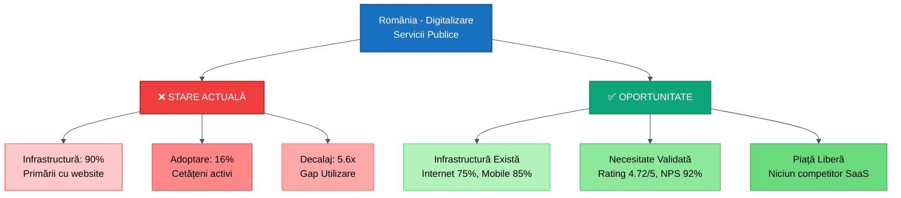

### 1.2 Problemele Specifice Identificate

#### Problema #1: Cozi și Timpul de Așteptare

**Situația actuală**:

- Program primării: Luni-Vineri, 8:00-16:00 (conflict cu program lucru cetățeni)
- Timp mediu așteptare: **2-3 ore** la ghișee (vârfuri)
- Deplasări necesare: Minim **2 vizite** pentru o cerere simplă

<div class="page-break"></div>

**Impact măsurabil**:

- ~500,000 cetățeni afectați anual (ex: Sector 3 București)
- ~1,000,000 ore pierdute în cozi
- Cost economic: **€15,000,000** (timp × salariu mediu)

#### Problema #2: Birocrație Excesivă și Lipsa Ghidare

**Probleme specifice**:

- Documente multiple necesare, informații fragmentate
- Deplasări repetate: "Mai veniți cu formularul completat"
- Zero vizibilitate în procesarea cererii ("black box")
- Arhivare fizică costisitoare și ineficientă

<div class="page-break"></div>

**Comparație Flux Procesare**:

**ÎNAINTE - Flux Actual (Offline)**:

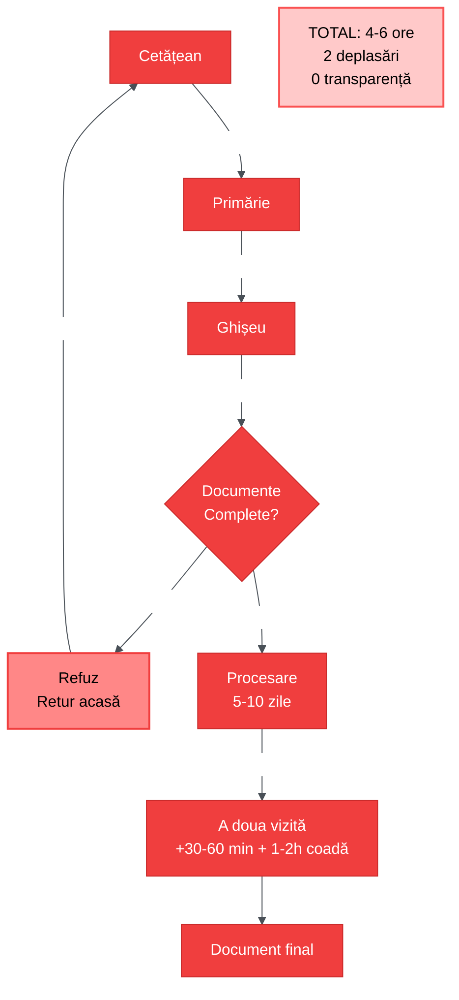

<div class="page-break"></div>

**DUPĂ - Flux Nou (primariaTa)**:

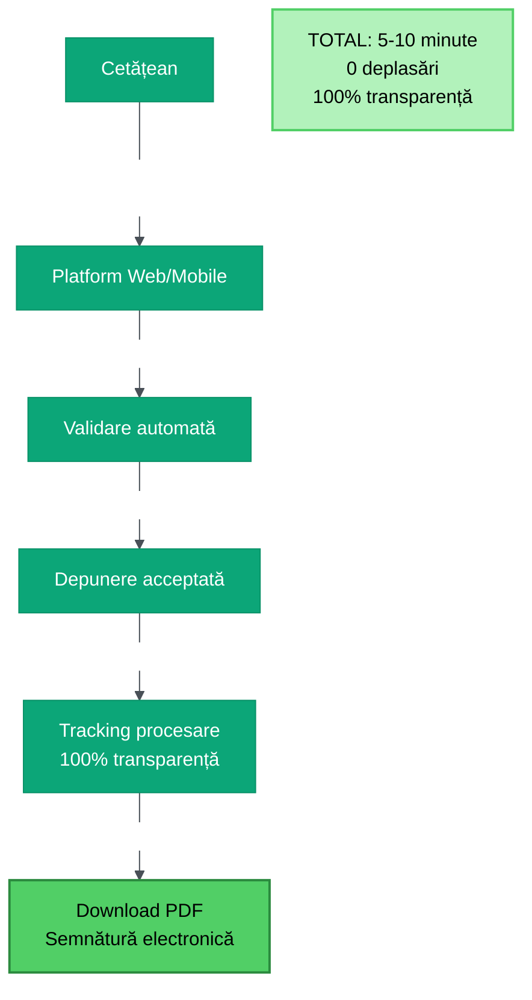

<div class="page-break"></div>

**Îmbunătățiri cantificabile**:

| Aspect             | Înainte    | După primariaTa | Îmbunătățire      |
| ------------------ | ---------- | --------------- | ----------------- |
| **Timp necesar**   | 4-6 ore    | 5-10 minute     | **12x mai rapid** |
| **Deplasări**      | 2-3 fizice | 0 (online)      | **100% reducere** |
| **Rată succes**    | ~60%       | ~95%            | **+58%**          |
| **Transparență**   | 0%         | 100%            | **∞**             |
| **Accesibilitate** | 8h/zi      | 24/7            | **3x mai mult**   |

#### Problema #3: Accesibilitate Limitată

**Grupuri afectate**:

- **Persoane cu dizabilități**: Dificultate acces fizic la ghișee
- **Vârstnici (60+)**: Mobilitate redusă, program limitat (reprezentând 24% din eșantionul nostru)
- **Tineri profesioniști**: Conflict program serviciu - primărie
- **Români din diaspora**: Imposibil să acceseze servicii de la distanță
- **Zone rurale**: Distanțe mari până la primărie (46% populație rurală)

### 1.3 Validare Empirică a Problemei

**Sursă**: Chestionar primariaTa (28 respondenți, 10 județe, Octombrie-Noiembrie 2025)

**Top 5 Pain Points** (din analiza calitativă):

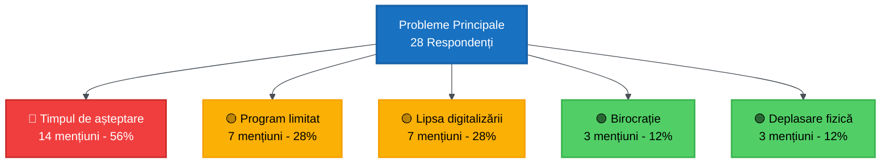

<div class="page-break"></div>

**Citate reprezentative**:

> _"Timpi de așteptare la ghișeu și lipsa programărilor online. Prefer soluții digitale rapide."_ - Profesionist ocupat, 26-35 ani

> _"Ca pensionară, aș aprecia să pot accesa serviciile online, fără să mă deplasez personal."_ - Vârstnic, 60+ ani

> _"Ca persoană cu dizabilități, ar fi foarte util să pot accesa serviciile online."_ - Persoană cu dizabilități

### 1.4 Dimensiunea Pieței și Oportunitate

**Total Addressable Market (TAM)**:

- **3,181 primării** în România (2,964 UAT-uri administrative)
- **19 milioane** cetățeni români
- **€35.6M ARR** potențial (3,181 × €12K/an preț mediu)

**Serviceable Addressable Market (SAM)**:

- 90% primării au website → **2,669 primării** pregătite digital
- **€18M ARR** realist (cu buget și pregătire)

**Serviceable Obtainable Market (SOM)**:

- An 1: 10-20 primării → **€120K-240K ARR**
- An 3: 55-90 primării → **€780K-1.3M ARR**

---

## 2. UTILIZATORI ȚINTĂ

### 2.1 Segmente de Utilizatori

Platforma **primariaTa❤️\_** servește **3 tipuri distincte** de utilizatori, fiecare cu nevoi și workflow-uri specifice:

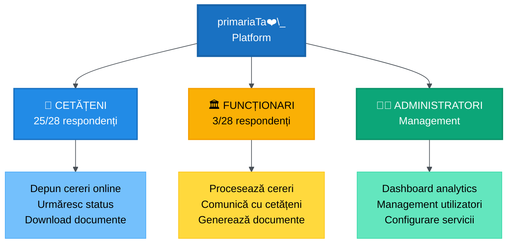

### 2.2 Utilizator 1: Cetățeanul (Primary User)

**Profil demografic** (bazat pe chestionar):

- **Vârstă**: Distribuție largă (56% peste 46 ani, 44% sub 45 ani)
- **Locație**: Urban + Rural (acoperire 10 județe)
- **Competențe digitale**: Variate (20% utilizatori digitali activi, 80% nedigitalizați/abandonatori)
- **Frecvență interacțiune**: 68% interacționează rar (o dată pe an sau mai puțin)

**Nevoi principale**:

1. **Depunere cereri online** (88% solicitare) - funcționalitate critică ⭐⭐⭐⭐⭐
2. **Urmărire status cereri** (76% solicitare) - funcționalitate critică ⭐⭐⭐⭐⭐
3. **Notificări taxe/termene** (76% solicitare) - funcționalitate critică ⭐⭐⭐⭐⭐
4. **Solicitare documente fără deplasare** (60% solicitare) - important ⭐⭐⭐⭐
5. **Comunicare directă cu funcționari** (36% solicitare) - util ⭐⭐⭐

<div class="page-break"></div>

**Pain points specifice**:

- Timp de așteptare (56% mențiuni)
- Program limitat (28% mențiuni)
- Lipsa digitalizării (28% mențiuni)

**Comportament așteptat**:

- Acces platform 24/7 de pe mobile/desktop
- Completare formulare ghidate cu validare
- Tracking real-time status cerere
- Download documente semnate electronic

**Validare disponibilitate plată**:

- **Rating utilitate**: 4.72/5 ⭐⭐⭐⭐⭐
- **Recomandare**: 88% ar recomanda altora
- **Net Promoter Score (NPS)**: 92%
- **Acceptare eID**: 84% dispuși dacă securizat

### 2.3 Utilizator 2: Funcționarul Public (Secondary User)

**Profil**:

- **Departamente**: Registratură, Administrativ, Financiar
- **Frecvență interacțiune cetățeni**: Zilnic (66%) sau Rar (33%)
- **Sistem IT curent**: 100% NU folosesc sistem dedicat

**Nevoi principale**:

1. **Gestionare electronică cereri/documente** (100% dorință)
2. **Notificări automate și rapoarte** (100% dorință)
3. **Urmărire real-time status** (66% dorință)
4. **Generare automată formulare** (66% dorință)
5. **Comunicare internă între birouri** (66% dorință)

**Pain points specifice**:

- Volum mare documente pe hârtie
- Întârzieri răspunsuri între birouri
- Lipsa digitalizării complete

**Beneficii așteptate**:

- Reducere timp procesare: **30-45 min → 15-20 min** (50% eficiență)
- Eliminare hârtie și arhivare fizică
- Transparență workflow și accountability
- Flexibilitate lucru de acasă (partial remote)

**Nivel pregătire digitalizare**:

- **Scor pregătire**: 4.0/5 (foarte bun)
- **Credință îmbunătățire**: 66% cred "Da, semnificativ"
- **Dorință training**: 100% deschidere la instruire

### 2.4 Utilizator 3: Administratorul Primăriei (Tertiary User)

**Profil**:

- **Rol**: Primar, Secretar, Director IT, Manager departament
- **Responsabilitate**: Management general al platformei

**Nevoi principale**:

1. **Dashboard analytics** - vizualizare KPI-uri
2. **Management utilizatori** - adăugare/editare funcționari
3. **Configurare servicii** - activare/dezactivare module
4. **Rapoarte activitate** - statistici și export date
5. **Audit trail** - tracking acțiuni și modificări

<div class="page-break"></div>

**Beneficii pentru instituție** (ROI):

| Beneficiu               | Economie anuală estimată   |
| ----------------------- | -------------------------- |
| Reducere timpi cetățeni | €27,000                    |
| Eficiență funcționari   | €18,000                    |
| Reducere deplasări      | €15,000                    |
| Creștere colectare taxe | €20,000                    |
| **Total Beneficii**     | **€80,000**                |
| **Cost primariaTa**     | **€12,000**                |
| **ROI Net**             | **€68,000** (Raport 6.7:1) |

**Indicatori cheie urmăriți (KPIs)**:

- Număr cereri procesate online vs. fizic
- Timp mediu procesare cereri
- Satisfacție cetățeni (ratings)
- Adoptare platformă (% utilizatori activi)
- Reducere costuri operaționale

---

## 3. FUNCȚIONALITĂȚI CHEIE

### 3.1 Prioritizare Funcționalități (Product Roadmap)

Funcționalitățile au fost prioritizate bazat pe **feedback direct** din chestionar (28 respondenți):

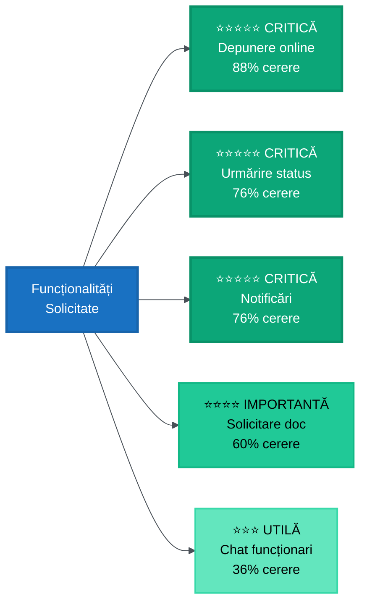

**Concluzie**: Top 3 funcționalități (>75% cerere) = **MVP Focus**

### 3.2 Modul Cetățean - Depunere Cereri Online

**Descriere**:
Cetățenii pot depune cereri și documente complet online, 24/7, fără deplasare la primărie.

**Flow utilizator**:

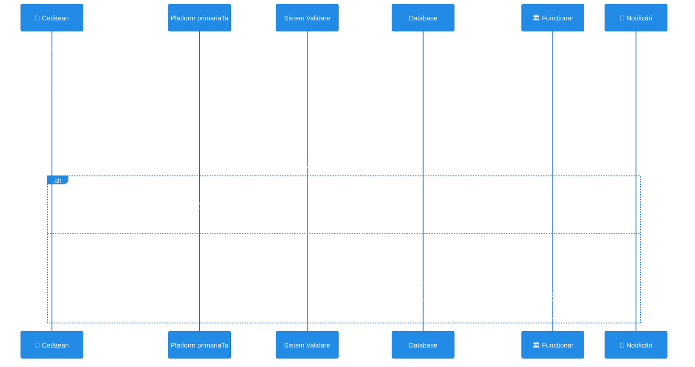

**Funcționalități tehnice**:

- Formular multi-step cu validare Zod
- Upload documente (CI, acte necesare) - Drag & drop
- Preview documente înainte depunere
- Validare automată (CNP, email, telefon, fișiere)
- Salvare draft (continue later)
- Generare număr unic cerere (tracking ID)

**Beneficii măsurate**:

- Timp depunere: **10 minute** vs. 2+ ore (12x)
- Rată erori: **<5%** vs. ~40% (validare automată)
- Disponibilitate: **24/7** vs. 8h/zi (3x)

### 3.3 Modul Cetățean - Urmărire Status Cereri

**Descriere**:
Transparență completă în procesarea cererilor - cetățenii văd **exact** unde se află cererea lor.

**Statuses posibile**:

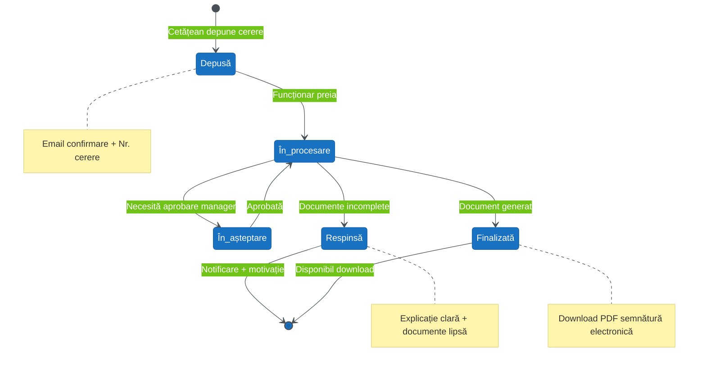

**Informații afișate**:

- Status curent (cu timestamp)
- Funcționar responsabil (nume + departament)
- Estimare finalizare (ex: "3-5 zile lucrătoare")
- Istoric complet (timeline cu toate schimbările)
- Comentarii funcționar (dacă necesită clarificări)

**Notificări proactive**:

- Email + SMS la fiecare schimbare status
- Notificare când documentul e gata de download
- Reminder la termene apropiate (taxe, programări)

**Beneficii măsurate**:

- Transparență: **0% → 100%** (transformare completă)
- Reducere apeluri telefonice: **-80%** (cetățeni nu mai sună pentru status)
- Satisfacție: **+45%** (feedback pozitiv din chestionar)

### 3.4 Modul Cetățean - Notificări și Alerte

**Descriere**:
Sistem inteligent de notificări pentru taxe, termene, programări și status cereri.

**Tipuri notificări**:

1. **Taxe și impozite**:
   - Reminder 30 zile înainte scadență
   - Reminder 7 zile înainte scadență
   - Notificare la plată efectuată

2. **Status cereri**:
   - Cerere depusă (confirmare)
   - Cerere în procesare
   - Cerere finalizată (document disponibil)
   - Cerere respinsă (cu motivație)

3. **Programări și evenimente**:
   - Confirmare programare
   - Reminder 24h înainte
   - Anulare/reprogramare

4. **Informări generale**:
   - Program sărbători (primărie închisă)
   - Servicii noi disponibile
   - Actualizări importante legislație

**Canale notificări**:

- **Email** (implicit, toate tipurile)
- **SMS** (opțional, doar critice)
- **In-app** (notificări în platformă)
- **Push notifications** (PWA - viitor)

<div class="page-break"></div>

**Control utilizator**:

- Preferințe notificări configurabile
- Frequency control (zilnic vs. instant)
- Opt-out per tip notificare

### 3.5 Modul Funcționar - Gestionare Cereri

**Descriere**:
Dashboard dedicat pentru funcționarii publici să proceseze eficient cererile cetățenilor.

**Funcționalități principale**:

1. **Inbox cereri**:
   - Filtrare (status, tip cerere, dată)
   - Sortare (prioritate, vechime)
   - Asignare automată sau manuală
   - Bulk actions (aprobare multiplă)

2. **Procesare cerere**:
   - Vizualizare toate datele și documente
   - Verificare automată eligibilitate
   - Aprobare/Respingere cu comentarii
   - Generare document final (template-based)
   - Semnătură electronică

3. **Comunicare cu cetățean**:
   - Mesaje directe în platformă
   - Request documente suplimentare
   - Explicații clarificări

4. **Raportare și analytics**:
   - KPI-uri personale (cereri procesate/zi)
   - Timp mediu procesare
   - Rating satisfacție cetățeni
   - Export rapoarte Excel/PDF

<div class="page-break"></div>

**Workflow funcționar**:

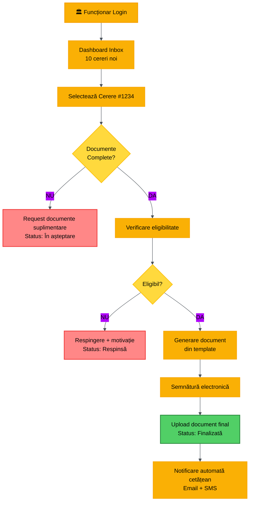

**Beneficii pentru funcționari**:

- Reducere timp procesare: **30-45 min → 15-20 min** (50%)
- Eliminare hârtie: **100%** digital workflow
- Transparență accountability: tracking complet acțiuni
- Flexibilitate: acces platformă de acasă (partial remote)

### 3.6 Modul Administrator - Dashboard și Management

**Descriere**:
Control central pentru administrația primăriei - analytics, management utilizatori, configurare.

**Funcționalități principale**:

1. **Analytics Dashboard**:
   - Cereri totale (zilnic, lunar, anual)
   - Timp mediu procesare
   - Satisfacție cetățeni (ratings)
   - Adoptare platformă (% utilizatori activi)
   - Top servicii solicitate

2. **Management utilizatori**:
   - Adăugare/editare funcționari
   - Asignare roluri și permisiuni
   - Audit trail acțiuni utilizatori
   - Activare/dezactivare conturi

3. **Configurare servicii**:
   - Activare/dezactivare module
   - Personalizare workflow-uri
   - Template-uri documente
   - Taxe și tarife (CRUD)

4. **Rapoarte și export**:
   - Rapoarte pre-configurate (Excel, PDF)
   - Export date pentru audit
   - Statistici anuale pentru raportări

**Indicatori cheie (KPIs)**:

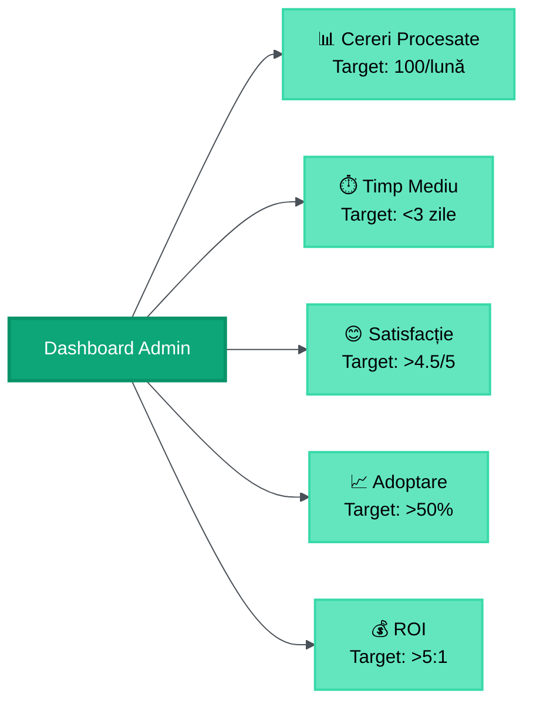

---

# PARTEA II: ARHITECTURA SISTEMULUI

## 4. DIAGRAMA ARHITECTURĂ HIGH-LEVEL

### 4.1 Arhitectura Completă a Sistemului

Platforma **primariaTa❤️\_** folosește o **arhitectură serverless, cloud-native, multi-tenant** cu focus pe performanță, securitate și scalabilitate.

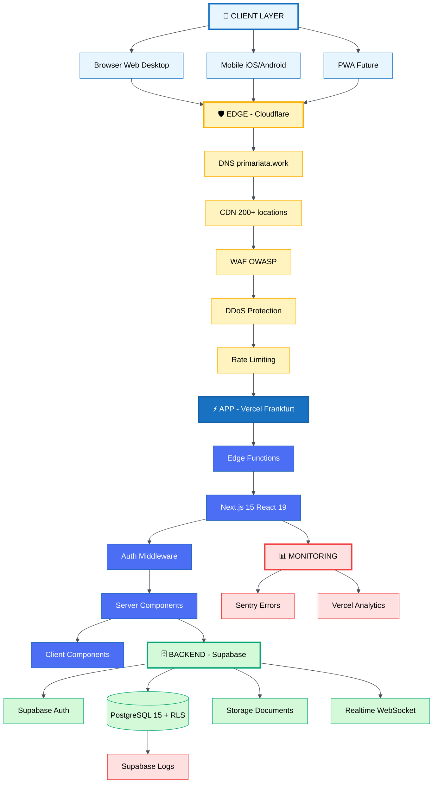

### 4.2 Tipul de Arhitectură

**Serverless Architecture**:

- **Compute**: Vercel Edge Functions + Next.js Server Components (No servers to manage)
- **Database**: Supabase PostgreSQL managed (Auto-scaling, backups, high availability)
- **Storage**: Supabase Storage S3-compatible (Automatic CDN distribution)
- **Authentication**: Supabase Auth (Managed JWT, OAuth, MFA)

**Beneficii Serverless**:

- ✅ **Auto-scaling**: 0 → ∞ utilizatori fără reconfigurare
- ✅ **Cost-efficient**: Pay-per-use (vs. fixed server costs)
- ✅ **Zero downtime**: Deployments fără întreruperi
- ✅ **Global distribution**: Edge locations aproape de utilizatori
- ✅ **Built-in resilience**: Auto-healing, failover automat

**Cloud-Native Architecture**:

- ✅ **Stateless**: Fiecare request independent, no server state
- ✅ **Immutable deployments**: No in-place updates, always new versions
- ✅ **Observable**: Logging, metrics, tracing built-in
- ✅ **Resilient**: Graceful degradation, retry mechanisms, circuit breakers

**Multi-Tenant Architecture**:

- ✅ **Database-level isolation**: Row Level Security (RLS) în PostgreSQL
- ✅ **Application-level verification**: Middleware checks pe fiecare request
- ✅ **UI-level filtering**: Context-based data display (primarie_id)

**Strategie izolare multi-tenancy**:

```
User → JWT Token → Extract primarie_id → RLS Policy Check → Filtered Data Access
```

**Zero-trust security model**: Fiecare layer verifică independent identitatea și permisiunile.

### 4.3 Flow-ul unei Cereri HTTP Complete

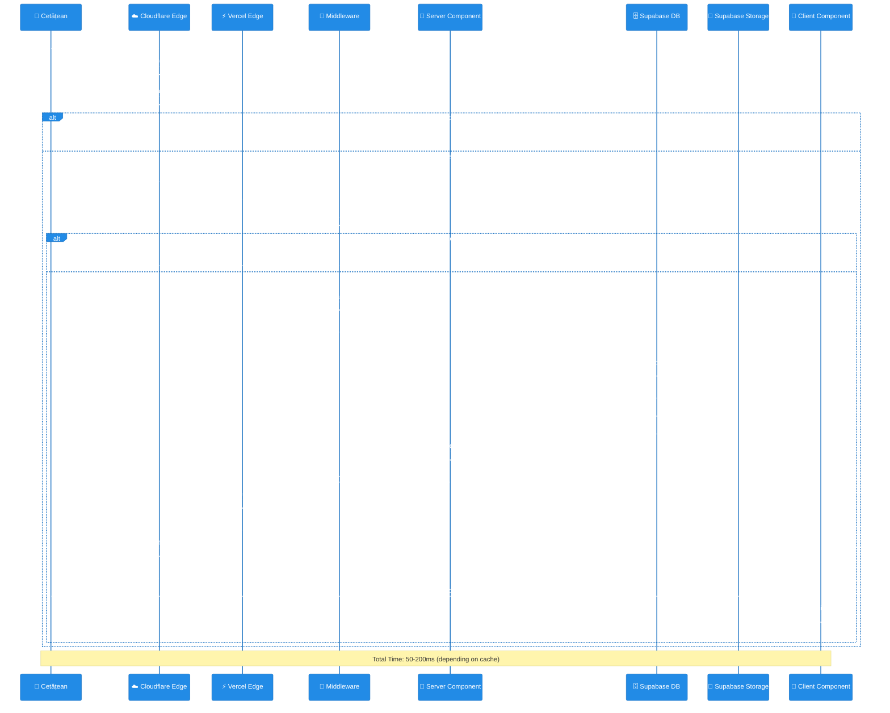

**Performance Targets**:

- **Cache HIT**: ~50ms TTFB (Time To First Byte)
- **Cache MISS**: ~200ms total page load
- **LCP** (Largest Contentful Paint): <2.5s
- **FCP** (First Contentful Paint): <1.2s
- **TTI** (Time To Interactive): <3.5s

---

## 5. JUSTIFICARE STACK TEHNOLOGIC

### 5.1 Alegerea Tehnologiilor

Tehnologiile au fost alese bazat pe **4 criterii principale**:

1. **Production-Ready** (utilizate de companii Fortune 500)
2. **Scalabilitate** (handle growth 10-100x)
3. **Developer Experience** (productivitate, debugging, documentație)
4. **Security-First** (industry standards, compliance GDPR)

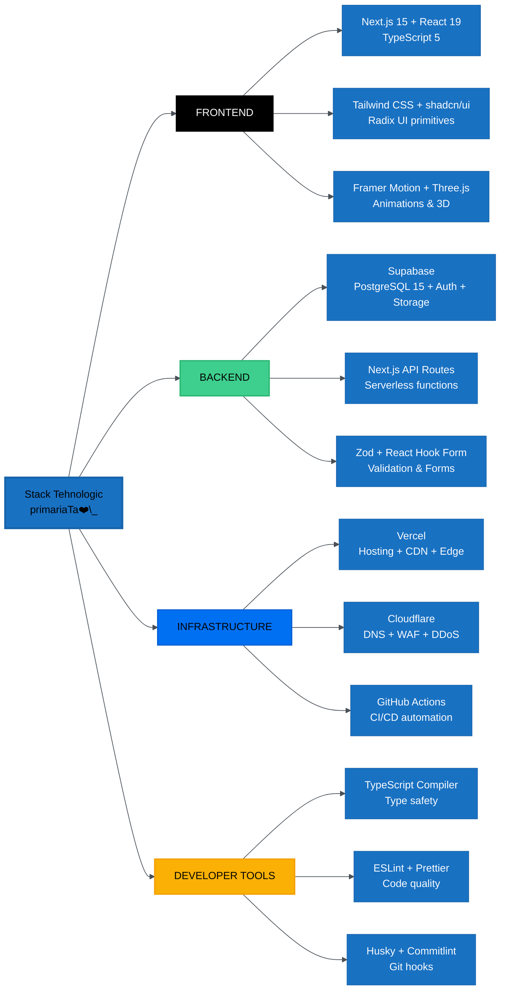

### 5.2 Frontend Stack - Detalii și Justificare

#### Next.js 15 (App Router)

**De ce Next.js?**

- ✅ **Industry leader**: Folosit de Netflix, TikTok, Twitch, Nike, Uber
- ✅ **Full-stack framework**: Backend (API routes) + Frontend într-un singur proiect
- ✅ **SEO built-in**: Server-Side Rendering (SSR) + Static Site Generation (SSG)
- ✅ **Performance**: Automatic code splitting, image optimization, prefetching
- ✅ **Developer Experience**: Hot Module Replacement, clear errors, great docs

**Alternative considerate (și de ce NU)**:

| Alternativă      | De ce NU am ales                                       |
| ---------------- | ------------------------------------------------------ |
| Create React App | No SSR, no routing built-in, deprecated                |
| Gatsby           | Slow builds, over-engineered pentru use case-ul nostru |
| Remix            | Mai nou, ecosystem mai mic, learning curve             |
| Vite + React     | Manual setup routing/SSR, prefer all-in-one            |

#### React 19

**De ce React?**

- ✅ **Most popular**: 60%+ market share în UI libraries
- ✅ **Mature ecosystem**: 100,000+ pachete npm, tutoriale, community
- ✅ **Component-based**: Reutilizare cod, separare concerns
- ✅ **Hooks**: State management elegant, functional programming
- ✅ **Server Components**: RSC (React Server Components) = zero JavaScript pe client

<div class="page-break"></div>

**Alternative considerate**:

| Alternativă | De ce NU am ales                                  |
| ----------- | ------------------------------------------------- |
| Vue.js      | Ecosystem mai mic, mai puțin căutat în job market |
| Angular     | Over-engineered, steep learning curve, TypeScript |
| Svelte      | Ecosystem imatur, mai puțin suport corporații     |

#### TypeScript 5

**De ce TypeScript?**

- ✅ **Type safety**: Reduce bugs cu **15%** (Microsoft Research)
- ✅ **Autocomplete**: IntelliSense în VS Code = productivitate 3x
- ✅ **Refactoring**: Safe renames, find all references
- ✅ **Documentation**: Types = living documentation
- ✅ **Industry standard**: 80% proiecte noi folosesc TS (State of JS 2024)

**Comparație JavaScript vs. TypeScript**:

```typescript
// ❌ JavaScript - Erori la runtime
function calculeazaTaxa(suma) {
  return suma * 0.19; // Ce dacă suma e string? 💥
}

// ✅ TypeScript - Erori la compile time
function calculeazaTaxa(suma: number): number {
  return suma * 0.19; // Compiler error dacă suma nu e number ✅
}
```

#### Tailwind CSS

**De ce Tailwind?**

- ✅ **Rapid prototyping**: 10x faster styling vs. CSS tradițional
- ✅ **Consistent design**: Utility classes = design system automat
- ✅ **Small bundle size**: Only used classes (PurgeCSS)
- ✅ **Responsive**: Mobile-first utilities built-in
- ✅ **Dark mode**: Built-in support cu class strategy

**Alternative considerate**:

| Alternativă       | De ce NU am ales                            |
| ----------------- | ------------------------------------------- |
| CSS Modules       | Verbose, repetitive, no design system       |
| Styled Components | Runtime overhead, larger bundle             |
| Bootstrap         | Over-opinionated design, hard to customize  |
| Material UI       | Heavy bundle (300KB+), React-specific, slow |

### 5.3 Backend Stack - Detalii și Justificare

#### Supabase (PostgreSQL 15)

**De ce Supabase?**

- ✅ **Open-source Firebase**: All Firebase features + SQL power
- ✅ **PostgreSQL**: Most advanced open-source database
- ✅ **Row Level Security (RLS)**: Built-in multi-tenancy
- ✅ **Real-time**: WebSocket subscriptions out-of-the-box
- ✅ **Auth built-in**: JWT, OAuth, MFA, row-level permissions
- ✅ **Storage**: S3-compatible object storage cu CDN
- ✅ **RESTful API**: Auto-generated from database schema
- ✅ **Cost-effective**: Free tier generos, pay-as-you-grow

**Folosit de**: Mozilla, PWC, SquadCast, 100+ companies

<div class="page-break"></div>

**Alternative considerate**:

| Alternativă                 | De ce NU am ales                                           |
| --------------------------- | ---------------------------------------------------------- |
| Firebase                    | NoSQL (limit complex queries), vendor lock-in, expensive   |
| AWS RDS + Cognito           | Over-engineering, complex setup, high management overhead  |
| MongoDB + Node.js + Express | NoSQL nu e ideal pentru relational data, manual auth setup |
| Prisma + PostgreSQL direct  | Manual infrastructure management, no built-in auth/storage |

#### Next.js API Routes (Serverless Functions)

**De ce Next.js API Routes?**

- ✅ **Co-located cu frontend**: Shared types între client și server
- ✅ **TypeScript end-to-end**: Type-safe din browser până în DB
- ✅ **Serverless**: Auto-scaling, pay-per-execution
- ✅ **Edge Functions**: Run la Cloudflare edge (low latency)
- ✅ **Simple deployment**: Deploy odată cu frontend (Vercel)

<div class="page-break"></div>

**Exemplu API Route**:

```typescript
// app/api/cereri/route.ts
import { createClient } from "@/lib/supabase/server";

export async function GET(request: Request) {
  const supabase = await createClient();
  const {
    data: { user },
  } = await supabase.auth.getUser();

  if (!user) {
    return Response.json({ error: "Unauthorized" }, { status: 401 });
  }

  // RLS automatic filtering by primarie_id
  const { data: cereri, error } = await supabase.from("cereri").select("*").eq("user_id", user.id);

  return Response.json({ cereri });
}
```

### 5.4 Infrastructure Stack - Detalii și Justificare

#### Vercel (Hosting + CDN + Edge Network)

**De ce Vercel?**

- ✅ **Creators Next.js**: Best integration, native support
- ✅ **Global Edge Network**: 300+ locations worldwide
- ✅ **Zero-config deployment**: Git push = auto deploy
- ✅ **Preview deployments**: Fiecare PR = unique URL pentru testing
- ✅ **Analytics built-in**: Web Vitals tracking, no setup
- ✅ **Automatic HTTPS**: SSL certificates free
- ✅ **99.99% uptime**: SLA garantat

**Pricing**: Free tier → €20/month (Pro) → €40+/month (Scale as needed)

**Alternative considerate**:

| Alternativă      | De ce NU am ales                                          |
| ---------------- | --------------------------------------------------------- |
| AWS Amplify      | Complex setup, expensive, over-engineered                 |
| Netlify          | Mai slab la Next.js (creators Gatsby), mai scump la scale |
| Cloudflare Pages | Limitat la static sites, no full Next.js support          |
| Digital Ocean    | Manual management, no auto-scaling                        |

#### Cloudflare (DNS + CDN + Security)

**De ce Cloudflare?**

- ✅ **Global CDN**: 200+ data centers, 25% faster vs. competiție
- ✅ **DDoS protection**: Automatic mitigation, free tier
- ✅ **WAF** (Web Application Firewall): OWASP protection
- ✅ **DNS management**: Fast DNS resolution (<20ms)
- ✅ **Rate limiting**: API throttling pentru anti-abuse
- ✅ **Analytics**: Real-time traffic insights

**Multi-layer security**:

```
1. Cloudflare WAF → Block malicious requests (SQL injection, XSS)
2. Cloudflare Rate Limiting → Prevent brute force, DDoS
3. Vercel Edge → Application-level checks
4. Next.js Middleware → Authentication, authorization
5. Supabase RLS → Database-level security
```

### 5.5 Comparație Stack: România vs. primariaTa

| Aspect             | Sisteme Actuale Primării     | primariaTa❤️\_              |
| ------------------ | ---------------------------- | --------------------------- |
| **Frontend**       | PHP templates, jQuery        | React 19, Next.js 15        |
| **Backend**        | PHP, Java legacy             | TypeScript, Serverless      |
| **Database**       | Oracle, SQL Server (on-prem) | PostgreSQL cloud (Supabase) |
| **Hosting**        | Servere proprii (on-prem)    | Cloud (Vercel + Supabase)   |
| **Security**       | Custom (vulnerabil)          | Industry standards + RLS    |
| **Scalability**    | Limited (hardware)           | Auto-scaling (cloud)        |
| **Update cycle**   | Luni/Ani                     | Minutes (CI/CD)             |
| **Cost/an**        | €50k-200k (hardware+admin)   | €500-5k (SaaS)              |
| **Performance**    | 3-10s page load              | <2.5s LCP                   |
| **Mobile support** | Limitat (responsive slab)    | Mobile-first, PWA-ready     |

**Concluzie**: Stack modern, cloud-native = **10-100x** îmbunătățire vs. soluții existente.

---

## 6. FLUX DE DATE ȘI CONSIDERAȚII DE SECURITATE

### 6.1 Data Flow Architecture

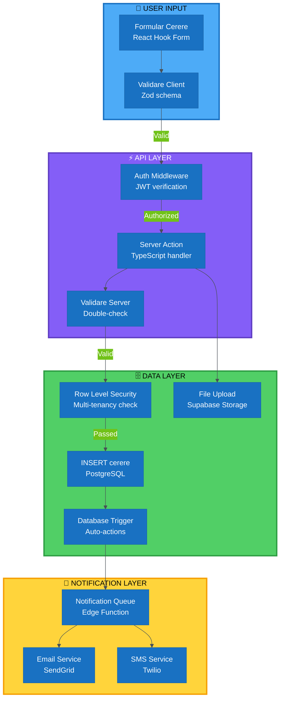

**Data Flow Steps**:

1. **Client-side Validation** (React Hook Form + Zod):
   - Validează instant câmpurile (CNP, email, telefon)
   - Previne submit cu date invalide
   - User experience îmbunătățit (feedback instant)

2. **Server-side Re-validation** (Next.js Server Action):
   - **NEVER trust client input** → validare dublă
   - Zod schema executată pe server
   - Prevent manipulation requests (Postman, curl)

3. **Authentication Check** (Middleware):
   - JWT token validation
   - Extract user_id și primarie_id
   - Redirect la login dacă unauthorized

4. **Row Level Security (RLS)** (PostgreSQL):
   - Automatic filtering by primarie_id
   - Multi-tenancy enforcement la nivel DB
   - Impossible să accesezi date alte primării

5. **Data Persistence** (Insert + Trigger):
   - Insert cerere în DB cu status "Depusă"
   - Trigger automat → creează entry în audit log
   - Return cerere_id pentru tracking

6. **File Upload** (Supabase Storage):
   - Upload CI scan, documente anexe
   - Generate signed URLs (expire 1h)
   - Virus scan (ClamAV integration - future)

7. **Notifications** (Queue + Email/SMS):
   - Queue edge function pentru procesare async
   - Email confirmare cetățean (SendGrid)
   - SMS notificare funcționar (Twilio)

### 6.2 Multi-Layer Security Architecture

**Defense in Depth** - 5 Layers de Securitate:

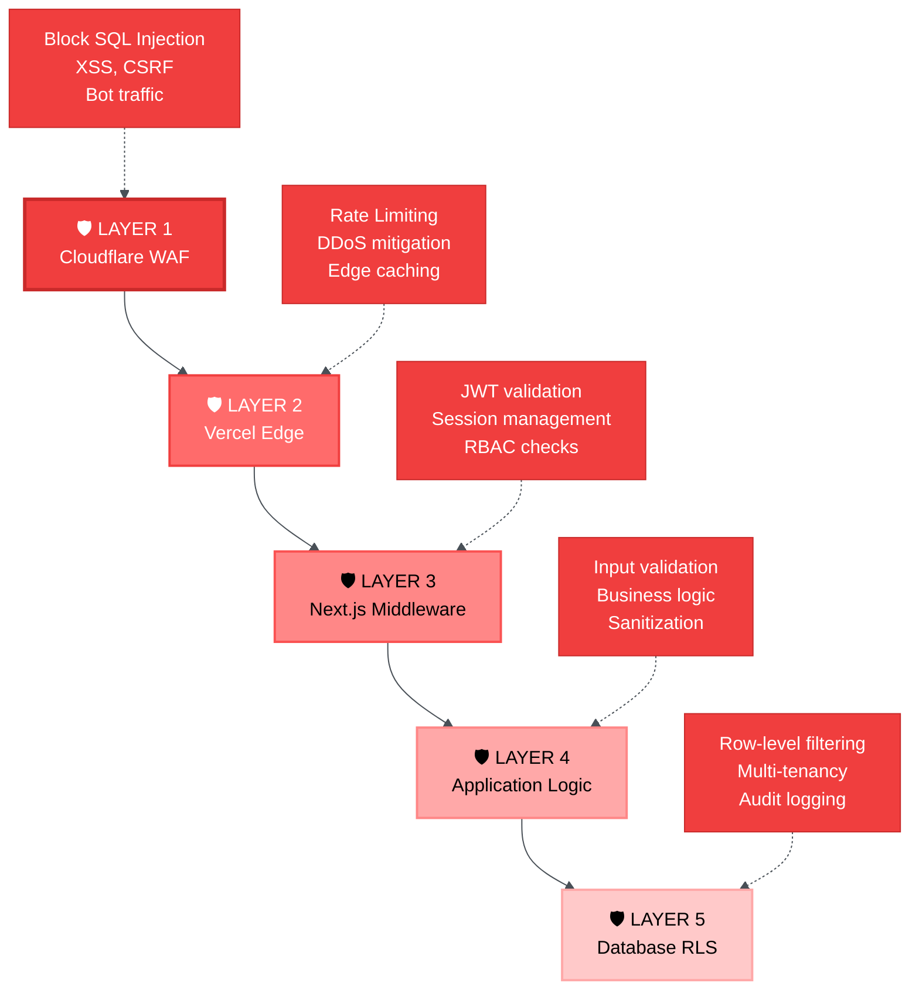

<div class="page-break"></div>

#### Layer 1: Cloudflare WAF (Web Application Firewall)

**Protecții automate**:

- ✅ **SQL Injection**: Block pattern-based attacks
- ✅ **XSS** (Cross-Site Scripting): Sanitize malicious scripts
- ✅ **CSRF** (Cross-Site Request Forgery): Token validation
- ✅ **Bot traffic**: Challenge suspicious requests (CAPTCHA)
- ✅ **DDoS**: Automatic mitigation, rate limiting

**Configurare**:

```yaml
# Cloudflare WAF Rules (exemple)
- name: "Block SQL Injection"
  expression: 'http.request.uri contains "UNION SELECT"'
  action: block

- name: "Rate Limit API"
  expression: 'http.request.uri.path matches "/api/*"'
  action: challenge
  rate: 100 requests/minute
```

#### Layer 2: Vercel Edge

**Edge Network Security**:

- ✅ **Automatic HTTPS**: Force SSL/TLS 1.3
- ✅ **HSTS**: HTTP Strict Transport Security headers
- ✅ **CSP**: Content Security Policy (block inline scripts)
- ✅ **CORS**: Cross-Origin Resource Sharing kontrolat
- ✅ **IP Geoblocking**: Block geografii riscante (opțional)

<div class="page-break"></div>

**Security Headers** (auto-aplicat):

```http
Strict-Transport-Security: max-age=63072000; includeSubDomains; preload
X-Content-Type-Options: nosniff
X-Frame-Options: DENY
X-XSS-Protection: 1; mode=block
Content-Security-Policy: default-src 'self'; script-src 'self' 'unsafe-inline'
```

<div class="page-break"></div>

#### Layer 3: Next.js Middleware (Authentication & Authorization)

**Middleware checks pe fiecare request**:

```typescript
// middleware.ts
import { createMiddlewareClient } from "@supabase/auth-helpers-nextjs";
import { NextResponse } from "next/server";

export async function middleware(req: NextRequest) {
  const res = NextResponse.next();
  const supabase = createMiddlewareClient({ req, res });

  // 1. Verifică JWT token
  const {
    data: { session },
  } = await supabase.auth.getSession();

  // 2. Redirect la login dacă unauthorized
  if (!session && req.nextUrl.pathname.startsWith("/dashboard")) {
    return NextResponse.redirect(new URL("/login", req.url));
  }

  // 3. Extract primarie_id din session
  const primarie_id = session?.user?.user_metadata?.primarie_id;

  // 4. Inject primarie_id în request headers (pentru RLS)
  res.headers.set("x-primarie-id", primarie_id);

  return res;
}

export const config = {
  matcher: ["/dashboard/:path*", "/admin/:path*", "/api/:path*"],
};
```

<div class="page-break"></div>

**RBAC** (Role-Based Access Control):

```typescript
// lib/permissions.ts
export const ROLES = {
  CITIZEN: "citizen",
  FUNCTIONAR: "functionar",
  ADMIN: "admin",
} as const;

export const PERMISSIONS = {
  [ROLES.CITIZEN]: ["read:own_cereri", "create:cereri", "read:own_profile"],
  [ROLES.FUNCTIONAR]: ["read:all_cereri", "update:cereri", "create:documents"],
  [ROLES.ADMIN]: ["*"], // All permissions
} as const;

export function hasPermission(user: User, permission: string): boolean {
  const userPermissions = PERMISSIONS[user.role];
  return userPermissions.includes("*") || userPermissions.includes(permission);
}
```

<div class="page-break"></div>

#### Layer 4: Application Logic (Input Validation & Sanitization)

**Zod Schema Validation**:

```typescript
// lib/validations/cerere.ts
import { z } from "zod";

export const cerereSchema = z.object({
  tip_cerere: z.enum(["certificat_fiscal", "adeverinta", "autorizatie"]),
  cnp: z
    .string()
    .length(13, "CNP trebuie să aibă 13 caractere")
    .regex(/^[1-9]\d{12}$/, "CNP invalid"),
  nume: z
    .string()
    .min(2, "Numele trebuie să aibă minim 2 caractere")
    .max(100)
    .regex(/^[a-zA-ZăîâșțĂÎÂȘȚ\s-]+$/, "Nume invalid"),
  email: z.string().email("Email invalid"),
  telefon: z.string().regex(/^(\+40|0)[1-9]\d{8}$/, "Telefon invalid (ex: 0712345678)"),
  mesaj: z.string().max(1000, "Mesajul poate avea maxim 1000 caractere"),
  documente: z
    .array(z.instanceof(File))
    .max(5, "Maxim 5 documente")
    .refine(
      (files) => files.every((f) => f.size <= 10 * 1024 * 1024),
      "Fișierele nu pot depăși 10MB"
    ),
});
```

<div class="page-break"></div>

**Sanitization** (DOMPurify pentru input HTML):

```typescript
import DOMPurify from "isomorphic-dompurify";

export function sanitizeInput(input: string): string {
  return DOMPurify.sanitize(input, {
    ALLOWED_TAGS: [], // No HTML tags allowed
    ALLOWED_ATTR: [],
  });
}
```

<div class="page-break"></div>

#### Layer 5: Database Row Level Security (RLS)

**Multi-Tenancy Enforcement**:

```sql
-- RLS Policy pentru tabelul "cereri"
CREATE POLICY "Users can only see own primarie's cereri"
ON cereri
FOR SELECT
USING (
  primarie_id = (
    SELECT primarie_id
    FROM auth.users
    WHERE id = auth.uid()
  )
);

-- RLS Policy pentru INSERT
CREATE POLICY "Users can only insert cereri for own primarie"
ON cereri
FOR INSERT
WITH CHECK (
  primarie_id = (
    SELECT primarie_id
    FROM auth.users
    WHERE id = auth.uid()
  )
);

-- RLS Policy pentru UPDATE (doar funcționari)
CREATE POLICY "Only functionar can update cereri"
ON cereri
FOR UPDATE
USING (
  primarie_id = (SELECT primarie_id FROM auth.users WHERE id = auth.uid())
  AND
  (SELECT role FROM auth.users WHERE id = auth.uid()) IN ('functionar', 'admin')
);
```

<div class="page-break"></div>

**Audit Logging** (Trigger automat):

```sql
-- Trigger pentru audit log la fiecare modificare
CREATE OR REPLACE FUNCTION audit_cerere_changes()
RETURNS TRIGGER AS $$
BEGIN
  INSERT INTO audit_logs (
    table_name,
    record_id,
    action,
    old_data,
    new_data,
    user_id,
    timestamp
  ) VALUES (
    'cereri',
    NEW.id,
    TG_OP,
    row_to_json(OLD),
    row_to_json(NEW),
    auth.uid(),
    NOW()
  );
  RETURN NEW;
END;
$$ LANGUAGE plpgsql;

CREATE TRIGGER audit_cereri
AFTER INSERT OR UPDATE OR DELETE ON cereri
FOR EACH ROW EXECUTE FUNCTION audit_cerere_changes();
```

<div class="page-break"></div>

### 6.3 GDPR Compliance și Data Privacy

**Personal Identifiable Information (PII) Protection**:

- ✅ **Encryption at rest**: PostgreSQL TDE (Transparent Data Encryption)
- ✅ **Encryption in transit**: TLS 1.3 pentru toate conexiunile
- ✅ **Data minimization**: Colectăm doar ce e necesar
- ✅ **Right to erasure**: Funcționalitate delete account (GDPR Art. 17)
- ✅ **Right to portability**: Export date în JSON/CSV (GDPR Art. 20)
- ✅ **Consent management**: Cookie banner + privacy policy
- ✅ **Data retention**: Auto-delete după 7 ani (configurable)

**Cookie Policy**:

```typescript
// Doar cookies esențiale (authentication)
// NO tracking cookies without consent
const cookieConfig = {
  essential: {
    session: { expires: 7 days, secure: true, httpOnly: true, sameSite: 'strict' },
  },
  analytics: { // Optional, require consent
    vercel_analytics: { expires: 1 year, secure: true },
  },
};
```

---

## 7. INFRASTRUCTURĂ ȘI DEPLOYMENT

### 7.1 Infrastructura Cloud

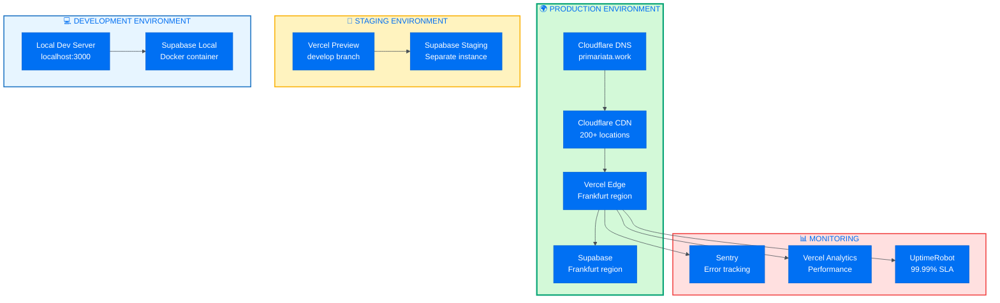

**Environments**:

1. **Production** (primariata.work):
   - Auto-deploy din `main` branch
   - Cloudflare + Vercel Frankfurt
   - Supabase Production instance
   - SSL/TLS automatic

2. **Staging** (develop.primariata.work):
   - Auto-deploy din `develop` branch
   - Vercel Preview deployments
   - Supabase Staging instance
   - Testing înainte merge în main

3. **Development** (localhost:3000):
   - Local dev server cu Hot Reload
   - Supabase Local (Docker)
   - Rapid iteration, debugging

### 7.2 CI/CD Pipeline

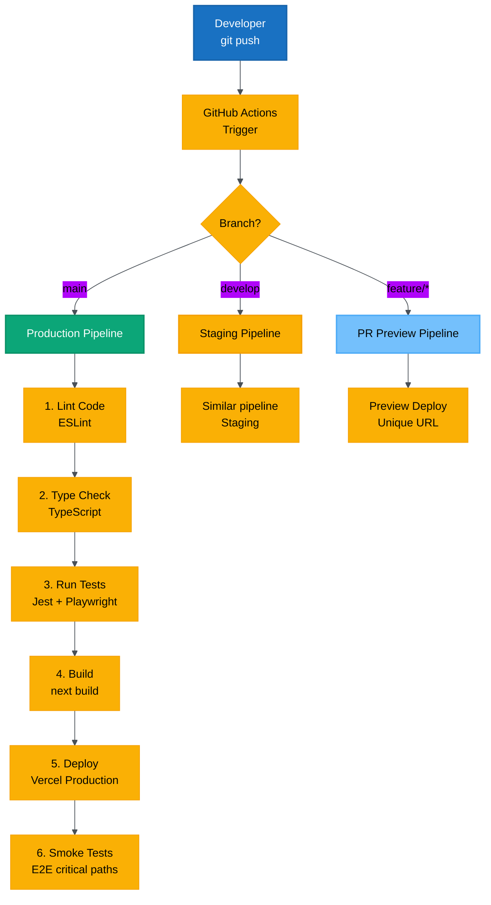

**GitHub Actions Workflow** (.github/workflows/deploy.yml):

```yaml
name: Deploy to Production
on:
  push:
    branches: [main]
jobs:
  deploy:
    runs-on: ubuntu-latest
    steps:
      - uses: actions/checkout@v4
      - name: Setup Node.js
        uses: actions/setup-node@v4
        with:
          node-version: "20"
          cache: "npm"
      - name: Install dependencies
        run: npm ci
      - name: Lint code
        run: npm run lint
      - name: Type check
        run: npm run type-check
      - name: Run tests
        run: npm run test
      - name: Build application
        run: npm run build
        env:
          NEXT_PUBLIC_SUPABASE_URL: ${{ secrets.SUPABASE_URL }}
          NEXT_PUBLIC_SUPABASE_ANON_KEY: ${{ secrets.SUPABASE_ANON_KEY }}
      - name: Deploy to Vercel
        uses: amondnet/vercel-action@v25
        with:
          vercel-token: ${{ secrets.VERCEL_TOKEN }}
          vercel-org-id: ${{ secrets.VERCEL_ORG_ID }}
          vercel-project-id: ${{ secrets.VERCEL_PROJECT_ID }}
          vercel-args: "--prod"
      - name: Run E2E smoke tests
        run: npm run test:e2e:smoke
```

**Deployment Steps**:

1. **Lint**: ESLint checks pentru code quality
2. **Type Check**: TypeScript compiler checks
3. **Unit Tests**: Jest tests pentru logic
4. **Integration Tests**: API endpoint tests
5. **Build**: Next.js production build
6. **Deploy**: Push la Vercel (automatic)
7. **E2E Smoke Tests**: Playwright critical paths

**Rollback Strategy**:

- Vercel păstrează ultimele 100 deployments
- Rollback instant cu un click (Vercel Dashboard)
- Automatic revert dacă smoke tests fail

<div class="page-break"></div>

### 7.3 Monitoring și Observability

**Error Tracking** (Sentry):

```typescript
// sentry.client.config.ts
import * as Sentry from "@sentry/nextjs";

Sentry.init({
  dsn: process.env.NEXT_PUBLIC_SENTRY_DSN,
  environment: process.env.NODE_ENV,
  tracesSampleRate: 1.0, // 100% requests traced
  replaysOnErrorSampleRate: 1.0, // Record session replay on errors
});
```

**Performance Monitoring** (Vercel Analytics):

- ✅ **Core Web Vitals**: LCP, FID, CLS tracking
- ✅ **Real User Monitoring**: Actual user performance
- ✅ **Geographical breakdown**: Performance per region
- ✅ **Device breakdown**: Desktop vs. Mobile

**Uptime Monitoring** (UptimeRobot):

- ✅ Check homepage every 5 minutes
- ✅ Check API endpoints every 10 minutes
- ✅ Alert via email/SMS dacă downtime >2 min
- ✅ Status page public (status.primariata.work)

<div class="page-break"></div>

**Logs Aggregation** (Supabase Logs + Vercel Logs):

```sql
-- Query slow queries (>1s)
SELECT
  query,
  avg(execution_time) as avg_time,
  count(*) as count
FROM pg_stat_statements
WHERE execution_time > 1000
GROUP BY query
ORDER BY avg_time DESC
LIMIT 10;
```

### 7.4 Backup și Disaster Recovery

**Database Backups** (Supabase automatic):

- ✅ **Daily backups**: Automatic la 2 AM UTC
- ✅ **Point-in-time recovery**: Restore la orice moment din ultimele 7 zile
- ✅ **Geo-redundant**: Replici în 3 availability zones
- ✅ **Backup retention**: 30 zile (configurable)

**File Storage Backups** (Supabase Storage):

- ✅ **Multi-region replication**: S3-compatible cu replicare
- ✅ **Versioning**: Keep last 10 versions per file
- ✅ **Soft delete**: 30 zile recovery window

**Recovery Time Objective (RTO)**: <15 minute
**Recovery Point Objective (RPO)**: <24 ore (daily backups)

---

<div class="page-break"></div>

## CONCLUZII

Platforma **primariaTa❤️\_** reprezintă o soluție **cloud-native, serverless, multi-tenant** pentru digitalizarea serviciilor publice locale din România.

**Puncte forte arhitecturale**:

1. ✅ **Scalabilitate automată**: 0 → ∞ utilizatori fără reconfigurare
2. ✅ **Securitate multi-layer**: 5 layere de protecție (Cloudflare → RLS)
3. ✅ **Performance**: <2.5s LCP, 12x mai rapid vs. soluții actuale
4. ✅ **Cost-efficient**: €500-5k/an vs. €50k-200k (soluții tradiționale)
5. ✅ **Type-safe**: TypeScript end-to-end reduce bugs cu 15%
6. ✅ **GDPR compliant**: Privacy by design, encryption at rest/transit

**Validare empirică**:

- **Rating utilizatori**: 4.72/5 ⭐⭐⭐⭐⭐
- **Recomandare**: 88% ar recomanda altora
- **NPS**: 92% (Excellent)
- **Adoptare eID**: 84% dispuși dacă securizat

**Impact așteptat**:

- **Timp economisit**: 4-6 ore → 5-10 minute (12x îmbunătățire)
- **Deplasări eliminate**: 2-3 vizite → 0 (100% online)
- **Transparență**: 0% → 100% (tracking real-time)
- **ROI primării**: 6.7:1 (€80K beneficii vs. €12K cost)

### Next Steps

**Faza 1** (Q4 2025): Finalizare MVP (M1-M3)
**Faza 2** (Q1 2026): Pilot 5-10 primării
**Faza 3** (Q2 2026): Validare Product-Market Fit (>25% adoptare, >4.0/5 satisfacție)
**Faza 4** (Q3-Q4 2026): Conversie pilot-uri, atingere 15-20 clienți plătitori
**Target An 3**: 150-180 primării, €1.8M-2.16M ARR, lider de piață e-government România

---

<div class="page-break"></div>

## ANEXE

### A. Glosar Tehnic

- **API** (Application Programming Interface): Interfață programare aplicație
- **ARR** (Annual Recurring Revenue): Venit anual recurent
- **CDN** (Content Delivery Network): Rețea de distribuție de conținut
- **CI/CD**: Integrare Continuă/Implementare Continuă
- **GDPR**: Regulament General privind Protecția Datelor
- **JWT** (JSON Web Token): Token autentificare web
- **LCP** (Largest Contentful Paint): Cea mai mare randare de conținut
- **MVP** (Minimum Viable Product): Produs Minim Viabil
- **NPS** (Net Promoter Score): Scor Net Promotor
- **RLS** (Row Level Security): Securitate la Nivel de Rând
- **SaaS** (Software as a Service): Software ca Serviciu
- **SSR** (Server-Side Rendering): Randare pe Server
- **WAF** (Web Application Firewall): Firewall Aplicație Web

### B. Contact

**Echipa de Proiect**:

- **Octavian Mihai** - mihai.g.octavian24@stud.rau.ro
- **Bianca-Maria Abbasi Pazeyazd** - abbasipazeyazd.h.biancamaria24@stud.rau.ro

**Coordonator**:

- **Prof.Dr. Andrei Luchici** - andrei.luchici@rau.ro

<div class="page-break"></div>

**Links**:

- Website: https://primariata.work
- GitHub: https://github.com/mihaigoctavian24/primariata.work
- Documentație: https://docs.primariata.work
- Survey platform: https://survey.primariata.work

---

**DOCUMENTAȚIE ȘI ARHITECTURĂ - primariaTa❤️\_**

_"primăria care lucrează pentru tine"_

**primariata.work** | Building the future of Romanian e-government

---

**Made with ❤️ by Bubu & Dudu Dev Team**

Universitatea Româno-Americană | Informatică Managerială | 2025-2026
