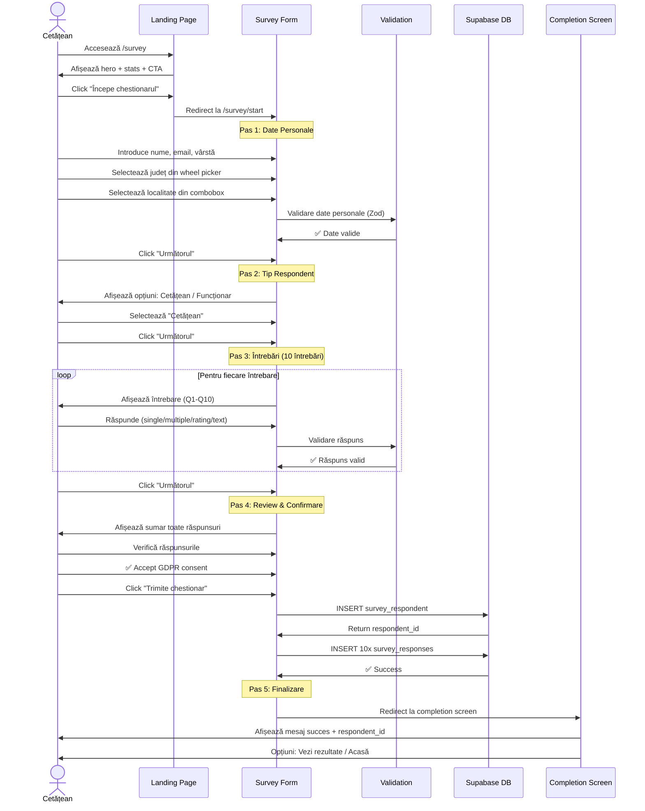
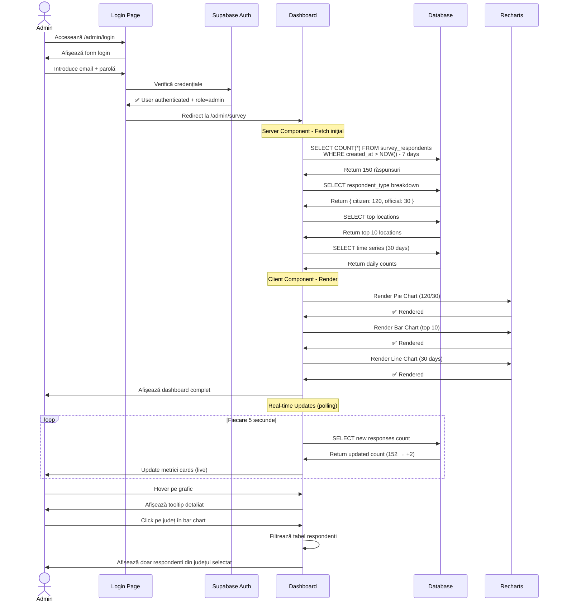
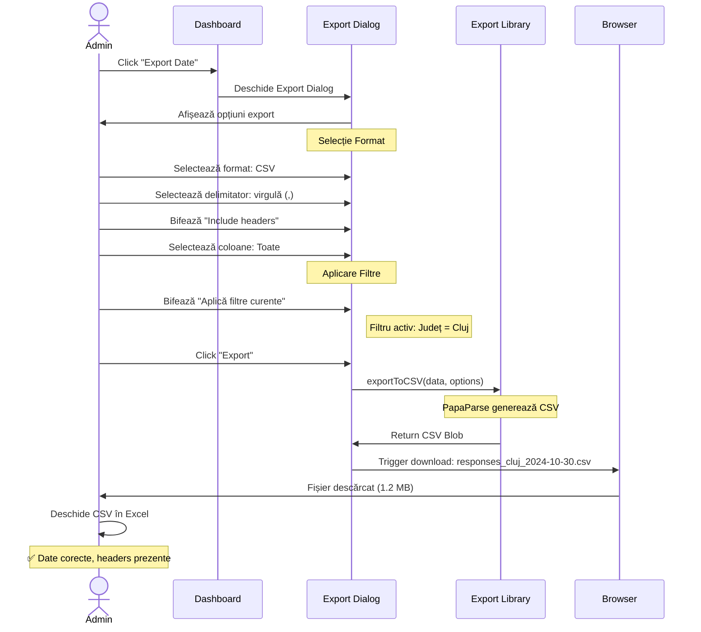
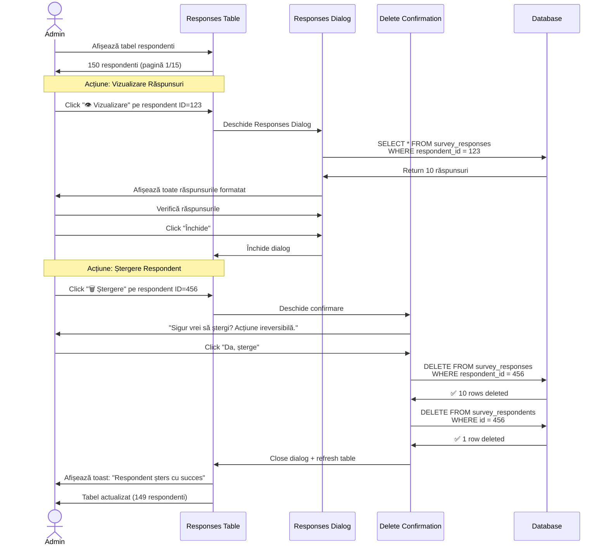
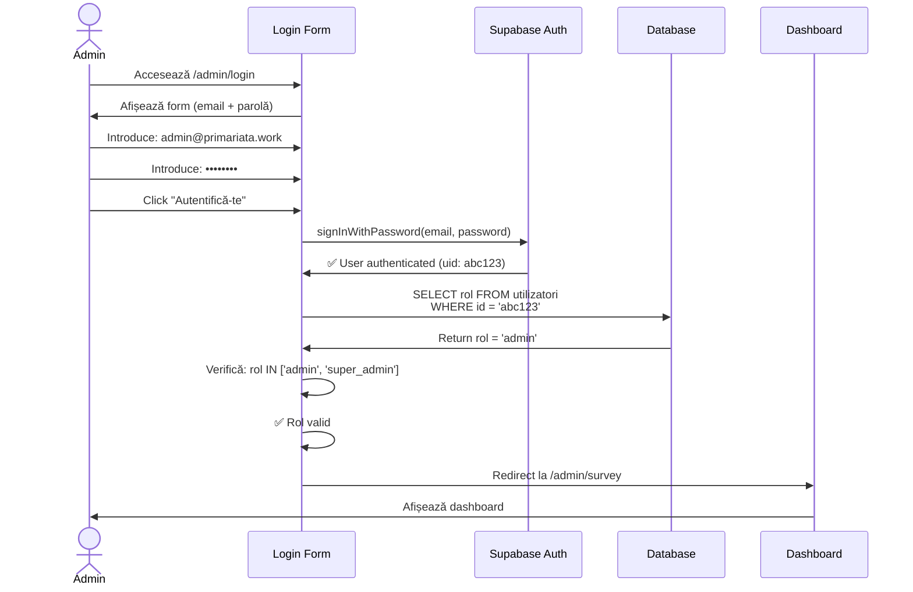
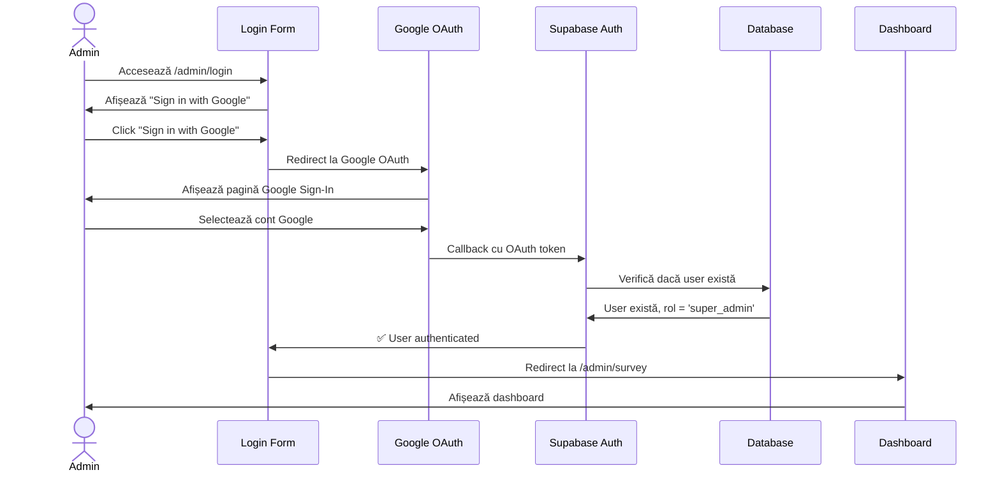

# 🎭 Cazuri de Utilizare

Documentația completă a cazurilor de utilizare pentru platforma **primariaTa❤️_**.

## Prezentare Generală

Cazurile de utilizare descriu **scenarii concrete** de interacțiune cu platforma, acoperind funcționalitățile principale din perspectiva utilizatorilor.

---

## UC-01: Cetățean Completează Chestionarul

### Informații Generale

| Atribut | Valoare |
|---|---|
| **ID** | UC-01 |
| **Nume** | Cetățean completează chestionarul despre digitalizare |
| **Actor Principal** | Cetățean (utilizator public) |
| **Actor Secundar** | - |
| **Prioritate** | Critică |
| **Frecvență** | 100+ ori/zi (estimat) |
| **Status** | ✅ Implementat |

### Precondiții

1. Cetățeanul are acces la internet și browser modern (Chrome, Firefox, Safari, Edge)
2. Platforma este online și funcțională
3. Cetățeanul a accesat landing page-ul (`/survey`)

### Postcondiții

**Succes**:
- Răspunsurile sunt salvate în baza de date (`survey_respondents` + `survey_responses`)
- Cetățeanul primește ID unic de respondent
- Email de confirmare este trimis (optional, dacă implementat)
- Dashboard admin afișează noul răspuns în timp real

**Eșec**:
- Datele nu sunt salvate
- Utilizatorul vede mesaj de eroare clar
- Poate reîncerca sau salva progresul local

---

### Flow Principal (Happy Path)



---

### Flow Alternativ 1: Validare Eșuează

**Trigger**: Date invalide la validare (email greșit, câmpuri obligatorii necompletate)

**Pași**:
1. Utilizatorul completează datele personale
2. Click "Următorul"
3. **Validare eșuează**: email invalid (ex: "test@invalid")
4. Form afișează eroare sub câmpul email: "Email invalid"
5. Utilizatorul corectează email-ul
6. Click "Următorul" din nou
7. **Validare reușește**: trece la pasul următor

**Rezultat**: Flow principal continuă de la pasul 2

---

### Flow Alternativ 2: Utilizator Abandonează + Revine

**Trigger**: Utilizatorul închide tab-ul în mijlocul completării

**Pași**:
1. Utilizatorul completează pașii 1-2 (Date personale + Tip respondent)
2. **Utilizatorul închide tab-ul** (accidental sau intenționat)
3. Datele sunt salvate automat în `localStorage`
4. **Utilizatorul revine** pe `/survey/start` (în max 7 zile)
5. Form detectează date salvate în localStorage
6. Afișează banner: "Ai un chestionar incomplet. Vrei să continui?"
7. Utilizatorul click "Da, continuă"
8. Form restaurează progresul la Pas 3 (Întrebări)
9. **Continuă flow principal** de la întrebări

**Rezultat**: Chestionar completat cu succes, fără pierdere progres

---

### Flow Alternativ 3: Eroare Server la Submit

**Trigger**: Supabase DB indisponibil sau timeout

**Pași**:
1. Utilizatorul completează toate cele 5 pașuri
2. Click "Trimite chestionar"
3. **Request către DB eșuează** (timeout sau 500 error)
4. Form afișează eroare: "Ne pare rău, a apărut o eroare. Te rugăm să încerci din nou."
5. Button "Încearcă din nou" devine vizibil
6. Utilizatorul click "Încearcă din nou"
7. **Retry request** (până la 3 tentative automate)
8. **Request reușește** (DB revenit online)
9. Redirect la completion screen

**Rezultat**: Chestionar salvat după retry, utilizator informat despre problemă

---

### Diagrama Activitate (Activity Diagram)

```mermaid
flowchart TD
    Start([Start: Utilizator pe /survey]) --> ClickCTA{Click "Începe<br/>chestionarul"?}
    ClickCTA -->|Da| Pas1[Pas 1: Date Personale]
    ClickCTA -->|Nu| ExploreLP[Explorează landing page]
    ExploreLP --> ClickCTA

    Pas1 --> ValPas1{Date valide?}
    ValPas1 -->|Nu| ShowError1[Afișează erori validare]
    ShowError1 --> Pas1
    ValPas1 -->|Da| Pas2[Pas 2: Tip Respondent]

    Pas2 --> SelectType[Selectează "Cetățean"]
    SelectType --> Pas3[Pas 3: Întrebări Q1-Q10]

    Pas3 --> AnswerQ{Răspunde întrebare}
    AnswerQ --> ValQ{Răspuns valid?}
    ValQ -->|Nu| ShowErrorQ[Eroare validare]
    ShowErrorQ --> AnswerQ
    ValQ -->|Da| MoreQ{Mai sunt întrebări?}
    MoreQ -->|Da| AnswerQ
    MoreQ -->|Nu| Pas4[Pas 4: Review]

    Pas4 --> CheckGDPR{GDPR consent?}
    CheckGDPR -->|Nu| ShowGDPRError[Eroare: Consent necesar]
    ShowGDPRError --> Pas4
    CheckGDPR -->|Da| Submit[Click "Trimite"]

    Submit --> SaveDB{Save to DB}
    SaveDB -->|Error| Retry{Retry < 3?}
    Retry -->|Da| Submit
    Retry -->|Nu| ShowFinalError[Eroare finală:<br/>Contact support]
    ShowFinalError --> End1([End: Eșec])

    SaveDB -->|Success| Pas5[Pas 5: Completion]
    Pas5 --> ShowID[Afișează respondent_id]
    ShowID --> End2([End: Succes])
```

---

### Scenarii de Test

| ID Test | Scenariu | Input | Output Expected |
|---|---|---|---|
| **TC-01.1** | Date valide complete | Toate câmpurile completate corect | ✅ Submit reușit |
| **TC-01.2** | Email invalid | `test@invalid` | ❌ Eroare validare email |
| **TC-01.3** | Câmpuri obligatorii goale | Prenume gol | ❌ Eroare "Câmp obligatoriu" |
| **TC-01.4** | GDPR consent lipsă | Checkbox GDPR nebifetat | ❌ Blocare submit |
| **TC-01.5** | Județ valid + localitate validă | Cluj, Cluj-Napoca | ✅ Date salvate corect |
| **TC-01.6** | Răspuns text peste limită | 1500 caractere text | ❌ Eroare "Max 1000 caractere" |
| **TC-01.7** | Submit cu DB timeout | Timeout 10s | ⚠️ Retry automat → Success |
| **TC-01.8** | Abandon + revenire | Închide tab → Revine | ✅ Progres restaurat |

---

## UC-02: Administrator Vizualizează Statistici în Timp Real

### Informații Generale

| Atribut | Valoare |
|---|---|
| **ID** | UC-02 |
| **Nume** | Administrator vizualizează statistici în timp real |
| **Actor Principal** | Administrator (rol `admin` sau `super_admin`) |
| **Actor Secundar** | - |
| **Prioritate** | Critică |
| **Frecvență** | 20+ ori/zi |
| **Status** | ✅ Implementat |

### Precondiții

1. Administratorul este autentificat cu rol `admin` sau `super_admin`
2. Există cel puțin 1 răspuns în baza de date
3. Browser suportă JavaScript și cookies

### Postcondiții

**Succes**:
- Dashboard afișează metrici actualizate în timp real
- Grafice interactive sunt randalizate
- Administratorul poate filtra și explora datele

---

### Flow Principal



---

### Flow Alternativ 1: Utilizator Neautorizat

**Trigger**: Utilizator fără rol admin încearcă să acceseze dashboard

**Pași**:
1. Utilizator autentificat (rol: `cetățean`)
2. Accesează URL `/admin/survey` direct
3. **Middleware verifică rol**
4. Rol nu este `admin` sau `super_admin`
5. **Redirect automat** la `/admin/login`
6. Afișează mesaj: "Acces interzis. Doar administratori."

**Rezultat**: Dashboard inaccesibil, utilizator redirectat

---

### Scenarii de Test

| ID Test | Scenariu | Expected Result |
|---|---|---|
| **TC-02.1** | Admin autentificat accesează dashboard | ✅ Dashboard se încarcă cu metrici |
| **TC-02.2** | User fără rol admin | ❌ Redirect la login |
| **TC-02.3** | Dashboard fără date | ✅ Afișează "0 răspunsuri" |
| **TC-02.4** | Real-time update | ✅ Metrici actualizate la 5s |
| **TC-02.5** | Hover pe grafice | ✅ Tooltip afișat |
| **TC-02.6** | Click pe bar chart | ✅ Filtrare tabel |

---

## UC-03: Administrator Exportă Date

### Informații Generale

| Atribut | Valoare |
|---|---|
| **ID** | UC-03 |
| **Nume** | Administrator exportă răspunsuri în format CSV/JSON/XLSX/PDF |
| **Actor Principal** | Administrator |
| **Prioritate** | Critică |
| **Frecvență** | 5+ ori/săptămână |
| **Status** | ✅ Implementat |

### Precondiții

1. Administrator autentificat
2. Există cel puțin 1 răspuns completat
3. Browser suportă download

### Postcondiții

**Succes**:
- Fișier exportat cu succes în formatul ales
- Download automat declanșat
- Fișier conține toate datele selectate

---

### Flow Principal



---

### Flow Alternativ 1: Export Excel Multi-Sheet

**Pași**:
1. Admin selectează format: **Excel (.xlsx)**
2. Bifează "Include statistici"
3. Click "Export"
4. Library generează Excel cu **2 sheets**:
   - **Sheet 1**: Date respondenti (toate coloanele)
   - **Sheet 2**: Statistici (count cetățeni, funcționari, top locații)
5. Download: `responses_2024-10-30.xlsx` (2.5 MB)
6. Admin deschide în Excel
7. **Verifică**: Sheet 1 = date, Sheet 2 = statistici ✅

---

### Scenarii de Test

| ID Test | Format | Coloane | Expected |
|---|---|---|---|
| **TC-03.1** | CSV | Toate | ✅ Fișier valid CSV |
| **TC-03.2** | JSON | Selectate (3) | ✅ JSON cu 3 keys |
| **TC-03.3** | Excel | Toate + Statistici | ✅ 2 sheets |
| **TC-03.4** | PDF | Custom | ✅ PDF profesional |
| **TC-03.5** | CSV | Filtre active (județ) | ✅ Doar județ filtrat |

---

## UC-04: Funcționar Completează Chestionarul

### Informații Generale

| Atribut | Valoare |
|---|---|
| **ID** | UC-04 |
| **Nume** | Funcționar completează chestionar despre nevoi digitalizare |
| **Actor Principal** | Funcționar public |
| **Prioritate** | Critică |
| **Frecvență** | 20+ ori/zi |
| **Status** | ✅ Implementat |

### Precondiții

Identice cu UC-01 (Cetățean)

### Diferențe față de UC-01

| Aspect | Cetățean | Funcționar |
|---|---|---|
| **Tip respondent** | Selectează "Cetățean" | Selectează "Funcționar" |
| **Număr întrebări** | 10 întrebări | 12 întrebări |
| **Tipuri întrebări** | Focus utilizare servicii | Focus nevoi departament |
| **Întrebări specifice** | "Cât de des mergi la primărie?" | "În ce departament activați?" |

### Flow Principal

**Identic cu UC-01**, cu excepția:
- **Pas 2**: Selectează "Funcționar"
- **Pas 3**: Afișează 12 întrebări specifice funcționari

---

## UC-05: Administrator Gestionează Respondenti

### Informații Generale

| Atribut | Valoare |
|---|---|
| **ID** | UC-05 |
| **Nume** | Administrator vizualizează și șterge respondenti |
| **Actor Principal** | Administrator |
| **Prioritate** | Medie |
| **Frecvență** | 10 ori/zi |
| **Status** | ✅ Implementat |

### Flow Principal



---

## UC-06: Administrator Se Autentifică

### Informații Generale

| Atribut | Valoare |
|---|---|
| **ID** | UC-06 |
| **Nume** | Administrator se autentifică cu email/parolă sau Google |
| **Actor Principal** | Administrator |
| **Prioritate** | Critică |
| **Frecvență** | 50+ ori/zi |
| **Status** | ✅ Implementat |

### Flow Principal: Email + Parolă



### Flow Alternativ: Google OAuth



---

## UC-07: Utilizator Navighează Landing Page

### Informații Generale

| Atribut | Valoare |
|---|---|
| **ID** | UC-07 |
| **Nume** | Utilizator explorează landing page interactiv |
| **Actor Principal** | Vizitator (utilizator neautentificat) |
| **Prioritate** | Medie |
| **Frecvență** | 500+ ori/zi |
| **Status** | ✅ Implementat |

### Flow Principal

```mermaid
flowchart TD
    Start([Utilizator accesează /survey]) --> LoadLP[Se încarcă Landing Page]
    LoadLP --> Hero[Afișează Hero Section<br/>cu animații WebGL]
    Hero --> MorphText[Text morphing:<br/>"Digitalizează" → "Modernizează"]
    MorphText --> Stats[Scroll la Stats Section]

    Stats --> CountUp[Animație CountUp:<br/>1500+ Respondenti]
    CountUp --> Features[Scroll la Features]
    Features --> HoverCards[Hover pe cards:<br/>Animații hover]

    HoverCards --> HowItWorks[Scroll la How It Works]
    HowItWorks --> ViewTimeline[Vizualizează timeline 4 pași]
    ViewTimeline --> CTA[Scroll la CTA Final]

    CTA --> Decision{Decizie?}
    Decision -->|"Începe chestionar"| RedirectSurvey[Redirect /survey/start]
    Decision -->|"Vezi GitHub"| OpenGithub[Deschide GitHub în tab nou]
    Decision -->|Scroll mai jos| Footer[Afișează Footer]

    Footer --> FooterLinks{Click link?}
    FooterLinks -->|Privacy Policy| PrivacyPage[/survey/privacy-policy]
    FooterLinks -->|Contact| ContactInfo[Afișează email]
    FooterLinks -->|Nu| End([End])

    RedirectSurvey --> StartSurvey([UC-01: Începe chestionar])
    OpenGithub --> End
    PrivacyPage --> End
    ContactInfo --> End
```

---

## Rezumat Cazuri de Utilizare

### Statistici

| Categorie | Count |
|---|---|
| **Total cazuri** | 7 |
| **Prioritate Critică** | 6 |
| **Prioritate Medie** | 1 |
| **Implementate** | 7 (100%) |

### Acoperire Funcționalități

| Funcționalitate | Cazuri de Utilizare |
|---|---|
| **Completare Chestionar** | UC-01, UC-04 |
| **Dashboard Admin** | UC-02, UC-05 |
| **Export Date** | UC-03 |
| **Autentificare** | UC-06 |
| **Landing Page** | UC-07 |

### Matrice Actori × Cazuri

| Actor | UC-01 | UC-02 | UC-03 | UC-04 | UC-05 | UC-06 | UC-07 |
|---|---|---|---|---|---|---|---|
| **Cetățean** | ✅ | - | - | - | - | - | ✅ |
| **Funcționar** | - | - | - | ✅ | - | - | ✅ |
| **Administrator** | - | ✅ | ✅ | - | ✅ | ✅ | - |

---

## Referințe

- [Cerințe Funcționale](./Cerinte-Functionale.md)
- [User Stories](./User-Stories.md)
- [Arhitectura Sistemului](../03-Arhitectura/README.md)
- [UML Use Case Diagrams](https://www.uml-diagrams.org/use-case-diagrams.html)
- [Mermaid Documentation](https://mermaid.js.org/)

**Ultima actualizare**: Octombrie 2024
