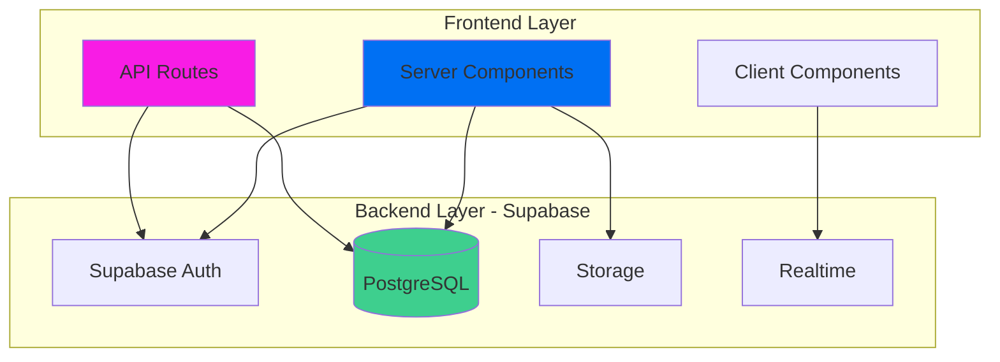
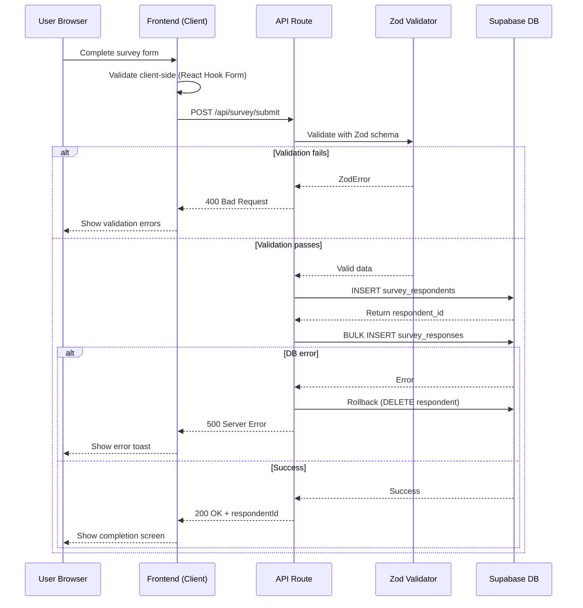
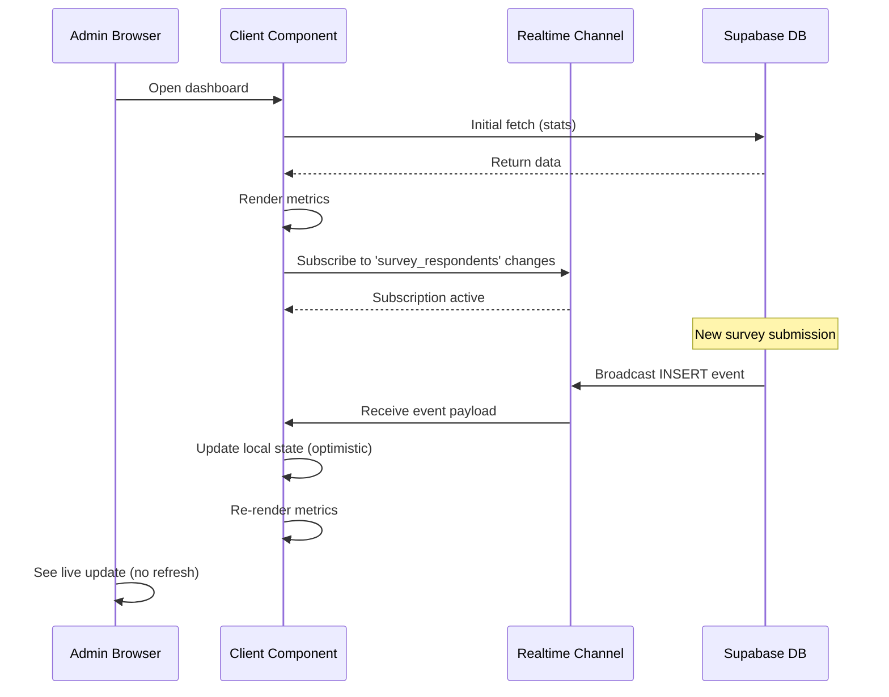
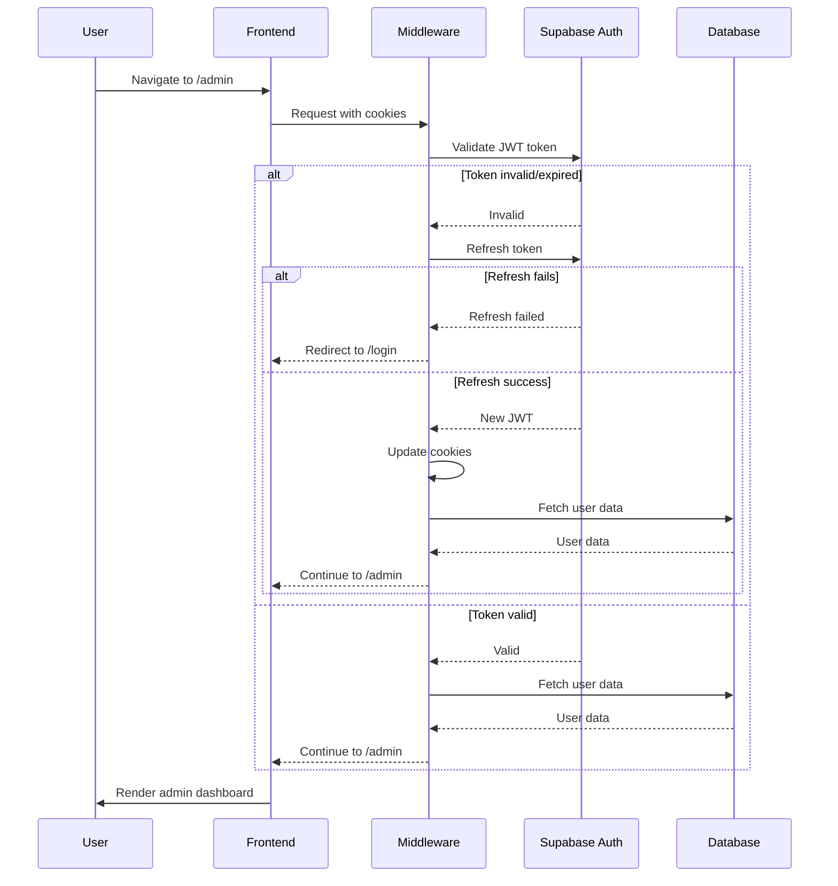
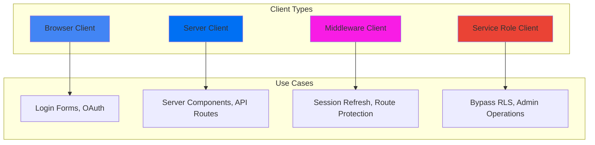
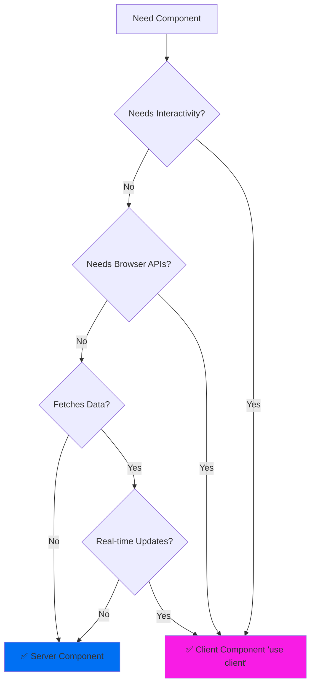

# API și Backend

Documentație completă a arhitecturii backend și API pentru **primariaTa❤️\_**.

---

## 📋 Cuprins

1. [Prezentare Generală](#prezentare-generală)
2. [Structura API](#structura-api)
3. [Flow Diagrame](#flow-diagrame)
4. [Authentication și Middleware](#authentication-și-middleware)
5. [Server Components vs Client Components](#server-components-vs-client-components)
6. [Error Handling](#error-handling)
7. [Rate Limiting și Caching](#rate-limiting-și-caching)

---

## 🎯 Prezentare Generală

### Arhitectura Backend

**primariaTa❤️\_** folosește **Backend as a Service (BaaS)** cu Supabase:



### Principii

1. **API Routes**: Pentru operațiuni complexe, validare, business logic
2. **Server Components**: Pentru fetch direct din database (read-only)
3. **Client Components**: Pentru interacțiuni real-time (Realtime subscriptions)
4. **Middleware**: Pentru authentication și authorization
5. **Type Safety**: TypeScript + Zod validation end-to-end

---

## 🛠️ Structura API

### Ierarhia Endpoints

```
src/app/api/
├── survey/
│   ├── submit/
│   │   └── route.ts          # POST /api/survey/submit
│   └── validate/
│       └── route.ts          # POST /api/survey/validate
│
├── admin/
│   └── survey/
│       ├── stats/
│       │   └── route.ts      # GET /api/admin/survey/stats
│       ├── realtime/
│       │   └── route.ts      # GET /api/admin/survey/realtime
│       ├── responses/
│       │   ├── route.ts      # GET /api/admin/survey/responses
│       │   └── [id]/
│       │       └── route.ts  # GET/DELETE /api/admin/survey/responses/[id]
│       └── export/
│           └── route.ts      # POST /api/admin/survey/export
│
├── localitati/
│   ├── judete/
│   │   └── route.ts          # GET /api/localitati/judete
│   └── route.ts              # GET /api/localitati?judet_id=X
│
├── cereri/
│   ├── route.ts              # GET/POST /api/cereri
│   └── [id]/
│       └── route.ts          # GET/PUT/DELETE /api/cereri/[id]
│
└── auth/
    ├── login/
    │   └── route.ts          # POST /api/auth/login
    ├── register/
    │   └── route.ts          # POST /api/auth/register
    └── logout/
        └── route.ts          # POST /api/auth/logout
```

---

## 📡 API Endpoints (Detaliat)

### 1. Survey API

#### POST /api/survey/submit

**Scop**: Submite un sondaj complet (respondent + răspunsuri).

**Request Body**:

```typescript
{
  "personalData": {
    "firstName": "Ion",
    "lastName": "Popescu",
    "email": "ion.popescu@example.com", // optional
    "ageCategory": "26-35",
    "county": "București",
    "locality": "Sector 1"
  },
  "respondentType": "citizen", // "citizen" | "official"
  "department": "IT", // doar pentru "official"
  "responses": [
    {
      "questionId": "q1_digital_services",
      "questionType": "single_choice",
      "answerChoices": ["option1"]
    },
    {
      "questionId": "q2_satisfaction",
      "questionType": "rating",
      "answerRating": 4
    },
    {
      "questionId": "q3_suggestions",
      "questionType": "text",
      "answerText": "Lorem ipsum dolor sit amet..."
    }
  ]
}
```

**Response**:

```typescript
{
  "success": true,
  "respondentId": "uuid-string",
  "message": "Sondaj submis cu succes"
}
```

**Implementare**:

```typescript
// src/app/api/survey/submit/route.ts
import { NextRequest, NextResponse } from "next/server";
import { z } from "zod";
import { createServiceRoleClient } from "@/lib/supabase/service-role";

// Validation schema
const surveySchema = z.object({
  personalData: z.object({
    firstName: z.string().min(2),
    lastName: z.string().min(2),
    email: z.string().email().optional(),
    ageCategory: z.enum(["18-25", "26-35", "36-45", "46-60", "60+"]),
    county: z.string().min(1),
    locality: z.string().min(1),
  }),
  respondentType: z.enum(["citizen", "official"]),
  department: z.string().optional(),
  responses: z.array(
    z.object({
      questionId: z.string(),
      questionType: z.enum(["single_choice", "multiple_choice", "text", "short_text", "rating"]),
      answerText: z.string().optional(),
      answerChoices: z.array(z.string()).optional(),
      answerRating: z.number().int().min(1).max(5).optional(),
    })
  ),
});

export async function POST(request: NextRequest) {
  try {
    // Parse and validate body
    const body = await request.json();
    const validatedData = surveySchema.parse(body);

    // Get IP and User-Agent for tracking
    const ipAddress =
      request.headers.get("x-forwarded-for") || request.headers.get("x-real-ip") || "unknown";
    const userAgent = request.headers.get("user-agent") || "unknown";

    // Use service role client (bypasses RLS for insert)
    const supabase = createServiceRoleClient();

    // 1. Insert respondent
    const { data: respondent, error: respondentError } = await supabase
      .from("survey_respondents")
      .insert({
        first_name: validatedData.personalData.firstName,
        last_name: validatedData.personalData.lastName,
        email: validatedData.personalData.email,
        age_category: validatedData.personalData.ageCategory,
        county: validatedData.personalData.county,
        locality: validatedData.personalData.locality,
        respondent_type: validatedData.respondentType,
        department: validatedData.department,
        is_completed: true,
        completed_at: new Date().toISOString(),
        ip_address: ipAddress,
        user_agent: userAgent,
      })
      .select()
      .single();

    if (respondentError) {
      console.error("Respondent insert error:", respondentError);
      return NextResponse.json(
        { success: false, error: "Eroare la salvarea respondentului" },
        { status: 500 }
      );
    }

    // 2. Bulk insert responses
    const responsesData = validatedData.responses.map((response) => ({
      respondent_id: respondent.id,
      question_id: response.questionId,
      question_type: response.questionType,
      answer_text: response.answerText || null,
      answer_choices: response.answerChoices || null,
      answer_rating: response.answerRating || null,
    }));

    const { error: responsesError } = await supabase.from("survey_responses").insert(responsesData);

    if (responsesError) {
      console.error("Responses insert error:", responsesError);
      // Rollback: delete respondent
      await supabase.from("survey_respondents").delete().eq("id", respondent.id);

      return NextResponse.json(
        { success: false, error: "Eroare la salvarea răspunsurilor" },
        { status: 500 }
      );
    }

    // Success
    return NextResponse.json({
      success: true,
      respondentId: respondent.id,
      message: "Sondaj submis cu succes",
    });
  } catch (error) {
    if (error instanceof z.ZodError) {
      return NextResponse.json(
        { success: false, error: "Date invalide", details: error.errors },
        { status: 400 }
      );
    }

    console.error("Survey submit error:", error);
    return NextResponse.json({ success: false, error: "Eroare server" }, { status: 500 });
  }
}
```

#### GET /api/admin/survey/stats

**Scop**: Obține metrici agregați pentru dashboard admin.

**Query Params**: Opțional `?from=2025-01-01&to=2025-12-31`

**Response**:

```typescript
{
  "totalRespondents": 1234,
  "completedRespondents": 1100,
  "citizenCount": 800,
  "officialCount": 300,
  "completionRate": 89.2,
  "avgCompletionTime": 5.3, // minutes
  "topLocations": [
    { "county": "București", "locality": "Sector 1", "count": 150 },
    // ...
  ],
  "recentResponses": [
    {
      "id": "uuid",
      "firstName": "Ion",
      "lastName": "P.",
      "respondentType": "citizen",
      "completedAt": "2025-01-15T10:30:00Z"
    },
    // ...
  ]
}
```

**Implementare**:

```typescript
// src/app/api/admin/survey/stats/route.ts
import { NextRequest, NextResponse } from "next/server";
import { createServerClient } from "@/lib/supabase/server";

export async function GET(request: NextRequest) {
  try {
    const supabase = await createServerClient();

    // Check auth
    const {
      data: { user },
      error: authError,
    } = await supabase.auth.getUser();
    if (authError || !user) {
      return NextResponse.json({ error: "Unauthorized" }, { status: 401 });
    }

    // Optional date range
    const searchParams = request.nextUrl.searchParams;
    const from = searchParams.get("from");
    const to = searchParams.get("to");

    // Build base query
    let query = supabase.from("survey_respondents").select("*");
    if (from) query = query.gte("created_at", from);
    if (to) query = query.lte("created_at", to);

    const { data: respondents, error } = await query;

    if (error) {
      console.error("Stats query error:", error);
      return NextResponse.json({ error: "Database error" }, { status: 500 });
    }

    // Calculate metrics
    const totalRespondents = respondents.length;
    const completedRespondents = respondents.filter((r) => r.is_completed).length;
    const citizenCount = respondents.filter((r) => r.respondent_type === "citizen").length;
    const officialCount = respondents.filter((r) => r.respondent_type === "official").length;
    const completionRate =
      totalRespondents > 0 ? (completedRespondents / totalRespondents) * 100 : 0;

    // Avg completion time (for completed surveys)
    const completedWithTime = respondents.filter(
      (r) => r.is_completed && r.completed_at && r.created_at
    );
    const avgCompletionTime =
      completedWithTime.length > 0
        ? completedWithTime.reduce((sum, r) => {
            const duration =
              (new Date(r.completed_at).getTime() - new Date(r.created_at).getTime()) / 1000 / 60;
            return sum + duration;
          }, 0) / completedWithTime.length
        : 0;

    // Top locations
    const locationCounts = respondents.reduce(
      (acc, r) => {
        const key = `${r.county}|${r.locality}`;
        acc[key] = (acc[key] || 0) + 1;
        return acc;
      },
      {} as Record<string, number>
    );

    const topLocations = Object.entries(locationCounts)
      .map(([key, count]) => {
        const [county, locality] = key.split("|");
        return { county, locality, count };
      })
      .sort((a, b) => b.count - a.count)
      .slice(0, 10);

    // Recent responses
    const recentResponses = respondents
      .filter((r) => r.is_completed)
      .sort((a, b) => new Date(b.completed_at).getTime() - new Date(a.completed_at).getTime())
      .slice(0, 5)
      .map((r) => ({
        id: r.id,
        firstName: r.first_name,
        lastName: r.last_name.charAt(0) + ".", // Privacy: only first letter
        respondentType: r.respondent_type,
        completedAt: r.completed_at,
      }));

    return NextResponse.json({
      totalRespondents,
      completedRespondents,
      citizenCount,
      officialCount,
      completionRate: Math.round(completionRate * 100) / 100,
      avgCompletionTime: Math.round(avgCompletionTime * 10) / 10,
      topLocations,
      recentResponses,
    });
  } catch (error) {
    console.error("Stats error:", error);
    return NextResponse.json({ error: "Server error" }, { status: 500 });
  }
}
```

---

## 🔄 Flow Diagrame

### Survey Submission Flow



### Admin Dashboard Real-time Flow



### Authentication Flow



---

## 🔐 Authentication și Middleware

### Arhitectura Auth

**Supabase oferă 4 tipuri de client-uri**:



### 1. Browser Client

**Scop**: Client-side auth operations (login, signup, OAuth).

```typescript
// lib/supabase/client.ts
import { createBrowserClient as createClient } from "@supabase/ssr";

export function createBrowserClient() {
  return createClient(
    process.env.NEXT_PUBLIC_SUPABASE_URL!,
    process.env.NEXT_PUBLIC_SUPABASE_ANON_KEY!
  );
}
```

**Usage**:

```typescript
"use client";

import { createBrowserClient } from "@/lib/supabase/client";

export function LoginForm() {
  const supabase = createBrowserClient();

  const handleLogin = async (email: string, password: string) => {
    const { data, error } = await supabase.auth.signInWithPassword({
      email,
      password,
    });

    if (error) {
      console.error("Login error:", error);
      return;
    }

    // Redirect
    window.location.href = "/dashboard";
  };

  // ...
}
```

### 2. Server Client

**Scop**: Server Components și API Routes cu RLS enforcement.

```typescript
// lib/supabase/server.ts
import { createServerClient as createClient } from "@supabase/ssr";
import { cookies } from "next/headers";

export async function createServerClient() {
  const cookieStore = await cookies();

  return createClient(
    process.env.NEXT_PUBLIC_SUPABASE_URL!,
    process.env.NEXT_PUBLIC_SUPABASE_ANON_KEY!,
    {
      cookies: {
        getAll() {
          return cookieStore.getAll();
        },
        setAll(cookiesToSet) {
          try {
            cookiesToSet.forEach(({ name, value, options }) =>
              cookieStore.set(name, value, options)
            );
          } catch {
            // Server Component - can't set cookies
          }
        },
      },
    }
  );
}
```

**Usage (Server Component)**:

```typescript
// app/dashboard/page.tsx
import { createServerClient } from '@/lib/supabase/server';

export default async function DashboardPage() {
  const supabase = await createServerClient();

  // Fetch with RLS enforcement
  const { data: cereri, error } = await supabase
    .from('cereri')
    .select('*')
    .order('created_at', { ascending: false });

  if (error) {
    console.error('Error:', error);
    return <div>Error loading data</div>;
  }

  return (
    <div>
      {cereri.map((cerere) => (
        <CerereCard key={cerere.id} cerere={cerere} />
      ))}
    </div>
  );
}
```

### 3. Middleware Client

**Scop**: Session refresh și route protection.

```typescript
// middleware.ts
import { createServerClient as createClient } from "@supabase/ssr";
import { NextResponse, type NextRequest } from "next/server";

export async function middleware(request: NextRequest) {
  let response = NextResponse.next({
    request: {
      headers: request.headers,
    },
  });

  const supabase = createClient(
    process.env.NEXT_PUBLIC_SUPABASE_URL!,
    process.env.NEXT_PUBLIC_SUPABASE_ANON_KEY!,
    {
      cookies: {
        getAll() {
          return request.cookies.getAll();
        },
        setAll(cookiesToSet) {
          cookiesToSet.forEach(({ name, value, options }) => request.cookies.set(name, value));
          response = NextResponse.next({
            request,
          });
          cookiesToSet.forEach(({ name, value, options }) =>
            response.cookies.set(name, value, options)
          );
        },
      },
    }
  );

  // Refresh session if expired
  const {
    data: { user },
  } = await supabase.auth.getUser();

  // Protect /admin routes
  if (request.nextUrl.pathname.startsWith("/admin") && !user) {
    return NextResponse.redirect(new URL("/login", request.url));
  }

  return response;
}

export const config = {
  matcher: ["/((?!_next/static|_next/image|favicon.ico|.*\\.(?:svg|png|jpg|jpeg|gif|webp)$).*)"],
};
```

### 4. Service Role Client

**Scop**: Admin operations cu bypass RLS.

```typescript
// lib/supabase/service-role.ts
import { createClient } from "@supabase/supabase-js";

export function createServiceRoleClient() {
  return createClient(
    process.env.NEXT_PUBLIC_SUPABASE_URL!,
    process.env.SUPABASE_SERVICE_ROLE_KEY!, // Secret key, NOT public
    {
      auth: {
        autoRefreshToken: false,
        persistSession: false,
      },
    }
  );
}
```

**Usage** (doar în API Routes, NU în componente):

```typescript
// app/api/admin/delete-user/route.ts
import { createServiceRoleClient } from "@/lib/supabase/service-role";

export async function DELETE(request: Request) {
  // Verify admin permission first!
  // ...

  const supabase = createServiceRoleClient();

  // Bypass RLS pentru ștergere
  const { error } = await supabase.from("survey_respondents").delete().eq("id", userId);

  // ...
}
```

---

## ⚛️ Server Components vs Client Components

### Decizie Flow



### Exemple

**Server Component** (default, fără 'use client'):

```typescript
// app/cereri/page.tsx (Server Component)
import { createServerClient } from '@/lib/supabase/server';

export default async function CereriPage() {
  const supabase = await createServerClient();

  // Fetch direct pe server
  const { data: cereri } = await supabase
    .from('cereri')
    .select('*')
    .order('created_at', { ascending: false });

  return (
    <div>
      <h1>Cereri</h1>
      {cereri?.map((cerere) => (
        <CerereCard key={cerere.id} cerere={cerere} />
      ))}
    </div>
  );
}
```

**Client Component** (cu 'use client'):

```typescript
// components/CerereCard.tsx (Client Component)
'use client';

import { useState } from 'react';
import { Button } from '@/components/ui/button';

export function CerereCard({ cerere }: { cerere: Cerere }) {
  const [isExpanded, setIsExpanded] = useState(false);

  return (
    <div>
      <h3>{cerere.titlu}</h3>
      {isExpanded && <p>{cerere.descriere}</p>}
      <Button onClick={() => setIsExpanded(!isExpanded)}>
        {isExpanded ? 'Ascunde' : 'Arată'}
      </Button>
    </div>
  );
}
```

---

## ❌ Error Handling

### Strategie Centralizată

```typescript
// lib/api-client.ts
export class ApiError extends Error {
  constructor(
    public status: number,
    public message: string,
    public details?: any
  ) {
    super(message);
    this.name = "ApiError";
  }
}

export async function apiRequest<T>(url: string, options?: RequestInit): Promise<T> {
  try {
    const response = await fetch(url, {
      ...options,
      headers: {
        "Content-Type": "application/json",
        ...options?.headers,
      },
    });

    const data = await response.json();

    if (!response.ok) {
      throw new ApiError(response.status, data.error || "Unknown error", data.details);
    }

    return data as T;
  } catch (error) {
    if (error instanceof ApiError) {
      throw error;
    }

    throw new ApiError(500, "Network error", error);
  }
}
```

**Usage**:

```typescript
"use client";

import { apiRequest, ApiError } from "@/lib/api-client";
import { toast } from "@/components/ui/use-toast";

async function submitSurvey(data: SurveyData) {
  try {
    const result = await apiRequest<{ respondentId: string }>("/api/survey/submit", {
      method: "POST",
      body: JSON.stringify(data),
    });

    toast({
      title: "Succes",
      description: "Sondaj submis cu succes",
    });

    return result.respondentId;
  } catch (error) {
    if (error instanceof ApiError) {
      if (error.status === 400) {
        toast({
          title: "Date invalide",
          description: error.message,
          variant: "destructive",
        });
      } else if (error.status === 500) {
        toast({
          title: "Eroare server",
          description: "Încearcă din nou mai târziu",
          variant: "destructive",
        });
      }
    }
  }
}
```

---

## 🚦 Rate Limiting și Caching

### Rate Limiting (Viitor)

**Implementare cu Upstash Redis**:

```typescript
// lib/rate-limit.ts
import { Ratelimit } from "@upstash/ratelimit";
import { Redis } from "@upstash/redis";

const redis = new Redis({
  url: process.env.UPSTASH_REDIS_REST_URL!,
  token: process.env.UPSTASH_REDIS_REST_TOKEN!,
});

// 10 requests per 10 seconds
export const ratelimit = new Ratelimit({
  redis,
  limiter: Ratelimit.slidingWindow(10, "10 s"),
  analytics: true,
});
```

**Usage în API Route**:

```typescript
// app/api/survey/submit/route.ts
import { ratelimit } from "@/lib/rate-limit";

export async function POST(request: NextRequest) {
  // Get IP
  const ip = request.headers.get("x-forwarded-for") || "anonymous";

  // Check rate limit
  const { success } = await ratelimit.limit(ip);

  if (!success) {
    return NextResponse.json({ error: "Too many requests" }, { status: 429 });
  }

  // Continue with request...
}
```

### Caching Strategy

**Vercel Edge Caching**:

```typescript
// app/api/localitati/judete/route.ts
export const revalidate = 3600; // 1 hour

export async function GET() {
  const supabase = await createServerClient();
  const { data: judete } = await supabase.from("judete").select("*");

  return NextResponse.json(judete, {
    headers: {
      "Cache-Control": "public, s-maxage=3600, stale-while-revalidate=7200",
    },
  });
}
```

**React Cache (Server Components)**:

```typescript
import { cache } from "react";
import { createServerClient } from "@/lib/supabase/server";

// Cached pentru request duration
export const getCereri = cache(async (userId: string) => {
  const supabase = await createServerClient();
  const { data } = await supabase.from("cereri").select("*").eq("user_id", userId);

  return data;
});
```

---

**Versiune**: 1.0.0
**Ultima actualizare**: Octombrie 2025
**Autor**: Echipa Tehnică primariaTa❤️\_
