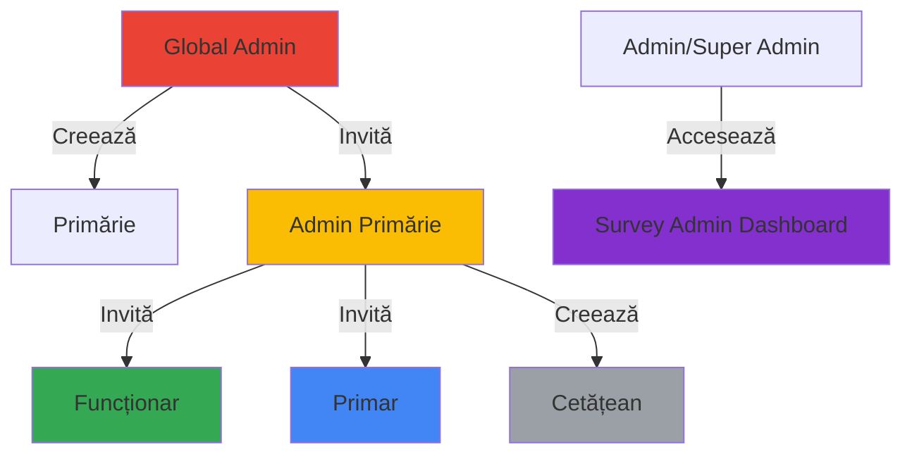
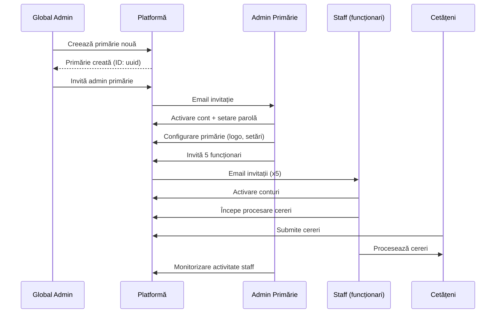
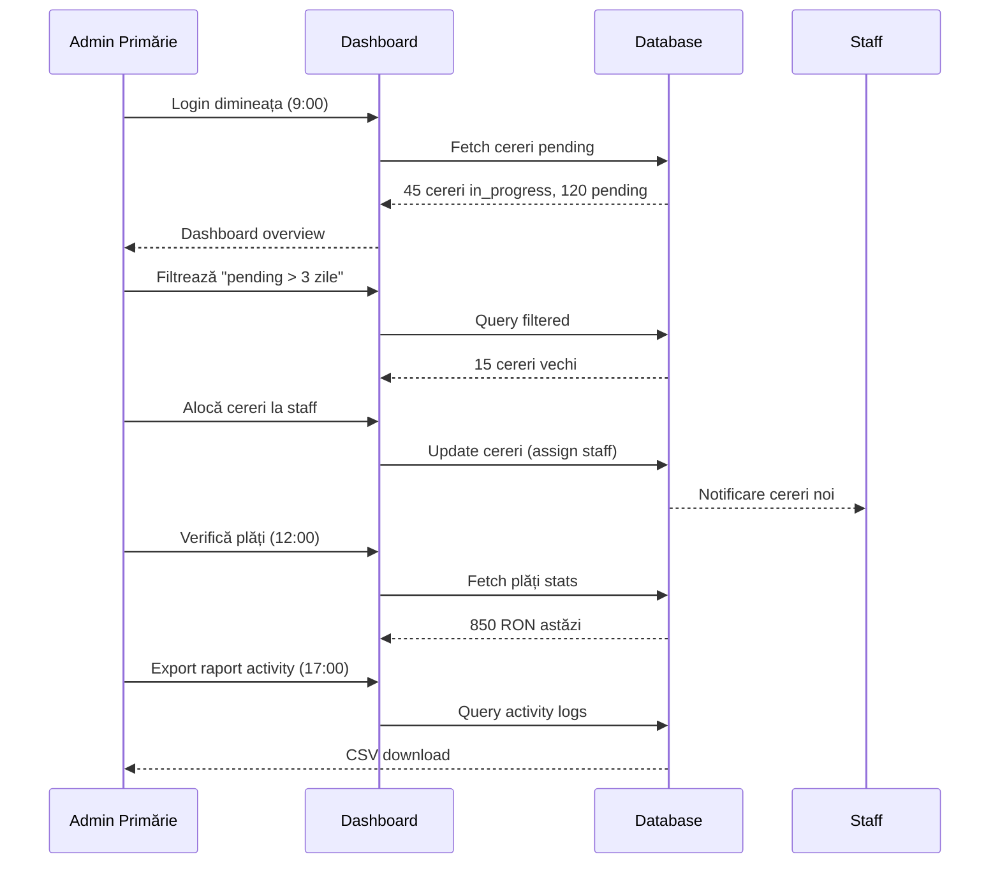
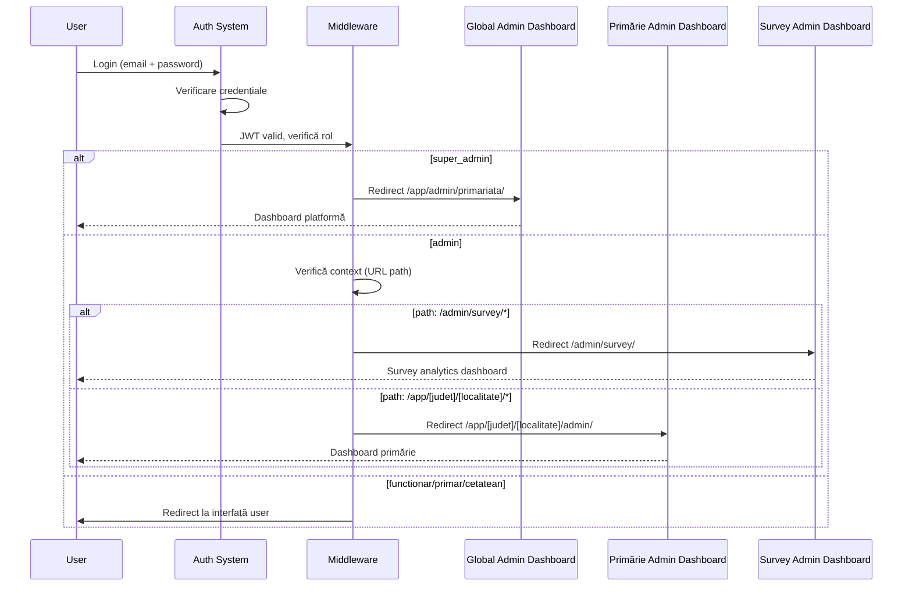

# Ierarhia Administrativă - primariaTa❤️\_

Documentație completă a ierarhiei administrative pe trei niveluri pentru managementul platformei și primăriilor.

---

## 📋 Cuprins

1. [Prezentare Generală](#prezentare-generală)
2. [Nivel 1: Global Admin](#nivel-1-global-admin-super_admin)
3. [Nivel 2: Admin Primărie](#nivel-2-admin-primărie-admin)
4. [Nivel 3: Survey Admin](#nivel-3-survey-admin-adminsuper_admin)
5. [Comparație Niveluri](#comparație-niveluri)
6. [Flow-uri și Scenarii](#flow-uri-și-scenarii)
7. [Implementare Tehnică](#implementare-tehnică)
8. [Best Practices](#best-practices)

---

## 🎯 Prezentare Generală

### Arhitectura pe Trei Niveluri

**primariaTa❤️\_** implementează o ierarhie administrativă stratificată pe trei niveluri distincte pentru a asigura management complet și eficient:

```
🌍 Global Admin (super_admin)
   └── Platformă completă
       └── 🏛️ Admin Primărie (admin)
           └── O primărie specifică
               └── 👥 Staff (funcționar, primar)
                   └── Operațiuni zilnice

🔬 Survey Admin (admin/super_admin)
   └── Aplicație separată pentru analytics
```

### Principii de Design

1. **Separarea Responsabilităților**: Fiecare nivel are scope și permisiuni clare
2. **Izolare Date**: Row Level Security (RLS) asigură izolare completă între primării
3. **Scalabilitate**: Ierarhia suportă creșterea de la 1 la 1000+ primării
4. **Securitate**: Multi-layer authentication și authorization
5. **Audit Trail**: Toate acțiunile admin sunt logate pentru compliance

### Două Aplicații Separate

**IMPORTANT**: Platforma constă din DOUĂ aplicații complet separate:

1. **Aplicația Primărie** - Servicii pentru cetățeni și management primării
   - Locații: `/`, `/app/[judet]/[localitate]/*`
   - Bază de date: 13 tabele (utilizatori, cereri, plăți, etc.)
   - Utilizatori: cetățeni, funcționari, primar, admin primărie, super admin

2. **Aplicația Survey** - Platform de cercetare și analytics
   - Locații: `/survey/*`, `/admin/survey/*`
   - Bază de date: 2 tabele (survey_respondents, survey_responses)
   - Utilizatori: public + admin/super_admin pentru analytics
   - Status: ✅ 100% Complete (M7)

---

## 🌍 Nivel 1: Global Admin (super_admin)

### Prezentare

**Global Admin** este administratorul platformei la cel mai înalt nivel, cu acces complet la toate primăriile și utilizatorii din sistem.

### Detalii Tehnice

| Aspect                  | Detalii                                   |
| ----------------------- | ----------------------------------------- |
| **Rol**                 | `super_admin`                             |
| **Locație**             | `/app/admin/primariata/`                  |
| **Scop**                | Management la nivel de platformă          |
| **Număr Utilizatori**   | 1-2 (echipa platformă)                    |
| **RLS Scope**           | TOATE datele din TOATE primăriile         |
| **Poate Crea**          | Primării, Admini primărie                 |
| **Status Implementare** | ⏳ Issue #150 (0% - Nu implementat, ~10h) |

### Responsabilități Cheie

#### 1. Management Primării

- **Creare primării noi**: Onboarding orașe noi pe platformă
- **Configurare primării**: Setări inițiale (logo, culori, informații contact)
- **Activare/Dezactivare**: Control asupra primăriilor active
- **Editare detalii**: Actualizare informații (adresă, telefon, email)

#### 2. Management Admini Primărie

- **Invitare admini**: Creează și trimite invitații pentru admini noi
- **Alocare permisiuni**: Setează access pentru fiecare admin
- **Monitorizare activitate**: Vezi ce fac adminii primăriilor
- **Revocare acces**: Dezactivează admini dacă este necesar

#### 3. Statistici Platformă

- **Vizualizare globală**: Toate datele agregate din toate primăriile
- **Analytics avansat**:
  - Total utilizatori înregistrați (toate primăriile)
  - Total cereri procesate (toate primăriile)
  - Total plăți efectuate (toate primăriile)
  - Primării cele mai active
  - Rate de creștere (zilnic, săptămânal, lunar)
- **Performance monitoring**: Uptime, latency, error rates
- **Cost monitoring**: Usage per primărie pentru billing

#### 4. Configurare Platformă

- **Feature flags**: Activează/dezactivează funcționalități noi
- **Setări globale**: Rate limits, quotas, restricții
- **Integrări**: Configurare API keys pentru servicii externe
- **Notificări**: Anunțuri la nivel de platformă

#### 5. Compliance și Audit

- **Audit logs**: Toate acțiunile admin logate complet
- **GDPR compliance**: Export/ștergere date utilizatori
- **Backup management**: Configurare backup policies
- **Security monitoring**: Detectare activități suspecte

### Structură Dashboard

```
/app/admin/primariata/
├── page.tsx                    # Overview platformă
├── primarii/
│   ├── page.tsx                # Lista toate primăriile
│   ├── new/page.tsx            # Creare primărie nouă
│   └── [id]/
│       ├── page.tsx            # Detalii primărie
│       ├── settings/page.tsx   # Setări primărie
│       └── admin/page.tsx      # Invită admin primărie
├── stats/
│   ├── page.tsx                # Statistici generale
│   ├── growth/page.tsx         # Analytics creștere
│   └── performance/page.tsx    # Metrici performanță
├── users/
│   ├── page.tsx                # Toți utilizatorii (toate primăriile)
│   └── [id]/page.tsx           # Detalii utilizator
├── settings/
│   ├── page.tsx                # Setări platformă
│   ├── features/page.tsx       # Feature flags
│   └── integrations/page.tsx   # Configurare integrări
└── audit/
    └── page.tsx                # Audit logs platformă
```

### API Endpoints

```typescript
// Statistici platformă
GET /api/admin/platform/stats
Response: {
  totalPrimarii: 100,
  activePrimarii: 87,
  totalUsers: 10000,
  totalCereri: 50000,
  totalPlati: 35000,
  growth: { users: "+12%", cereri: "+8%" }
}

// Management primării
GET /api/admin/platform/primarii
POST /api/admin/platform/primarii
Body: {
  nume: "Primăria Cluj-Napoca",
  judet: "Cluj",
  localitate: "Cluj-Napoca",
  email: "contact@primariacluj.ro"
}

PUT /api/admin/platform/primarii/:id
DELETE /api/admin/platform/primarii/:id

// Invitare admin primărie
POST /api/admin/platform/invite-admin
Body: {
  email: "admin@primarie-cluj.ro",
  primarie_id: "uuid",
  firstName: "Ion",
  lastName: "Popescu"
}

// Audit logs
GET /api/admin/platform/audit
Query: ?from=2025-01-01&to=2025-01-31&action_type=primarie_created
```

### RLS Policy

```sql
-- Super admin vede TOATE datele din TOATE primăriile
CREATE POLICY super_admin_full_access ON utilizatori
FOR ALL TO authenticated
USING (
  EXISTS (
    SELECT 1 FROM utilizatori
    WHERE id = auth.uid()
    AND rol = 'super_admin'
  )
);

-- Aplicat similar pe toate tabelele
CREATE POLICY super_admin_cereri_access ON cereri
FOR ALL TO authenticated
USING (
  EXISTS (
    SELECT 1 FROM utilizatori
    WHERE id = auth.uid()
    AND rol = 'super_admin'
  )
);
```

### Scenarii de Utilizare

#### Scenariu 1: Onboarding Primărie Nouă

```
1. Global Admin primește cerere de la Primăria Timișoara
2. Accesează /app/admin/primariata/primarii/new
3. Completează formular:
   - Nume: "Primăria Timișoara"
   - Județ: "Timiș"
   - Localitate: "Timișoara"
   - Email: "contact@primariatimisoara.ro"
   - Logo: upload logo.png
4. Salvează primăria → se creează în DB cu ID unic
5. Invită admin: admin@primariatimisoara.ro
6. Admin primărie primește email cu link de activare
7. Admin primărie se înregistrează și preia controlul
```

#### Scenariu 2: Monitorizare Platformă

```
1. Global Admin accesează /app/admin/primariata/stats
2. Vezi dashboard cu:
   - 100 primării active
   - 10,000 utilizatori totali
   - 50,000 cereri procesate
   - +12% creștere utilizatori ultimele 30 zile
3. Identifică primăriile top performers
4. Identifică primării cu probleme (low adoption)
5. Contactează primările pentru support
```

---

## 🏛️ Nivel 2: Admin Primărie (admin)

### Prezentare

**Admin Primărie** este administratorul unei primării specifice, cu acces limitat DOAR la datele primăriei sale prin Row Level Security.

### Detalii Tehnice

| Aspect                  | Detalii                                   |
| ----------------------- | ----------------------------------------- |
| **Rol**                 | `admin`                                   |
| **Locație**             | `/app/[judet]/[localitate]/admin/`        |
| **Scop**                | Management la nivel de primărie           |
| **Număr Utilizatori**   | Câte unul per primărie                    |
| **RLS Scope**           | DOAR datele primăriei sale                |
| **Poate Crea**          | Staff (funcționari, primar), Cetățeni     |
| **Status Implementare** | ⏳ Issue #148 (0% - Blocat de #152, ~12h) |

### Responsabilități Cheie

#### 1. Management Utilizatori

- **Invitare staff**: Funcționari și primar prin email
- **Creare conturi**: Cetățeni care vin fizic la primărie
- **Editare utilizatori**: Actualizare informații (rol, departament)
- **Dezactivare conturi**: Funcționari care pleacă din primărie

#### 2. Supraveghere Cereri

- **Vizualizare toate cererile**: Din primăria sa (RLS enforced)
- **Filtrare și căutare**: După status, tip, dată
- **Detalii cerere**: Vezi toate informațiile despre o cerere
- **Intervenție**: Poate interveni în cereri blocate

#### 3. Supraveghere Plăți

- **Vizualizare plăți**: Toate plățile din primărie
- **Statistici financiare**: Total încasat, plăți pending
- **Export rapoarte**: Pentru contabilitate

#### 4. Rapoarte și Analytics

- **Rapoarte activitate**: Ce face staff-ul (cine procesează cereri)
- **Rapoarte performanță**: Timp mediu procesare, completion rate
- **Export date**: CSV/Excel pentru analiza externă

#### 5. Configurare Primărie

- **Setări primărie**: Logo, culori, informații contact
- **Departamente**: Configurare departamente (Urbanism, Finanțe, etc.)
- **Notificări**: Ce notificări primesc cetățenii

### Structură Dashboard

```
/app/[judet]/[localitate]/admin/
├── page.tsx                    # Overview primărie
├── users/
│   ├── page.tsx                # Lista utilizatori (tabel)
│   ├── invite/page.tsx         # Invitare staff
│   ├── create/page.tsx         # Creare cont cetățean
│   └── [id]/
│       ├── page.tsx            # Detalii utilizator
│       └── edit/page.tsx       # Editare utilizator
├── cereri/
│   ├── page.tsx                # Toate cererile (tabel + filtre)
│   └── [id]/
│       ├── page.tsx            # Detalii cerere
│       └── intervene/page.tsx  # Intervenție admin
├── plati/
│   ├── page.tsx                # Toate plățile (tabel + filtre)
│   ├── stats/page.tsx          # Statistici financiare
│   └── [id]/page.tsx           # Detalii plată
├── reports/
│   ├── activity/page.tsx       # Log activitate staff
│   ├── performance/page.tsx    # Metrici performanță
│   └── export/page.tsx         # Export rapoarte
└── settings/
    ├── page.tsx                # Setări generale
    ├── departments/page.tsx    # Configurare departamente
    └── notifications/page.tsx  # Setări notificări
```

### API Endpoints

```typescript
// Management utilizatori
GET /api/admin/users?primarie_id=uuid
Query: ?role=functionar&status=active&page=1&limit=20

POST /api/admin/users/invite
Body: {
  email: "functionar@primarie.ro",
  role: "functionar",
  primarie_id: "uuid",
  department: "Urbanism"
}

// Supraveghere cereri
GET /api/admin/cereri?primarie_id=uuid
Query: ?status=in_progress&from=2025-01-01&to=2025-01-31

GET /api/admin/cereri/stats?primarie_id=uuid
Response: {
  total: 1234,
  byStatus: { pending: 120, in_progress: 45, completed: 1000 },
  avgProcessingTime: 5.3, // days
  completionRate: 81.2 // %
}

// Supraveghere plăți
GET /api/admin/plati?primarie_id=uuid
GET /api/admin/plati/stats?primarie_id=uuid
Response: {
  total: 850,
  totalAmount: 125000.50, // RON
  byStatus: { completed: 700, pending: 100 },
  successRate: 93.3 // %
}

// Rapoarte
GET /api/admin/reports/activity?primarie_id=uuid
Query: ?from=2025-01-01&to=2025-01-31&user_id=uuid

GET /api/admin/reports/performance?primarie_id=uuid
Response: {
  avgProcessingTime: 5.3,
  cereriPerDay: 45.2,
  staffPerformance: [
    { userId: "uuid", name: "Ion P.", cereriProcessed: 150 }
  ]
}
```

### RLS Policy

```sql
-- Admin vede DOAR datele primăriei sale
CREATE POLICY admin_primarie_access ON utilizatori
FOR ALL TO authenticated
USING (
  EXISTS (
    SELECT 1 FROM utilizatori u
    WHERE u.id = auth.uid()
    AND u.rol = 'admin'
    AND u.primarie_id = utilizatori.primarie_id
  )
);

-- Același pattern pentru celelalte tabele
CREATE POLICY admin_cereri_access ON cereri
FOR ALL TO authenticated
USING (
  EXISTS (
    SELECT 1 FROM utilizatori u
    WHERE u.id = auth.uid()
    AND u.rol = 'admin'
    AND u.primarie_id = cereri.primarie_id
  )
);
```

### Scenarii de Utilizare

#### Scenariu 1: Invitare Funcționar

```
1. Admin primărie accesează /app/cluj/cluj-napoca/admin/users/invite
2. Completează formular:
   - Email: ion.popescu@primariacluj.ro
   - Rol: Funcționar
   - Departament: Urbanism
   - Nume: Ion Popescu
3. Trimite invitație → email cu link activare
4. Funcționarul primește emailul
5. Accesează link, completează parolă
6. Se autentifică și vede interfața de funcționar
```

#### Scenariu 2: Monitorizare Cereri Zilnice

```
1. Admin primărie se autentifică dimineața
2. Accesează /app/cluj/cluj-napoca/admin/cereri
3. Vezi dashboard cu:
   - 45 cereri în progres
   - 120 cereri pending (nealocate)
   - 15 cereri noi astăzi
4. Filtrează după "pending + vechime > 3 zile"
5. Identifică cereri blocate
6. Alocă manual funcționarilor sau intervine
```

---

## 🔬 Nivel 3: Survey Admin (admin/super_admin)

### Prezentare

**Survey Admin** este interfața de analytics pentru **Aplicația Survey** - o aplicație COMPLET SEPARATĂ de aplicația principală de primărie.

### Detalii Tehnice

| Aspect                  | Detalii                                          |
| ----------------------- | ------------------------------------------------ |
| **Rol**                 | `admin` sau `super_admin`                        |
| **Locație**             | `/admin/survey/` și `/admin/survey/research/`    |
| **Scop**                | Analytics și research pe date survey             |
| **Aplicație**           | SEPARATĂ (Survey App, nu Primărie App)           |
| **Bază de Date**        | 2 tabele (survey_respondents, survey_responses)  |
| **RLS Scope**           | Date survey publice (nu există izolare primării) |
| **Status Implementare** | ✅ M7 - 100% Complete                            |

### Caracteristici Funcționale

#### 1. Dashboard Analytics

- **Metrici în timp real**: Total respondenți, completion rate
- **Grafice interactive**: Distribution by location, age, type
- **Filtre avansate**: Date range, county, respondent type

#### 2. AI-Powered Insights

- **Analiză text cu GPT-4o-mini**: Rezumat răspunsuri deschise
- **Sentiment analysis**: Pozitiv/neutru/negativ
- **Key themes extraction**: Teme recurente în feedback

#### 3. Export Date

- **Multiple formate**: Excel, CSV, PDF, JSON
- **Configurabil**: Selectare coloane, filtre custom
- **Rapoarte customizabile**: Template-uri predefinite

#### 4. Real-time Updates

- **WebSocket subscriptions**: Actualizări live când vine răspuns nou
- **Auto-refresh**: Dashboard se actualizează automat
- **Notificări**: Alert pentru milestone-uri (ex: 100 răspunsuri)

### Structură Dashboard

```
/admin/survey/
├── page.tsx                    # Overview metrici generale
├── responses/
│   ├── page.tsx                # Lista răspunsuri (tabel)
│   └── [id]/page.tsx           # Detalii răspuns individual
├── research/
│   ├── page.tsx                # Research Dashboard (AI insights)
│   ├── demographics/page.tsx   # Analiză demografică
│   ├── sentiment/page.tsx      # Sentiment analysis
│   └── correlations/page.tsx   # Corelații între întrebări
└── export/
    └── page.tsx                # Export configurabil
```

### API Endpoints

```typescript
// Statistici generale
GET /api/admin/survey/stats
Response: {
  totalRespondents: 1234,
  completedRespondents: 1100,
  citizenCount: 800,
  officialCount: 300,
  completionRate: 89.2, // %
  avgCompletionTime: 5.3 // minutes
}

// Real-time updates
GET /api/admin/survey/realtime
Response: {
  connected: true,
  lastUpdate: "2025-01-19T10:30:00Z",
  newResponses: 5
}

// Lista răspunsuri
GET /api/admin/survey/responses
Query: ?from=2025-01-01&to=2025-01-31&respondentType=citizen

// Detalii răspuns
GET /api/admin/survey/responses/:id
DELETE /api/admin/survey/responses/:id

// Export
POST /api/admin/survey/export
Body: {
  format: "excel", // excel | csv | pdf | json
  filters: {
    from: "2025-01-01",
    to: "2025-01-31",
    respondentType: "citizen"
  },
  columns: ["firstName", "ageCategory", "county", "responses"]
}
```

### Access Control

```typescript
// Both admin and super_admin can access Survey Admin
function canAccessSurveyAdmin(userRole: Role): boolean {
  return userRole === "admin" || userRole === "super_admin";
}

// Middleware check
if (path.startsWith("/admin/survey")) {
  if (!["admin", "super_admin"].includes(user.rol)) {
    return redirect("/unauthorized");
  }
}
```

### Separare de Aplicația Primărie

**IMPORTANT**: Survey Admin este o aplicație COMPLET SEPARATĂ:

| Aspect           | Primărie App                  | Survey App                     |
| ---------------- | ----------------------------- | ------------------------------ |
| **Scop**         | Servicii primărie             | Cercetare opinii               |
| **Bază de Date** | 13 tabele                     | 2 tabele                       |
| **Utilizatori**  | Cetățeni, staff, admin        | Public + admin analytics       |
| **Locație**      | `/app/[judet]/[localitate]/*` | `/survey/*`, `/admin/survey/*` |
| **RLS**          | Izolare per primărie          | Date publice, no RLS           |
| **Status**       | ~40% complete                 | ✅ 100% complete (M7)          |

---

## 📊 Comparație Niveluri

### Tabel Comparativ

| Caracteristică        | Global Admin              | Admin Primărie                     | Survey Admin         |
| --------------------- | ------------------------- | ---------------------------------- | -------------------- |
| **Rol**               | super_admin               | admin                              | admin/super_admin    |
| **Număr Utilizatori** | 1-2 (echipa platformă)    | 1 per primărie                     | N/A (read-only)      |
| **Scop Principal**    | Management platformă      | Management primărie                | Analytics & research |
| **Locație**           | `/app/admin/primariata/`  | `/app/[judet]/[localitate]/admin/` | `/admin/survey/*`    |
| **RLS Scope**         | TOATE datele platformei   | DOAR primăria sa                   | Date survey publice  |
| **Poate Crea**        | Primării, Admini primărie | Staff, Cetățeni                    | N/A                  |
| **Poate Edita**       | Toate primăriile          | Doar primăria sa                   | N/A                  |
| **Poate Șterge**      | Primării, Utilizatori     | Utilizatori primărie               | Răspunsuri survey    |
| **Audit Log**         | Acțiuni platformă         | Acțiuni primărie                   | Acțiuni analytics    |
| **Status**            | ⏳ 0% (Issue #150)        | ⏳ 0% (Issue #148)                 | ✅ 100% (M7)         |

### Ierarhie de Creare



---

## 🔄 Flow-uri și Scenarii

### Flow 1: Onboarding Primărie Completă



### Flow 2: Zi Tipică Admin Primărie



### Flow 3: Autentificare și Redirect Admin



---

## 🛠️ Implementare Tehnică

### Structură Fișiere

```
src/
├── app/
│   ├── admin/
│   │   └── primariata/          # Global Admin routes
│   │       ├── page.tsx
│   │       ├── primarii/
│   │       ├── stats/
│   │       └── settings/
│   │
│   ├── [judet]/[localitate]/
│   │   └── admin/               # Primărie Admin routes (dynamic)
│   │       ├── page.tsx
│   │       ├── users/
│   │       ├── cereri/
│   │       ├── plati/
│   │       └── reports/
│   │
│   └── admin/
│       └── survey/              # Survey Admin routes
│           ├── page.tsx
│           ├── responses/
│           ├── research/
│           └── export/
│
├── components/
│   └── admin/
│       ├── global/              # Global Admin components
│       ├── primarie/            # Primărie Admin components
│       └── survey/              # Survey Admin components
│
└── lib/
    ├── admin/
    │   ├── permissions.ts       # Permission checks
    │   ├── audit-log.ts         # Audit logging
    │   └── rls-helpers.ts       # RLS query helpers
    └── supabase/
        └── admin-client.ts      # Service role client (pentru bypass RLS)
```

### Permission System

```typescript
// lib/admin/permissions.ts
export type AdminRole = "super_admin" | "admin" | "functionar" | "primar" | "cetatean";

export interface PermissionCheck {
  userId: string;
  role: AdminRole;
  primarieId?: string;
  action: string;
  resource: string;
}

export async function checkPermission(check: PermissionCheck): Promise<boolean> {
  const { role, action, resource, primarieId } = check;

  // Super admin: poate totul
  if (role === "super_admin") {
    return true;
  }

  // Admin primărie: doar în primăria sa
  if (role === "admin") {
    if (resource === "platform") return false; // nu poate accesa platformă

    // Verifică că acțiunea e în primăria sa
    if (resource.includes("primarie") && primarieId) {
      return await checkPrimarieOwnership(check.userId, primarieId);
    }
  }

  // Alte roluri nu au acces admin
  return false;
}

async function checkPrimarieOwnership(userId: string, primarieId: string): Promise<boolean> {
  const supabase = createServerClient();
  const { data } = await supabase
    .from("utilizatori")
    .select("primarie_id")
    .eq("id", userId)
    .single();

  return data?.primarie_id === primarieId;
}
```

### Audit Logging

```typescript
// lib/admin/audit-log.ts
export interface AuditLogEntry {
  timestamp: string;
  userId: string;
  userName: string;
  role: AdminRole;
  actionType: string;
  resource: string;
  resourceId?: string;
  details?: Record<string, any>;
  ipAddress: string;
  userAgent: string;
  primarieId?: string; // pentru audit la nivel de primărie
}

export async function logAdminAction(entry: AuditLogEntry): Promise<void> {
  const supabase = createServiceRoleClient(); // Bypass RLS pentru logging

  await supabase.from("audit_logs").insert({
    timestamp: entry.timestamp,
    user_id: entry.userId,
    user_name: entry.userName,
    role: entry.role,
    action_type: entry.actionType,
    resource: entry.resource,
    resource_id: entry.resourceId,
    details: entry.details,
    ip_address: entry.ipAddress,
    user_agent: entry.userAgent,
    primarie_id: entry.primarieId,
  });
}

// Usage în API route
export async function PUT(request: NextRequest, { params }: { params: { id: string } }) {
  // ... update logic ...

  await logAdminAction({
    timestamp: new Date().toISOString(),
    userId: user.id,
    userName: `${user.firstName} ${user.lastName}`,
    role: user.rol,
    actionType: "primarie_updated",
    resource: "primarii",
    resourceId: params.id,
    details: { changes: updatedFields },
    ipAddress: request.headers.get("x-forwarded-for") || "unknown",
    userAgent: request.headers.get("user-agent") || "unknown",
  });

  // ... response ...
}
```

### Middleware pentru Admin Routes

```typescript
// middleware.ts (excerpt pentru admin routes)
export async function middleware(request: NextRequest) {
  const path = request.nextUrl.pathname;
  const supabase = await createServerClient();

  const {
    data: { user },
  } = await supabase.auth.getUser();

  if (!user) {
    return NextResponse.redirect(new URL("/login", request.url));
  }

  // Fetch user role
  const { data: userData } = await supabase
    .from("utilizatori")
    .select("rol, primarie_id")
    .eq("id", user.id)
    .single();

  // Global Admin routes
  if (path.startsWith("/app/admin/primariata")) {
    if (userData?.rol !== "super_admin") {
      return NextResponse.redirect(new URL("/unauthorized", request.url));
    }
  }

  // Primărie Admin routes
  if (path.match(/\/app\/[^/]+\/[^/]+\/admin/)) {
    if (!["admin", "super_admin"].includes(userData?.rol)) {
      return NextResponse.redirect(new URL("/unauthorized", request.url));
    }

    // Extract primarie from URL
    const matches = path.match(/\/app\/([^/]+)\/([^/]+)/);
    if (matches && userData?.rol === "admin") {
      const [, judet, localitate] = matches;

      // Verifică că adminul e pentru această primărie
      const { data: primarie } = await supabase
        .from("primarii")
        .select("id")
        .eq("judet", judet)
        .eq("localitate", localitate)
        .single();

      if (primarie?.id !== userData.primarie_id) {
        return NextResponse.redirect(new URL("/unauthorized", request.url));
      }
    }
  }

  // Survey Admin routes
  if (path.startsWith("/admin/survey")) {
    if (!["admin", "super_admin"].includes(userData?.rol)) {
      return NextResponse.redirect(new URL("/unauthorized", request.url));
    }
  }

  return NextResponse.next();
}
```

---

## 🎯 Best Practices

### 1. Securitate

#### Multi-Factor Authentication (Viitor)

```typescript
// Obligatoriu pentru super_admin
if (user.rol === "super_admin" && !user.mfa_enabled) {
  return redirect("/setup-mfa");
}

// Recomandat pentru admin primărie
if (user.rol === "admin" && !user.mfa_enabled) {
  showBanner("Recomandăm activarea MFA pentru securitate crescută");
}
```

#### Session Timeouts

```typescript
const SESSION_TIMEOUT = {
  super_admin: 30 * 60 * 1000, // 30 minute
  admin: 60 * 60 * 1000, // 1 oră
  functionar: 4 * 60 * 60 * 1000, // 4 ore
  cetatean: 24 * 60 * 60 * 1000, // 24 ore
};
```

#### IP Whitelisting (Opțional pentru super_admin)

```typescript
const ALLOWED_IPS_SUPER_ADMIN = [
  "192.168.1.0/24", // Office network
  "10.0.0.1", // VPN gateway
];

function checkIpWhitelist(ip: string, role: AdminRole): boolean {
  if (role !== "super_admin") return true;
  return ALLOWED_IPS_SUPER_ADMIN.some((allowed) => ipInRange(ip, allowed));
}
```

### 2. Performance

#### Caching Strategy

```typescript
// Cache pentru statistici care se schimbă rar
export const revalidate = 60; // 1 minut pentru stats

// Cache mai lung pentru liste statice
export const revalidate = 3600; // 1 oră pentru lista primării
```

#### Pagination

```typescript
// Limit rezultate per pagină
const DEFAULT_PAGE_SIZE = 20;
const MAX_PAGE_SIZE = 100;

function validatePagination(page: number, limit: number) {
  return {
    page: Math.max(1, page),
    limit: Math.min(limit, MAX_PAGE_SIZE),
  };
}
```

### 3. User Experience

#### Progressive Disclosure

```typescript
// Start cu overview simplu
<AdminDashboard>
  <SimpleStats /> {/* 4 metrici cheie */}
  <Button onClick={showDetailed}>Vezi Detalii Avansate</Button>
</AdminDashboard>

// Nu overwhelm cu toate datele dintr-o dată
```

#### Real-time Feedback

```typescript
// Notificări pentru acțiuni admin
toast({
  title: "Funcționar invitat cu succes",
  description: "ion.popescu@primarie.ro va primi emailul în câteva minute",
  variant: "success",
});
```

### 4. Compliance

#### GDPR Data Export

```typescript
// Cetățeni pot cere export complete
async function exportUserData(userId: string) {
  // Include TOATE datele utilizatorului
  const data = await Promise.all([
    getCereri(userId),
    getPlati(userId),
    getDocuments(userId),
    getActivity(userId),
    getNotifications(userId),
  ]);

  return generateGDPRExport(data);
}
```

#### Audit Retention

```sql
-- Păstrează audit logs 2 ani (compliance)
CREATE POLICY delete_old_audit_logs ON audit_logs
FOR DELETE TO postgres
USING (created_at < NOW() - INTERVAL '2 years');
```

### 5. Monitoring și Alerting

#### Critical Alerts

```typescript
// Alert când primărie nouă nu are admin după 24h
if (primarie.created_at < Date.now() - 24 * 60 * 60 * 1000 && !primarie.admin_id) {
  sendAlert({
    type: "critical",
    message: `Primăria ${primarie.nume} nu are admin alocat după 24h`,
    recipients: ["super_admin@primariata.work"],
  });
}
```

#### Performance Monitoring

```typescript
// Track API response times pentru admin endpoints
Sentry.startTransaction({
  name: "GET /api/admin/platform/stats",
  op: "http.server",
  data: { role: "super_admin" },
});
```

---

## 📚 Resurse Adiționale

### Documentație Tehnică

- [Arhitectura Generală](./Arhitectura-Generala.md) - Overview complet sistem
- [API și Backend](./API-si-Backend.md) - Detalii API endpoints și RLS policies
- [Baza de Date](./Baza-de-Date.md) - Schema completă și relații

### Ghiduri de Implementare

- [ARCHITECTURE.md](../../ARCHITECTURE.md) - English technical architecture
- [DEVELOPMENT_GUIDE.md](../../DEVELOPMENT_GUIDE.md) - Developer workflows
- `.docs/02-technical-specs/` - Specificații tehnice detaliate

### Referințe Externe

- [Supabase Row Level Security](https://supabase.com/docs/guides/auth/row-level-security)
- [Next.js Middleware](https://nextjs.org/docs/app/building-your-application/routing/middleware)
- [GDPR Compliance Guide](https://gdpr.eu/)

---

**Versiune**: 1.0
**Data Creare**: 19 ianuarie 2026
**Ultima Actualizare**: 19 ianuarie 2026
**Autor**: Echipa Tehnică primariaTa❤️\_
**Status**: ⏳ În așteptare implementare (M8-M9)
