# Arhitectura Generală

Documentație detaliată a arhitecturii sistemului **primariaTa❤️\_** - platformă digitală pentru modernizarea serviciilor publice locale din România.

---

## 📋 Cuprins

1. [Prezentare Generală](#prezentare-generală)
2. [Tipul de Arhitectură](#tipul-de-arhitectură)
3. [Diagrama de Ansamblu](#diagrama-de-ansamblu)
4. [Stack Tehnologic](#stack-tehnologic)
5. [Pattern-uri Arhitecturale](#pattern-uri-arhitecturale)
6. [Arhitectura Admin](#arhitectura-admin)
   - [Global Admin](#1-global-admin-super_admin)
   - [Admin Primărie](#2-admin-primărie-admin)
   - [Survey Admin](#3-survey-admin-adminsuper_admin)
7. [Strategia de Deployment](#strategia-de-deployment)
8. [Scalabilitate și Performance](#scalabilitate-și-performance)

---

## 🎯 Prezentare Generală

### Scop

**primariaTa❤️\_** este o platformă cloud-native, serverless, multi-tenant care oferă cetățenilor români acces digital la serviciile primăriilor locale.

### Caracteristici Cheie

- ✅ **Serverless**: Zero management de servere, scalare automată
- ✅ **Multi-tenant**: Izolare completă a datelor per primărie
- ✅ **Edge-first**: Distribuit global pentru latență minimă
- ✅ **Type-safe**: TypeScript end-to-end pentru siguranță maximă
- ✅ **Real-time**: Actualizări live pentru dashboard-uri administrative
- ✅ **Mobile-first**: Responsive design pentru toate dispozitivele

### Principii de Design

1. **Performance**: Sub 2.5s LCP, optimizare Core Web Vitals
2. **Security**: Multi-layer defense, RLS, zero-trust
3. **Accessibility**: WCAG 2.1 AA compliance
4. **Developer Experience**: Hot reload, type-safety, clear errors
5. **Cost Efficiency**: Pay-per-use, serverless economics

---

## 🏗️ Tipul de Arhitectură

### Serverless Architecture

Sistemul este complet **serverless**, eliminând necesitatea de management al infrastructurii:

- **Compute**: Vercel Edge Functions + Next.js Server Components
- **Database**: Supabase (PostgreSQL managed)
- **Storage**: Supabase Storage (S3-compatible)
- **Authentication**: Supabase Auth (JWT-based)

**Beneficii**:

- Scalare automată de la 0 la ∞ utilizatori
- Plată doar pentru utilizare efectivă
- Zero downtime deployments
- Resilience built-in (auto-healing)

### Cloud-Native Architecture

Built for cloud from ground up:

- **Stateless**: Fiecare request este independent
- **Immutable**: Deployments fără mutații de state
- **Observable**: Logging, metrics, tracing built-in
- **Resilient**: Graceful degradation, retry mechanisms

### Multi-Tenant Architecture

Izolare completă a datelor între primării:

- **Database Level**: Row Level Security (RLS) în PostgreSQL
- **Application Level**: Middleware verification la fiecare request
- **UI Level**: Context-based filtering (primarie_id)

**Strategie de izolare**:

```
Utilizator → Auth Token → primarie_id extraction → RLS policy check → Data access
```

---

## 📐 Diagrama de Ansamblu

### Arhitectura Completă

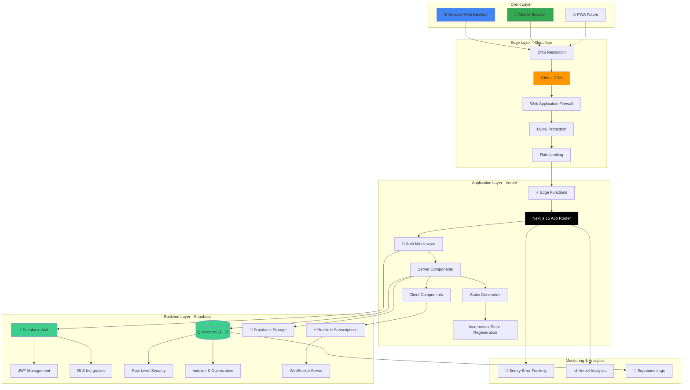

### Flow-ul unei Cereri HTTP

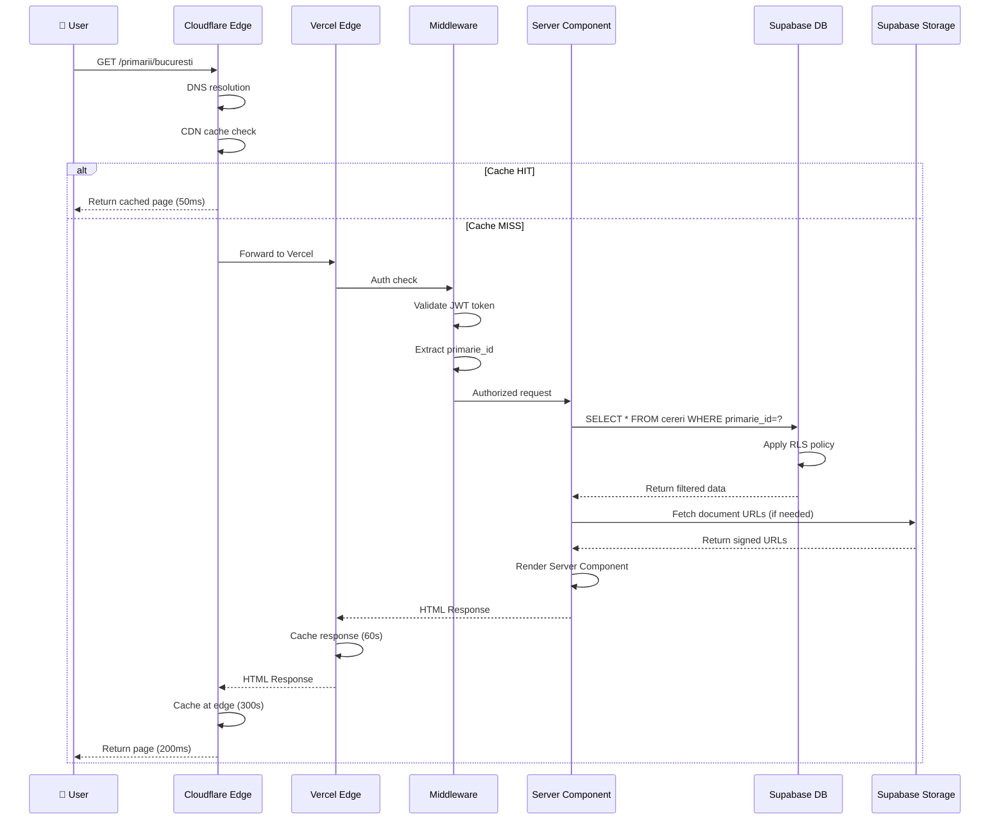

---

## 🛠️ Stack Tehnologic

### Frontend Stack

| Categorie             | Tehnologie      | Versiune | Rol                                |
| --------------------- | --------------- | -------- | ---------------------------------- |
| **Framework**         | Next.js         | 15.0.4   | React meta-framework cu SSR/SSG    |
| **UI Library**        | React           | 19.0.0   | Component-based UI library         |
| **Language**          | TypeScript      | 5.7.3    | Type-safe JavaScript               |
| **Styling**           | Tailwind CSS    | 4.0.0    | Utility-first CSS framework        |
| **Component Library** | shadcn/ui       | Latest   | Accessible, unstyled components    |
| **UI Primitives**     | Radix UI        | Latest   | Headless UI components             |
| **Animations**        | Framer Motion   | 11.15.0  | Declarative animations             |
| **3D Graphics**       | Three.js        | 0.171.0  | WebGL rendering engine             |
| **Postprocessing**    | postprocessing  | 6.36.4   | Three.js effects library           |
| **Icons**             | Lucide React    | 0.468.0  | Icon library                       |
| **Form Handling**     | React Hook Form | 7.54.2   | Performant form library            |
| **Validation**        | Zod             | 3.24.1   | TypeScript-first schema validation |
| **State Management**  | Zustand         | 5.0.2    | Lightweight state management       |
| **Date Handling**     | date-fns        | 4.1.0    | Modern JavaScript date utility     |

### Backend Stack

| Categorie            | Tehnologie            | Versiune | Rol                          |
| -------------------- | --------------------- | -------- | ---------------------------- |
| **BaaS Platform**    | Supabase              | Latest   | Backend as a Service         |
| **Database**         | PostgreSQL            | 15       | Relational database          |
| **Authentication**   | Supabase Auth         | Latest   | JWT-based auth system        |
| **Storage**          | Supabase Storage      | Latest   | S3-compatible object storage |
| **Realtime**         | Supabase Realtime     | Latest   | WebSocket subscriptions      |
| **Client Libraries** | @supabase/ssr         | 0.5.3    | Server-side Supabase client  |
|                      | @supabase/supabase-js | 2.47.11  | Client-side Supabase client  |

### Infrastructure Stack

| Categorie          | Tehnologie             | Rol                      |
| ------------------ | ---------------------- | ------------------------ |
| **Hosting**        | Vercel                 | Serverless hosting + CDN |
| **Edge Network**   | Cloudflare             | DNS + CDN + Security     |
| **Domain**         | primariata.work        | Custom domain            |
| **SSL/TLS**        | Cloudflare + Vercel    | Automatic HTTPS          |
| **CI/CD**          | Vercel Git Integration | Auto-deploy on push      |
| **Error Tracking** | Sentry                 | Error monitoring         |
| **Analytics**      | Vercel Analytics       | Web vitals tracking      |

### Developer Tools

| Categorie           | Tehnologie          | Rol                   |
| ------------------- | ------------------- | --------------------- |
| **Package Manager** | npm                 | Dependency management |
| **Code Quality**    | ESLint              | Linting               |
| **Code Formatting** | Prettier            | Code formatting       |
| **Git Hooks**       | Husky               | Pre-commit hooks      |
| **Type Checking**   | TypeScript Compiler | Static type checking  |

---

## 🎨 Pattern-uri Arhitecturale

### 1. JAMstack Pattern

**primariaTa❤️\_** folosește JAMstack (JavaScript, APIs, Markup):

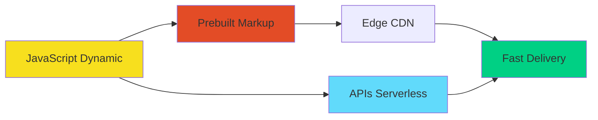

**Beneficii**:

- **Performance**: Static files servite de la CDN (TTFB ~50ms)
- **Scalability**: CDN se ocupă de scaling, nu servere
- **Security**: No server → no server attacks
- **Developer Experience**: Decoupling front-end de back-end

**Implementare**:

```typescript
// pages/primarii/[slug]/page.tsx
export async function generateStaticParams() {
  // Pre-generate pages for top 100 primarii
  const primarii = await supabase.from("primarii").select("slug").limit(100);

  return primarii.data?.map((p) => ({ slug: p.slug })) || [];
}

// ISR: Revalidate every 60 seconds
export const revalidate = 60;
```

### 2. Server Components Pattern

Next.js 15 folosește **React Server Components** (RSC) pentru optimizare:

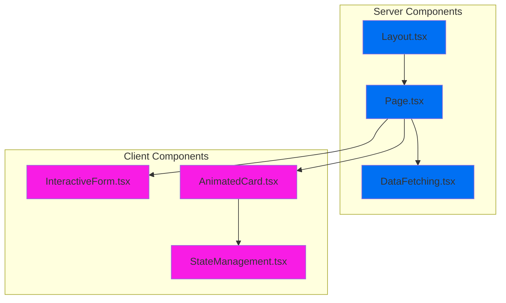

**Server Components** (default):

- ✅ Data fetching direct din server
- ✅ Zero JavaScript în browser
- ✅ Access la backend resources (DB, FS)
- ❌ No interactivity (onClick, useState)

**Client Components** ('use client'):

- ✅ Full interactivity (hooks, events)
- ✅ Browser APIs (localStorage, window)
- ❌ Increase bundle size
- ❌ No direct backend access

**Best Practice**:

```typescript
// ✅ Good: Server Component fetches data
async function PrimariiList() {
  const primarii = await getPrimarii(); // Server-side fetch
  return (
    <div>
      {primarii.map(p => (
        <PrimariaCard key={p.id} data={p} /> // Client Component
      ))}
    </div>
  );
}

// ❌ Bad: Client Component fetches data
'use client';
function PrimariiList() {
  const [primarii, setPrimarii] = useState([]);
  useEffect(() => {
    fetch('/api/primarii').then(/* ... */); // Unnecessary client fetch
  }, []);
  // ...
}
```

### 3. Multi-Tenant Pattern

**Izolare completă a datelor** la nivel de rând (Row Level Security):

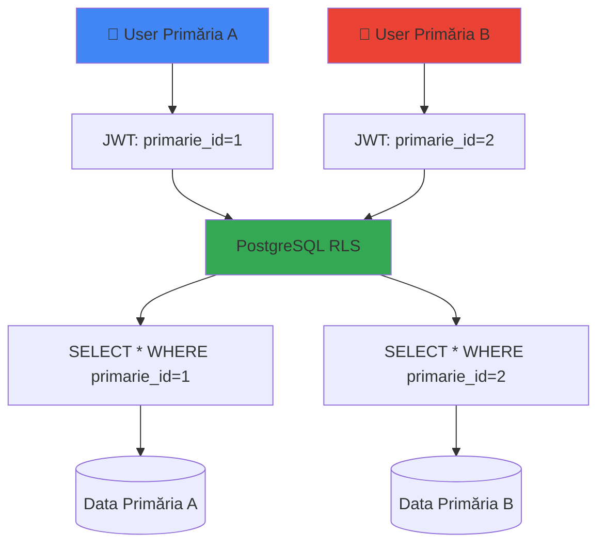

**Implementare**:

```sql
-- Enable RLS on table
ALTER TABLE cereri ENABLE ROW LEVEL SECURITY;

-- Policy: Users can only see their primarie's data
CREATE POLICY "tenant_isolation_policy" ON cereri
  FOR SELECT
  TO authenticated
  USING (
    primarie_id = (auth.jwt() ->> 'primarie_id')::uuid
  );
```

### 4. Edge-First Pattern

**Deployment global** cu Vercel Edge Network:

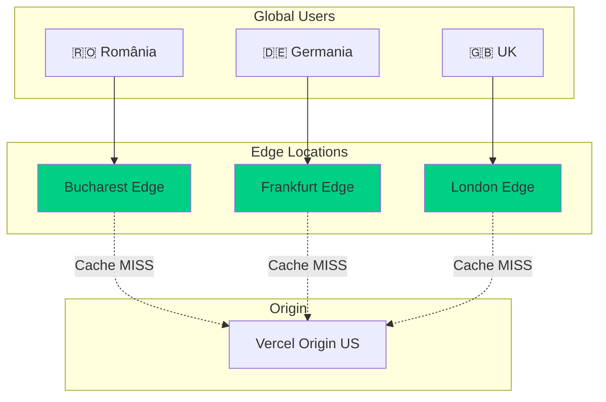

**Latency Optimization**:

- **Romania**: ~50ms (Bucharest edge)
- **Europe**: ~80ms (Frankfurt, London edges)
- **Global**: <200ms (45+ edge locations)

---

## 🏛️ Arhitectura Admin

Platforma implementează o **ierarhie administrativă pe trei niveluri** pentru management complet al platformei și primăriilor:

### Prezentare Generală Ierarhie

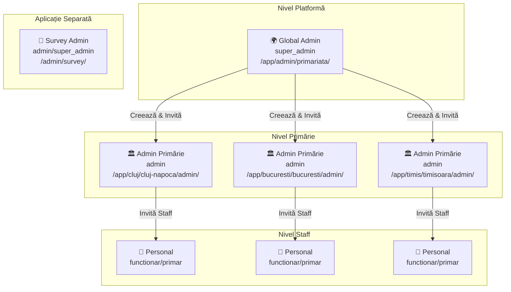

### 1. Global Admin (super_admin)

**Locație**: `/app/admin/primariata/`
**Scop**: Management la nivel de platformă (TOATE primăriile)

**Responsabilități**:

- Vizualizare statistici la nivel de platformă (toate primăriile combinate)
- Management primării (creare, editare, activare/dezactivare)
- Creare și invitare admini de primărie (câte unul per oraș)
- Configurare setări de platformă și feature flags
- Vizualizare audit logs la nivel de platformă
- Monitorizare stare sistem și performanță

**Status Implementare**: ⏳ Issue #150 (0% - Nu implementat, estimat 10h)

**RLS Policy**:

```sql
-- Super admin vede TOATE datele din TOATE primăriile
CREATE POLICY super_admin_full_access ON utilizatori
FOR ALL TO authenticated
USING (
  EXISTS (
    SELECT 1 FROM utilizatori
    WHERE id = auth.uid()
    AND rol = 'super_admin'
  )
);
```

**API Endpoints**:

```typescript
// Platform-wide statistics
GET /api/admin/platform/stats
Response: {
  totalPrimarii: 100,
  totalUsers: 10000,
  totalCereri: 50000,
  activeToday: 1200
}

// Manage primării
POST /api/admin/platform/primarii
PUT /api/admin/platform/primarii/:id
DELETE /api/admin/platform/primarii/:id

// Invite primărie admin
POST /api/admin/platform/invite-admin
Body: {
  email: "admin@primarie.ro",
  primarie_id: "uuid",
  role: "admin"
}
```

### 2. Admin Primărie (admin)

**Locație**: `/app/[judet]/[localitate]/admin/`
**Scop**: Management la nivel de primărie (DOAR primăria lor, RLS enforced)

**Structură Dashboard**:

```
/app/[judet]/[localitate]/admin/
├── page.tsx                    # Prezentare generală stare platformă
├── users/                      # Management utilizatori
│   ├── page.tsx                # Lista utilizatori (tabel)
│   ├── invite/page.tsx         # Invitare staff
│   └── [id]/page.tsx           # Detalii utilizator
├── cereri/                     # Supraveghere cereri
│   ├── page.tsx                # Toate cererile (tabel)
│   └── [id]/page.tsx           # Detalii cerere
├── plati/                      # Supraveghere plăți
│   ├── page.tsx                # Toate plățile (tabel)
│   └── [id]/page.tsx           # Detalii plată
├── reports/page.tsx            # Rapoarte & analytics
└── activity/page.tsx           # Log activitate
```

**Responsabilități**:

- Management utilizatori primărie (cetățeni, funcționari, primar)
- Invitare staff (funcționari, primar) prin email
- Supraveghere cereri și plăți din primărie
- Generare rapoarte și analytics
- Vizualizare log activitate
- Configurare setări primărie

**Status Implementare**: ⏳ Issue #148 (0% - Blocat de #152, estimat 12h)

**RLS Policy**:

```sql
-- Admin vede DOAR datele primăriei sale
CREATE POLICY admin_primarie_access ON utilizatori
FOR ALL TO authenticated
USING (
  EXISTS (
    SELECT 1 FROM utilizatori u
    WHERE u.id = auth.uid()
    AND u.rol = 'admin'
    AND u.primarie_id = utilizatori.primarie_id
  )
);
```

**API Endpoints**:

```typescript
// Users management
GET /api/admin/users?primarie_id=uuid
POST /api/admin/users/invite
Body: {
  email: "functionar@primarie.ro",
  role: "functionar",
  primarie_id: "uuid"
}

// Cereri oversight
GET /api/admin/cereri?primarie_id=uuid&status=in_progress
GET /api/admin/cereri/stats?primarie_id=uuid

// Plăți oversight
GET /api/admin/plati?primarie_id=uuid&status=pending
GET /api/admin/plati/stats?primarie_id=uuid

// Reports
GET /api/admin/reports/activity?primarie_id=uuid&from=date&to=date
GET /api/admin/reports/performance?primarie_id=uuid
```

### 3. Survey Admin (admin/super_admin)

**Locație**: `/admin/survey/` și `/admin/survey/research/`
**Scop**: Analytics și research (APLICAȚIE COMPLET SEPARATĂ)

**Caracteristici**:

- Analiză răspunsuri survey cu AI (GPT-4o-mini)
- Export date (Excel/CSV/PDF/JSON)
- Insights demographics și corelații
- Analytics real-time și trends
- Dashboard research cu AI-powered insights

**Status Implementare**: ✅ M7 - 100% Complete (aplicație funcțională)

**Access Control**:

```typescript
// Both admin and super_admin can access Survey Admin
function canAccessSurveyAdmin(userRole: Role): boolean {
  return userRole === "admin" || userRole === "super_admin";
}
```

**Separare Aplicații**:
Survey Admin este o aplicație complet separată de aplicația principală de primărie. Are propriile sale rute, componente, și logică de business.

### Flow Autentificare Admin

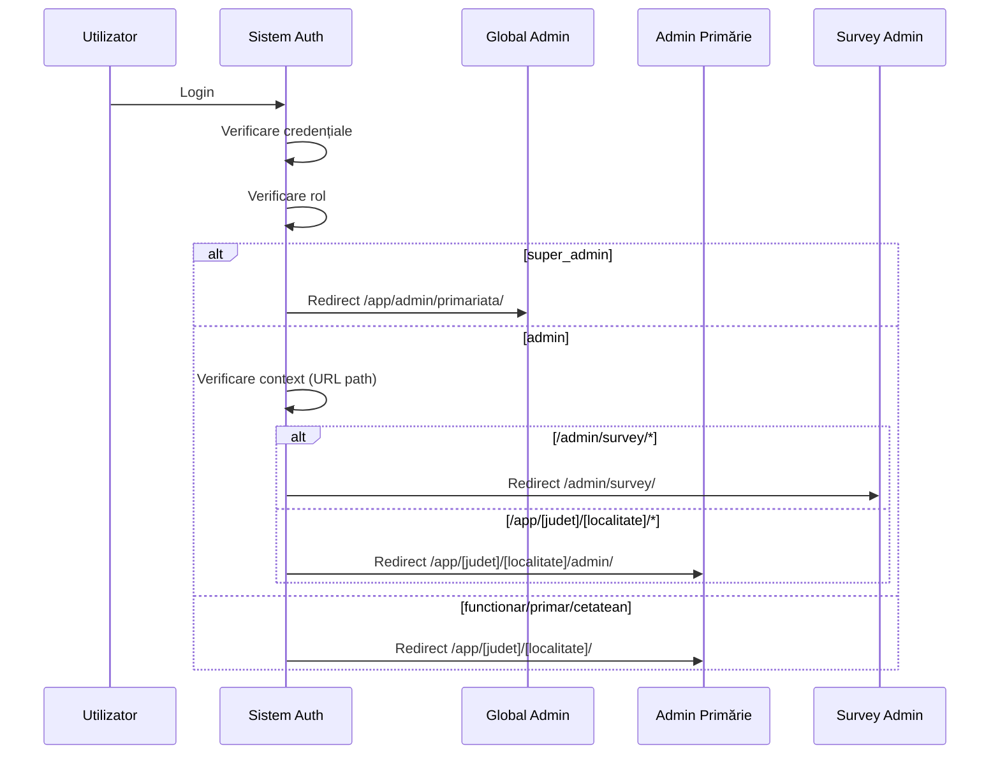

### Tabel Comparativ Admin

| Caracteristică | Global Admin              | Admin Primărie                   | Survey Admin         |
| -------------- | ------------------------- | -------------------------------- | -------------------- |
| **Rol**        | super_admin               | admin                            | admin/super_admin    |
| **Scop**       | TOATE primăriile          | O primărie                       | Research & Analytics |
| **Locație**    | /app/admin/primariata/    | /app/[judet]/[localitate]/admin/ | /admin/survey/       |
| **RLS Scope**  | Toate datele              | primarie_id filtered             | Public survey data   |
| **Poate crea** | Primării, Admini primărie | Staff (funcționari, primar)      | N/A (read-only)      |
| **Acces date** | Platforma completă        | Doar primăria sa                 | Date survey publice  |
| **Status**     | ⏳ 0% (Issue #150)        | ⏳ 0% (Issue #148)               | ✅ 100% (M7)         |

### Ierarhie de Creare

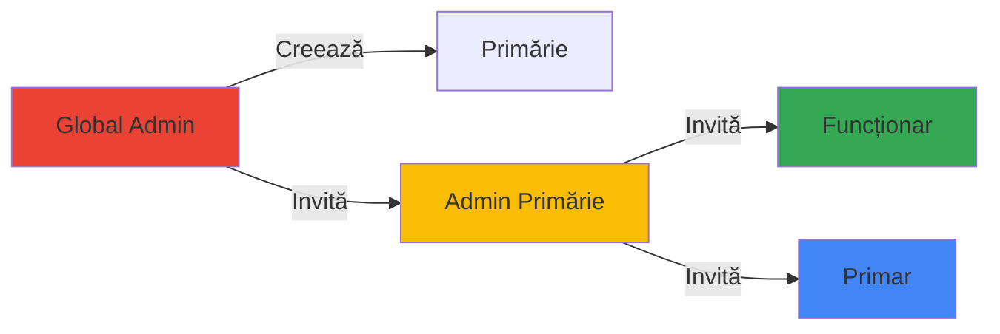

**Flux complet**:

1. **Global Admin** creează primărie nouă în sistem
2. **Global Admin** invită un admin pentru acea primărie (email cu link activare)
3. **Admin Primărie** se autentifică și configurează primăria
4. **Admin Primărie** invită staff (funcționari, primar) prin email
5. **Staff** se autentifică și începe să proceseze cereri

### Izolare Date și Securitate

**Multi-tenancy prin RLS**:

```sql
-- Exemplu de policy pentru cereri
CREATE POLICY tenant_isolation_cereri ON cereri
FOR ALL TO authenticated
USING (
  CASE
    -- Super admin: access to ALL
    WHEN EXISTS (
      SELECT 1 FROM utilizatori
      WHERE id = auth.uid() AND rol = 'super_admin'
    ) THEN true

    -- Admin/Staff: only their primărie
    WHEN primarie_id = (
      SELECT primarie_id FROM utilizatori
      WHERE id = auth.uid()
    ) THEN true

    ELSE false
  END
);
```

**Middleware Verification**:

```typescript
// middleware.ts
export async function middleware(request: NextRequest) {
  const user = await getUser(request);
  const path = request.nextUrl.pathname;

  // Global admin routes
  if (path.startsWith("/app/admin/primariata")) {
    if (user?.rol !== "super_admin") {
      return NextResponse.redirect("/unauthorized");
    }
  }

  // Primărie admin routes
  if (path.includes("/admin") && !path.includes("primariata")) {
    if (!["admin", "super_admin"].includes(user?.rol)) {
      return NextResponse.redirect("/unauthorized");
    }
  }

  return NextResponse.next();
}
```

### Best Practices Admin

1. **Separarea Rolurilor**:
   - Super admin: Nu se implică în operațiuni zilnice ale primăriilor
   - Admin primărie: Focus pe managementul primăriei sale
   - Survey admin: Analiză și research, fără modificări la date operaționale

2. **Audit Logging**:
   - Toate acțiunile admin sunt logate cu timestamp, user_id, action, details
   - Retention: 2 ani pentru compliance
   - Query: `SELECT * FROM audit_logs WHERE user_id = ? AND action_type = 'admin_action'`

3. **Rate Limiting**:
   - Global admin: 100 requests/minute
   - Admin primărie: 50 requests/minute
   - Protecție împotriva abuse

4. **Two-Factor Authentication** (Viitor):
   - Obligatoriu pentru super_admin
   - Opțional pentru admin primărie
   - Implementare cu Supabase Auth + TOTP

---

## 🚀 Strategia de Deployment

### Deployment Pipeline

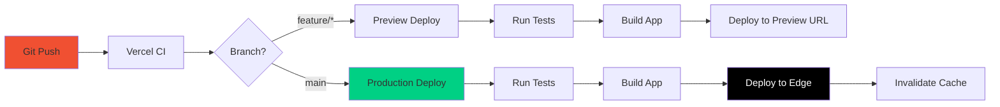

### Environments

| Environment     | Trigger       | URL             | Purpose           |
| --------------- | ------------- | --------------- | ----------------- |
| **Development** | Local         | localhost:3000  | Local development |
| **Preview**     | PR creation   | `*.vercel.app`  | QA testing per PR |
| **Production**  | Merge to main | primariata.work | Live environment  |

### Deployment Strategy

**Zero-Downtime Deployments**:

1. **Build**: Compile app în Vercel
2. **Deploy**: Push to edge locations
3. **Test**: Automated health checks
4. **Activate**: Atomic switch to new version
5. **Rollback**: One-click rollback dacă issues

**Cache Invalidation**:

```typescript
// Revalidate specific path
export async function POST(request: Request) {
  const path = request.nextUrl.searchParams.get("path");
  revalidatePath(path);
  return Response.json({ revalidated: true });
}
```

---

## 📈 Scalabilitate și Performance

### Horizontal Scaling

**Automatic scaling** la toate nivelele:

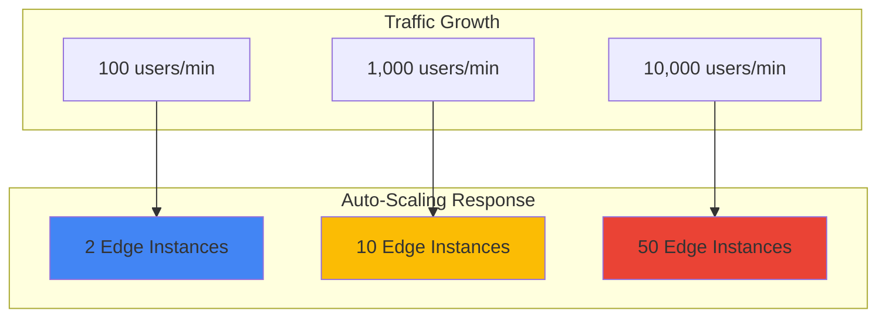

**Scalare la nivel de**:

- **Edge Functions**: 0 → 1000s instances (automatic)
- **Database**: Connection pooling (Supabase Pooler)
- **CDN**: Unlimited bandwidth (Cloudflare)

### Performance Optimization

**Strategii aplicate**:

1. **Code Splitting**

```typescript
// Dynamic imports pentru heavy components
const HeavyChart = dynamic(() => import('./HeavyChart'), {
  loading: () => <Skeleton />,
  ssr: false // Client-side only
});
```

2. **Image Optimization**

```typescript
// Next.js Image component cu lazy loading
<Image
  src="/hero.jpg"
  width={1200}
  height={800}
  alt="Hero"
  priority // LCP optimization
  placeholder="blur"
/>
```

3. **Font Optimization**

```typescript
// next/font cu self-hosting
import { Inter } from "next/font/inter";
const inter = Inter({ subsets: ["latin"], display: "swap" });
```

4. **Prefetching**

```typescript
// Prefetch next navigation
<Link href="/primarii" prefetch={true}>
  Vezi Primării
</Link>
```

### Performance Budget

| Metric                  | Budget | Current | Status |
| ----------------------- | ------ | ------- | ------ |
| **JavaScript Bundle**   | <200KB | ~180KB  | ✅     |
| **CSS Bundle**          | <50KB  | ~35KB   | ✅     |
| **Total Page Weight**   | <500KB | ~420KB  | ✅     |
| **Time to Interactive** | <3.8s  | ~3.0s   | ✅     |

---

## 🔄 Data Flow Architecture

### Read Flow (GET Request)

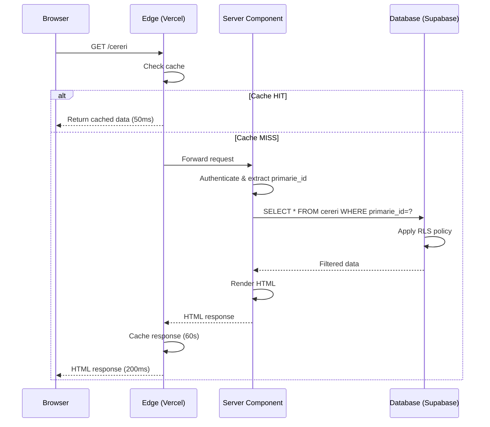

### Write Flow (POST Request)

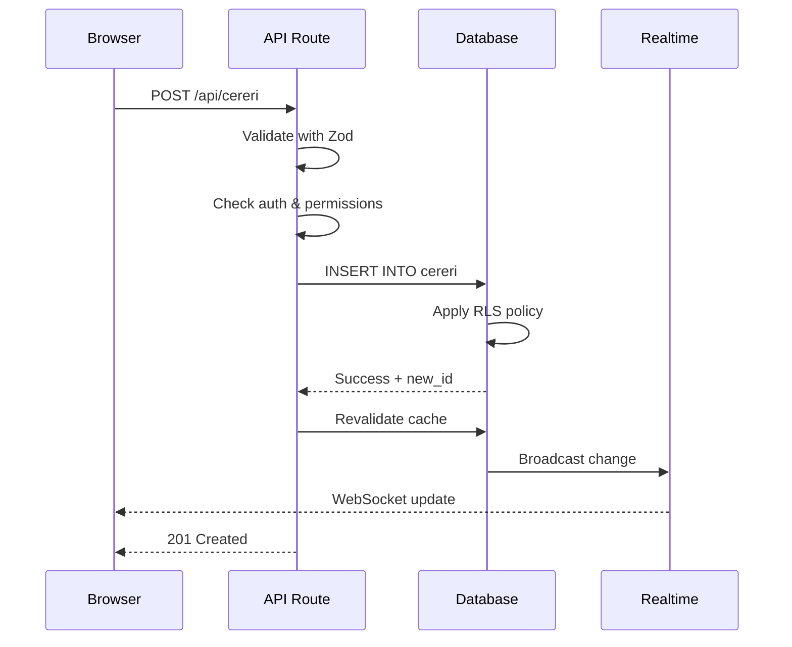

---

## 🎯 Design Decisions și Rationale

### De ce Next.js 15?

- ✅ **React Server Components**: Zero JS pentru static content
- ✅ **App Router**: File-based routing cu layouts
- ✅ **Edge Runtime**: Deploy global cu latență minimă
- ✅ **Image Optimization**: Automatic WebP/AVIF conversion
- ✅ **TypeScript**: First-class support

### De ce Supabase?

- ✅ **PostgreSQL**: Relational database cu full SQL
- ✅ **Row Level Security**: Multi-tenancy built-in
- ✅ **Realtime**: WebSocket subscriptions out-of-the-box
- ✅ **Auth**: JWT-based cu OAuth providers
- ✅ **Storage**: S3-compatible object storage
- ✅ **Cost**: Generous free tier, pay-as-you-grow

### De ce Vercel?

- ✅ **Next.js Native**: Built by Next.js creators
- ✅ **Edge Network**: 45+ global locations
- ✅ **Zero Config**: Git push → deploy
- ✅ **Preview Deploys**: Automatic per PR
- ✅ **Analytics**: Web Vitals tracking built-in

### De ce Tailwind CSS?

- ✅ **Utility-First**: Rapid prototyping
- ✅ **Type-Safe**: TypeScript autocomplete
- ✅ **Tree-Shaking**: Unused styles purged
- ✅ **Design System**: Consistent spacing/colors
- ✅ **Dark Mode**: Built-in class-based system

---

## 📊 Arhitectura în Cifre

### Scale Targets (2025)

| Metric                       | Curent         | Țintă 2025 |
| ---------------------------- | -------------- | ---------- |
| **Primării Active**          | 1              | 100        |
| **Utilizatori Înregistrați** | 0              | 10,000     |
| **Cereri Procesate**         | 0              | 50,000     |
| **Requests/Day**             | ~1,000         | ~100,000   |
| **Database Size**            | ~50MB          | ~5GB       |
| **Monthly Cost**             | $0 (free tier) | ~$100      |

### Performance SLAs

| Service Level            | Target | Measurement        |
| ------------------------ | ------ | ------------------ |
| **Uptime**               | 99.9%  | Vercel status      |
| **API Latency (p95)**    | <500ms | Sentry performance |
| **Page Load (p75)**      | <2s    | Vercel Analytics   |
| **Database Query (p95)** | <100ms | Supabase logs      |
| **Error Rate**           | <0.1%  | Sentry             |

---

## 🔗 Integrări Externe

### Servicii de Plată (Viitor)

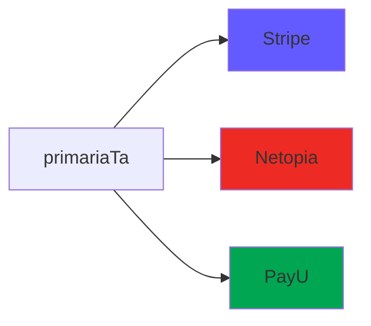

### Servicii Guvernamentale (Viitor)

- **SPV**: Sistem de Plăți și Venituri
- **ANAF**: Verificare coduri fiscale
- **ANCPI**: Date cadastrale
- **MAI**: Verificare acte identitate

---

**Versiune**: 1.0.0
**Ultima actualizare**: Octombrie 2025
**Autor**: Echipa Tehnică primariaTa❤️\_
