# Arhitectura Generală

Documentație detaliată a arhitecturii sistemului **primariaTa❤️\_** - platformă digitală pentru modernizarea serviciilor publice locale din România.

---

## 📋 Cuprins

1. [Prezentare Generală](#prezentare-generală)
2. [Tipul de Arhitectură](#tipul-de-arhitectură)
3. [Diagrama de Ansamblu](#diagrama-de-ansamblu)
4. [Stack Tehnologic](#stack-tehnologic)
5. [Pattern-uri Arhitecturale](#pattern-uri-arhitecturale)
6. [Strategia de Deployment](#strategia-de-deployment)
7. [Scalabilitate și Performance](#scalabilitate-și-performance)

---

## 🎯 Prezentare Generală

### Scop

**primariaTa❤️\_** este o platformă cloud-native, serverless, multi-tenant care oferă cetățenilor români acces digital la serviciile primăriilor locale.

### Caracteristici Cheie

- ✅ **Serverless**: Zero management de servere, scalare automată
- ✅ **Multi-tenant**: Izolare completă a datelor per primărie
- ✅ **Edge-first**: Distribuit global pentru latență minimă
- ✅ **Type-safe**: TypeScript end-to-end pentru siguranță maximă
- ✅ **Real-time**: Actualizări live pentru dashboard-uri administrative
- ✅ **Mobile-first**: Responsive design pentru toate dispozitivele

### Principii de Design

1. **Performance**: Sub 2.5s LCP, optimizare Core Web Vitals
2. **Security**: Multi-layer defense, RLS, zero-trust
3. **Accessibility**: WCAG 2.1 AA compliance
4. **Developer Experience**: Hot reload, type-safety, clear errors
5. **Cost Efficiency**: Pay-per-use, serverless economics

---

## 🏗️ Tipul de Arhitectură

### Serverless Architecture

Sistemul este complet **serverless**, eliminând necesitatea de management al infrastructurii:

- **Compute**: Vercel Edge Functions + Next.js Server Components
- **Database**: Supabase (PostgreSQL managed)
- **Storage**: Supabase Storage (S3-compatible)
- **Authentication**: Supabase Auth (JWT-based)

**Beneficii**:

- Scalare automată de la 0 la ∞ utilizatori
- Plată doar pentru utilizare efectivă
- Zero downtime deployments
- Resilience built-in (auto-healing)

### Cloud-Native Architecture

Built for cloud from ground up:

- **Stateless**: Fiecare request este independent
- **Immutable**: Deployments fără mutații de state
- **Observable**: Logging, metrics, tracing built-in
- **Resilient**: Graceful degradation, retry mechanisms

### Multi-Tenant Architecture

Izolare completă a datelor între primării:

- **Database Level**: Row Level Security (RLS) în PostgreSQL
- **Application Level**: Middleware verification la fiecare request
- **UI Level**: Context-based filtering (primarie_id)

**Strategie de izolare**:

```
Utilizator → Auth Token → primarie_id extraction → RLS policy check → Data access
```

---

## 📐 Diagrama de Ansamblu

### Arhitectura Completă

```mermaid
graph TB
    subgraph "Client Layer"
        Browser[🌐 Browser Web Desktop]
        Mobile[📱 Mobile Browser]
        PWA[📲 PWA Future]
    end

    subgraph "Edge Layer - Cloudflare"
        DNS[DNS Resolution]
        CDN[Global CDN]
        WAF[Web Application Firewall]
        DDoS[DDoS Protection]
        RateLimit[Rate Limiting]
    end

    subgraph "Application Layer - Vercel"
        EdgeFunc[⚡ Edge Functions]
        NextJS[Next.js 15 App Router]
        Middleware[🔐 Auth Middleware]
        ServerComp[Server Components]
        ClientComp[Client Components]
        StaticGen[Static Generation]
        ISR[Incremental Static Regeneration]
    end

    subgraph "Backend Layer - Supabase"
        Auth[🔑 Supabase Auth]
        AuthJWT[JWT Management]
        AuthRLS[RLS Integration]
        DB[(🗄️ PostgreSQL 15)]
        DBRLS[Row Level Security]
        DBIndex[Indexes & Optimization]
        Storage[📁 Supabase Storage]
        Realtime[⚡ Realtime Subscriptions]
        RealtimeWS[WebSocket Server]
    end

    subgraph "Monitoring & Analytics"
        Sentry[🐛 Sentry Error Tracking]
        VercelAnalytics[📊 Vercel Analytics]
        SupabaseLogs[📝 Supabase Logs]
    end

    Browser --> DNS
    Mobile --> DNS
    PWA -.-> DNS
    DNS --> CDN
    CDN --> WAF
    WAF --> DDoS
    DDoS --> RateLimit
    RateLimit --> EdgeFunc
    EdgeFunc --> NextJS
    NextJS --> Middleware
    Middleware --> ServerComp
    ServerComp --> ClientComp
    ServerComp --> StaticGen
    StaticGen --> ISR

    Middleware --> Auth
    Auth --> AuthJWT
    Auth --> AuthRLS
    ServerComp --> DB
    DB --> DBRLS
    DB --> DBIndex
    ServerComp --> Storage
    ClientComp --> Realtime
    Realtime --> RealtimeWS

    NextJS --> Sentry
    NextJS --> VercelAnalytics
    DB --> SupabaseLogs

    style Browser fill:#4285f4
    style Mobile fill:#34a853
    style CDN fill:#ff9800
    style NextJS fill:#000000,color:#ffffff
    style DB fill:#3ecf8e
    style Auth fill:#3ecf8e
```



### Flow-ul unei Cereri HTTP

```mermaid
sequenceDiagram
    participant U as 👤 User
    participant CF as Cloudflare Edge
    participant V as Vercel Edge
    participant MW as Middleware
    participant SC as Server Component
    participant DB as Supabase DB
    participant ST as Supabase Storage

    U->>CF: GET /primarii/bucuresti
    CF->>CF: DNS resolution
    CF->>CF: CDN cache check
    alt Cache HIT
        CF-->>U: Return cached page (50ms)
    else Cache MISS
        CF->>V: Forward to Vercel
        V->>MW: Auth check
        MW->>MW: Validate JWT token
        MW->>MW: Extract primarie_id
        MW->>SC: Authorized request
        SC->>DB: SELECT * FROM cereri WHERE primarie_id=?
        DB->>DB: Apply RLS policy
        DB-->>SC: Return filtered data
        SC->>ST: Fetch document URLs (if needed)
        ST-->>SC: Return signed URLs
        SC->>SC: Render Server Component
        SC-->>V: HTML Response
        V->>V: Cache response (60s)
        V-->>CF: HTML Response
        CF->>CF: Cache at edge (300s)
        CF-->>U: Return page (200ms)
    end
```



---

## 🛠️ Stack Tehnologic

### Frontend Stack

| Categorie             | Tehnologie      | Versiune | Rol                                |
| --------------------- | --------------- | -------- | ---------------------------------- |
| **Framework**         | Next.js         | 15.0.4   | React meta-framework cu SSR/SSG    |
| **UI Library**        | React           | 19.0.0   | Component-based UI library         |
| **Language**          | TypeScript      | 5.7.3    | Type-safe JavaScript               |
| **Styling**           | Tailwind CSS    | 4.0.0    | Utility-first CSS framework        |
| **Component Library** | shadcn/ui       | Latest   | Accessible, unstyled components    |
| **UI Primitives**     | Radix UI        | Latest   | Headless UI components             |
| **Animations**        | Framer Motion   | 11.15.0  | Declarative animations             |
| **3D Graphics**       | Three.js        | 0.171.0  | WebGL rendering engine             |
| **Postprocessing**    | postprocessing  | 6.36.4   | Three.js effects library           |
| **Icons**             | Lucide React    | 0.468.0  | Icon library                       |
| **Form Handling**     | React Hook Form | 7.54.2   | Performant form library            |
| **Validation**        | Zod             | 3.24.1   | TypeScript-first schema validation |
| **State Management**  | Zustand         | 5.0.2    | Lightweight state management       |
| **Date Handling**     | date-fns        | 4.1.0    | Modern JavaScript date utility     |

### Backend Stack

| Categorie            | Tehnologie            | Versiune | Rol                          |
| -------------------- | --------------------- | -------- | ---------------------------- |
| **BaaS Platform**    | Supabase              | Latest   | Backend as a Service         |
| **Database**         | PostgreSQL            | 15       | Relational database          |
| **Authentication**   | Supabase Auth         | Latest   | JWT-based auth system        |
| **Storage**          | Supabase Storage      | Latest   | S3-compatible object storage |
| **Realtime**         | Supabase Realtime     | Latest   | WebSocket subscriptions      |
| **Client Libraries** | @supabase/ssr         | 0.5.3    | Server-side Supabase client  |
|                      | @supabase/supabase-js | 2.47.11  | Client-side Supabase client  |

### Infrastructure Stack

| Categorie          | Tehnologie             | Rol                      |
| ------------------ | ---------------------- | ------------------------ |
| **Hosting**        | Vercel                 | Serverless hosting + CDN |
| **Edge Network**   | Cloudflare             | DNS + CDN + Security     |
| **Domain**         | primariata.work        | Custom domain            |
| **SSL/TLS**        | Cloudflare + Vercel    | Automatic HTTPS          |
| **CI/CD**          | Vercel Git Integration | Auto-deploy on push      |
| **Error Tracking** | Sentry                 | Error monitoring         |
| **Analytics**      | Vercel Analytics       | Web vitals tracking      |

### Developer Tools

| Categorie           | Tehnologie          | Rol                   |
| ------------------- | ------------------- | --------------------- |
| **Package Manager** | npm                 | Dependency management |
| **Code Quality**    | ESLint              | Linting               |
| **Code Formatting** | Prettier            | Code formatting       |
| **Git Hooks**       | Husky               | Pre-commit hooks      |
| **Type Checking**   | TypeScript Compiler | Static type checking  |

---

## 🎨 Pattern-uri Arhitecturale

### 1. JAMstack Pattern

**primariaTa❤️\_** folosește JAMstack (JavaScript, APIs, Markup):


**Beneficii**:

- **Performance**: Static files servite de la CDN (TTFB ~50ms)
- **Scalability**: CDN se ocupă de scaling, nu servere
- **Security**: No server → no server attacks
- **Developer Experience**: Decoupling front-end de back-end

**Implementare**:

```typescript
// pages/primarii/[slug]/page.tsx
export async function generateStaticParams() {
  // Pre-generate pages for top 100 primarii
  const primarii = await supabase.from("primarii").select("slug").limit(100);

  return primarii.data?.map((p) => ({ slug: p.slug })) || [];
}

// ISR: Revalidate every 60 seconds
export const revalidate = 60;
```

### 2. Server Components Pattern

Next.js 15 folosește **React Server Components** (RSC) pentru optimizare:


**Server Components** (default):

- ✅ Data fetching direct din server
- ✅ Zero JavaScript în browser
- ✅ Access la backend resources (DB, FS)
- ❌ No interactivity (onClick, useState)

**Client Components** ('use client'):

- ✅ Full interactivity (hooks, events)
- ✅ Browser APIs (localStorage, window)
- ❌ Increase bundle size
- ❌ No direct backend access

**Best Practice**:

```typescript
// ✅ Good: Server Component fetches data
async function PrimariiList() {
  const primarii = await getPrimarii(); // Server-side fetch
  return (
    <div>
      {primarii.map(p => (
        <PrimariaCard key={p.id} data={p} /> // Client Component
      ))}
    </div>
  );
}

// ❌ Bad: Client Component fetches data
'use client';
function PrimariiList() {
  const [primarii, setPrimarii] = useState([]);
  useEffect(() => {
    fetch('/api/primarii').then(/* ... */); // Unnecessary client fetch
  }, []);
  // ...
}
```

### 3. Multi-Tenant Pattern

**Izolare completă a datelor** la nivel de rând (Row Level Security):

```mermaid
graph TB
    User1[👤 User Primăria A] --> Auth1[JWT: primarie_id=1]
    User2[👤 User Primăria B] --> Auth2[JWT: primarie_id=2]

    Auth1 --> RLS[PostgreSQL RLS]
    Auth2 --> RLS

    RLS --> Query1[SELECT * WHERE primarie_id=1]
    RLS --> Query2[SELECT * WHERE primarie_id=2]

    Query1 --> Data1[(Data Primăria A)]
    Query2 --> Data2[(Data Primăria B)]

    style User1 fill:#4285f4
    style User2 fill:#ea4335
    style RLS fill:#34a853
```



**Implementare**:

```sql
-- Enable RLS on table
ALTER TABLE cereri ENABLE ROW LEVEL SECURITY;

-- Policy: Users can only see their primarie's data
CREATE POLICY "tenant_isolation_policy" ON cereri
  FOR SELECT
  TO authenticated
  USING (
    primarie_id = (auth.jwt() ->> 'primarie_id')::uuid
  );
```

### 4. Edge-First Pattern

**Deployment global** cu Vercel Edge Network:

```mermaid
graph TB
    subgraph "Global Users"
        U1[🇷🇴 România]
        U2[🇩🇪 Germania]
        U3[🇬🇧 UK]
    end

    subgraph "Edge Locations"
        E1[Bucharest Edge]
        E2[Frankfurt Edge]
        E3[London Edge]
    end

    subgraph "Origin"
        O[Vercel Origin US]
    end

    U1 --> E1
    U2 --> E2
    U3 --> E3

    E1 -.->|Cache MISS| O
    E2 -.->|Cache MISS| O
    E3 -.->|Cache MISS| O

    style E1 fill:#00d084
    style E2 fill:#00d084
    style E3 fill:#00d084
```



**Latency Optimization**:

- **Romania**: ~50ms (Bucharest edge)
- **Europe**: ~80ms (Frankfurt, London edges)
- **Global**: <200ms (45+ edge locations)

---

## 🚀 Strategia de Deployment

### Deployment Pipeline


### Environments

| Environment     | Trigger       | URL             | Purpose           |
| --------------- | ------------- | --------------- | ----------------- |
| **Development** | Local         | localhost:3000  | Local development |
| **Preview**     | PR creation   | `*.vercel.app`  | QA testing per PR |
| **Production**  | Merge to main | primariata.work | Live environment  |

### Deployment Strategy

**Zero-Downtime Deployments**:

1. **Build**: Compile app în Vercel
2. **Deploy**: Push to edge locations
3. **Test**: Automated health checks
4. **Activate**: Atomic switch to new version
5. **Rollback**: One-click rollback dacă issues

**Cache Invalidation**:

```typescript
// Revalidate specific path
export async function POST(request: Request) {
  const path = request.nextUrl.searchParams.get("path");
  revalidatePath(path);
  return Response.json({ revalidated: true });
}
```

---

## 📈 Scalabilitate și Performance

### Horizontal Scaling

**Automatic scaling** la toate nivelele:


**Scalare la nivel de**:

- **Edge Functions**: 0 → 1000s instances (automatic)
- **Database**: Connection pooling (Supabase Pooler)
- **CDN**: Unlimited bandwidth (Cloudflare)

### Performance Optimization

**Strategii aplicate**:

1. **Code Splitting**

```typescript
// Dynamic imports pentru heavy components
const HeavyChart = dynamic(() => import('./HeavyChart'), {
  loading: () => <Skeleton />,
  ssr: false // Client-side only
});
```

2. **Image Optimization**

```typescript
// Next.js Image component cu lazy loading
<Image
  src="/hero.jpg"
  width={1200}
  height={800}
  alt="Hero"
  priority // LCP optimization
  placeholder="blur"
/>
```

3. **Font Optimization**

```typescript
// next/font cu self-hosting
import { Inter } from "next/font/inter";
const inter = Inter({ subsets: ["latin"], display: "swap" });
```

4. **Prefetching**

```typescript
// Prefetch next navigation
<Link href="/primarii" prefetch={true}>
  Vezi Primării
</Link>
```

### Performance Budget

| Metric                  | Budget | Current | Status |
| ----------------------- | ------ | ------- | ------ |
| **JavaScript Bundle**   | <200KB | ~180KB  | ✅     |
| **CSS Bundle**          | <50KB  | ~35KB   | ✅     |
| **Total Page Weight**   | <500KB | ~420KB  | ✅     |
| **Time to Interactive** | <3.8s  | ~3.0s   | ✅     |

---

## 🔄 Data Flow Architecture

### Read Flow (GET Request)


### Write Flow (POST Request)


---

## 🎯 Design Decisions și Rationale

### De ce Next.js 15?

- ✅ **React Server Components**: Zero JS pentru static content
- ✅ **App Router**: File-based routing cu layouts
- ✅ **Edge Runtime**: Deploy global cu latență minimă
- ✅ **Image Optimization**: Automatic WebP/AVIF conversion
- ✅ **TypeScript**: First-class support

### De ce Supabase?

- ✅ **PostgreSQL**: Relational database cu full SQL
- ✅ **Row Level Security**: Multi-tenancy built-in
- ✅ **Realtime**: WebSocket subscriptions out-of-the-box
- ✅ **Auth**: JWT-based cu OAuth providers
- ✅ **Storage**: S3-compatible object storage
- ✅ **Cost**: Generous free tier, pay-as-you-grow

### De ce Vercel?

- ✅ **Next.js Native**: Built by Next.js creators
- ✅ **Edge Network**: 45+ global locations
- ✅ **Zero Config**: Git push → deploy
- ✅ **Preview Deploys**: Automatic per PR
- ✅ **Analytics**: Web Vitals tracking built-in

### De ce Tailwind CSS?

- ✅ **Utility-First**: Rapid prototyping
- ✅ **Type-Safe**: TypeScript autocomplete
- ✅ **Tree-Shaking**: Unused styles purged
- ✅ **Design System**: Consistent spacing/colors
- ✅ **Dark Mode**: Built-in class-based system

---

## 📊 Arhitectura în Cifre

### Scale Targets (2025)

| Metric                       | Curent         | Țintă 2025 |
| ---------------------------- | -------------- | ---------- |
| **Primării Active**          | 1              | 100        |
| **Utilizatori Înregistrați** | 0              | 10,000     |
| **Cereri Procesate**         | 0              | 50,000     |
| **Requests/Day**             | ~1,000         | ~100,000   |
| **Database Size**            | ~50MB          | ~5GB       |
| **Monthly Cost**             | $0 (free tier) | ~$100      |

### Performance SLAs

| Service Level            | Target | Measurement        |
| ------------------------ | ------ | ------------------ |
| **Uptime**               | 99.9%  | Vercel status      |
| **API Latency (p95)**    | <500ms | Sentry performance |
| **Page Load (p75)**      | <2s    | Vercel Analytics   |
| **Database Query (p95)** | <100ms | Supabase logs      |
| **Error Rate**           | <0.1%  | Sentry             |

---

## 🔗 Integrări Externe

### Servicii de Plată (Viitor)


### Servicii Guvernamentale (Viitor)

- **SPV**: Sistem de Plăți și Venituri
- **ANAF**: Verificare coduri fiscale
- **ANCPI**: Date cadastrale
- **MAI**: Verificare acte identitate

---

**Versiune**: 1.0.0
**Ultima actualizare**: Octombrie 2025
**Autor**: Echipa Tehnică primariaTa❤️\_
