# Baza de Date

Documentație completă a schemei bazei de date PostgreSQL pentru **primariaTa❤️\_**.

---

## 📋 Cuprins

1. [Prezentare Generală](#prezentare-generală)
2. [Schema Completă](#schema-completă)
3. [Tabele Survey (Detaliat)](#tabele-survey-detaliat)
4. [Relații între Tabele](#relații-între-tabele)
5. [Row Level Security (RLS)](#row-level-security-rls)
6. [Indexare și Optimizare](#indexare-și-optimizare)
7. [Migrări și Versiuni](#migrări-și-versiuni)

---

## 🎯 Prezentare Generală

### Tehnologie

- **DBMS**: PostgreSQL 15.x
- **Hosting**: Supabase (managed PostgreSQL)
- **Extensions**: uuid-ossp, pgcrypto, pgjwt
- **Encoding**: UTF-8
- **Timezone**: UTC (convertit la București în aplicație)

### Caracteristici Cheie

- ✅ **Multi-tenant**: Izolare prin RLS (Row Level Security)
- ✅ **Type-safe**: Schema Zod sincronizată cu TypeScript
- ✅ **Audit Trail**: created_at, updated_at pe toate tabelele
- ✅ **Soft Deletes**: deleted_at pentru ștergeri logice (unde aplicabil)
- ✅ **JSONB**: Flexibilitate pentru date semi-structurate
- ✅ **Full-Text Search**: Indexare tsvector pentru căutare

### Convenții de Naming

- **Tabele**: snake_case, plural (utilizatori, cereri)
- **Coloane**: snake_case (first_name, created_at)
- **Primary Keys**: id (UUID v4)
- **Foreign Keys**: [table_name]\_id (primarie_id, user_id)
- **Indexes**: idx*[table]*[column] (idx_cereri_status)
- **Constraints**: [table]_[column]_[type] (cereri_status_check)

---

## 📊 Schema Completă

### Lista Tabelelor

| #   | Tabel                | Scop                                     | Rânduri (~) |
| --- | -------------------- | ---------------------------------------- | ----------- |
| 1   | `utilizatori`        | Utilizatori sistem (cetățeni + oficiali) | 10,000      |
| 2   | `primarii`           | Primării înregistrate                    | 100         |
| 3   | `judete`             | Județe România (referință)               | 42          |
| 4   | `localitati`         | Orașe + comune                           | 3,181       |
| 5   | `cereri`             | Cereri depuse de cetățeni                | 50,000      |
| 6   | `tipuri_cerere`      | Tipuri de cereri (template)              | 50          |
| 7   | `documente`          | Documente încărcate                      | 100,000     |
| 8   | `plati`              | Plăți procesate                          | 30,000      |
| 9   | `sesizari`           | Sesizări cetățeni                        | 5,000       |
| 10  | `notificari`         | Notificări push/email                    | 200,000     |
| 11  | `survey_respondents` | Respondenți sondaj                       | 1,000+      |
| 12  | `survey_responses`   | Răspunsuri sondaj                        | 20,000+     |
| 13  | `audit_logs`         | Log-uri acțiuni                          | 500,000     |

---

## 📋 Tabele Survey (Detaliat)

### 1. survey_respondents

**Scop**: Stochează informații despre respondenții sondajului de cercetare inițial.

**Schema SQL**:

```sql
CREATE TABLE survey_respondents (
    -- Primary Key
    id UUID PRIMARY KEY DEFAULT uuid_generate_v4(),

    -- Personal Information
    first_name VARCHAR(100) NOT NULL,
    last_name VARCHAR(100) NOT NULL,
    email VARCHAR(255) UNIQUE,

    -- Demographics
    age_category VARCHAR(10) CHECK (age_category IN ('18-25', '26-35', '36-45', '46-60', '60+')),
    county VARCHAR(100) NOT NULL,
    locality VARCHAR(200) NOT NULL,

    -- Respondent Type
    respondent_type VARCHAR(20) NOT NULL CHECK (respondent_type IN ('citizen', 'official')),
    department VARCHAR(200), -- Doar pentru officials

    -- Completion Status
    is_completed BOOLEAN DEFAULT FALSE,
    completed_at TIMESTAMP WITH TIME ZONE,

    -- Tracking
    ip_address INET,
    user_agent TEXT,

    -- Timestamps
    created_at TIMESTAMP WITH TIME ZONE DEFAULT NOW(),
    updated_at TIMESTAMP WITH TIME ZONE DEFAULT NOW()
);

-- Comments
COMMENT ON TABLE survey_respondents IS 'Respondenți sondaj cercetare inițială';
COMMENT ON COLUMN survey_respondents.respondent_type IS 'Tip respondent: citizen (cetățean) sau official (funcționar)';
COMMENT ON COLUMN survey_respondents.is_completed IS 'Flag pentru sondaj complet finalizat';
```

**Indexare**:

```sql
-- Indecși pentru performance
CREATE INDEX idx_survey_respondent_type ON survey_respondents(respondent_type);
CREATE INDEX idx_survey_created_at ON survey_respondents(created_at DESC);
CREATE INDEX idx_survey_county_locality ON survey_respondents(county, locality);
CREATE INDEX idx_survey_completed ON survey_respondents(is_completed, completed_at);
CREATE INDEX idx_survey_email ON survey_respondents(email) WHERE email IS NOT NULL;

-- Index pentru full-text search
CREATE INDEX idx_survey_name_search ON survey_respondents
USING GIN (to_tsvector('romanian', first_name || ' ' || last_name));
```

**Trigger pentru updated_at**:

```sql
CREATE TRIGGER update_survey_respondents_updated_at
    BEFORE UPDATE ON survey_respondents
    FOR EACH ROW
    EXECUTE FUNCTION update_updated_at_column();
```

### 2. survey_responses

**Scop**: Stochează răspunsurile individuale la întrebările sondajului.

**Schema SQL**:

```sql
CREATE TABLE survey_responses (
    -- Primary Key
    id UUID PRIMARY KEY DEFAULT uuid_generate_v4(),

    -- Foreign Key
    respondent_id UUID NOT NULL REFERENCES survey_respondents(id) ON DELETE CASCADE,

    -- Question Identification
    question_id VARCHAR(50) NOT NULL, -- Ex: "q1_digital_services", "q2_satisfaction"
    question_type VARCHAR(20) NOT NULL CHECK (
        question_type IN ('single_choice', 'multiple_choice', 'text', 'short_text', 'rating')
    ),

    -- Answer Data (polymorphic - one of these will be populated)
    answer_text TEXT, -- Pentru text/short_text
    answer_choices JSONB, -- Pentru single/multiple choice: ["option1", "option2"]
    answer_rating INTEGER CHECK (answer_rating BETWEEN 1 AND 5), -- Pentru rating

    -- Timestamps
    created_at TIMESTAMP WITH TIME ZONE DEFAULT NOW(),
    updated_at TIMESTAMP WITH TIME ZONE DEFAULT NOW(),

    -- Constraints
    UNIQUE(respondent_id, question_id) -- Un răspuns per întrebare per respondent
);

-- Comments
COMMENT ON TABLE survey_responses IS 'Răspunsuri individuale la întrebările sondajului';
COMMENT ON COLUMN survey_responses.question_id IS 'ID unic întrebare (ex: q1_digital_services)';
COMMENT ON COLUMN survey_responses.answer_choices IS 'Array JSON cu opțiunile selectate';
```

**Indexare**:

```sql
-- Indecși pentru performance
CREATE INDEX idx_response_respondent ON survey_responses(respondent_id);
CREATE INDEX idx_response_question_id ON survey_responses(question_id);
CREATE INDEX idx_response_question_type ON survey_responses(question_type);
CREATE INDEX idx_response_created_at ON survey_responses(created_at DESC);

-- Index pentru JSONB queries
CREATE INDEX idx_response_choices ON survey_responses USING GIN (answer_choices);

-- Index pentru full-text search în răspunsuri text
CREATE INDEX idx_response_text_search ON survey_responses
USING GIN (to_tsvector('romanian', COALESCE(answer_text, '')));
```

**Trigger pentru updated_at**:

```sql
CREATE TRIGGER update_survey_responses_updated_at
    BEFORE UPDATE ON survey_responses
    FOR EACH ROW
    EXECUTE FUNCTION update_updated_at_column();
```

**Constraint pentru validare polimorfică**:

```sql
-- Asigură că exact un câmp de răspuns este populat
ALTER TABLE survey_responses ADD CONSTRAINT check_answer_populated CHECK (
    (
        (answer_text IS NOT NULL AND answer_choices IS NULL AND answer_rating IS NULL) OR
        (answer_text IS NULL AND answer_choices IS NOT NULL AND answer_rating IS NULL) OR
        (answer_text IS NULL AND answer_choices IS NULL AND answer_rating IS NOT NULL)
    )
);
```

---

## 🔗 Relații între Tabele

### Diagrama ERD Completă


### Relații Survey

**survey_respondents → survey_responses** (1:N)

- Un respondent poate avea multiple răspunsuri (câte unul per întrebare)
- `ON DELETE CASCADE`: Ștergerea respondentului șterge automat toate răspunsurile
- Constraint `UNIQUE(respondent_id, question_id)`: Un singur răspuns per întrebare

```mermaid
erDiagram
    SURVEY_RESPONDENTS ||--o{ SURVEY_RESPONSES : has_many

    SURVEY_RESPONDENTS {
        uuid id PK "Primary key"
        string first_name "Prenume"
        string last_name "Nume"
        string respondent_type "citizen | official"
        boolean is_completed "Sondaj finalizat?"
    }

    SURVEY_RESPONSES {
        uuid id PK "Primary key"
        uuid respondent_id FK "Link la respondent"
        string question_id "ID întrebare (q1, q2...)"
        string question_type "Tip întrebare"
        text answer_text "Răspuns text"
        jsonb answer_choices "Opțiuni selectate"
        int answer_rating "Rating 1-5"
    }
```



---

## 🔐 Row Level Security (RLS)

### Conceptul RLS

**Row Level Security** permite izolarea datelor la nivel de rând în PostgreSQL, esențial pentru arhitectura multi-tenant.

**Flow RLS**:


### Activarea RLS

```sql
-- Enable RLS pe toate tabelele multi-tenant
ALTER TABLE survey_respondents ENABLE ROW LEVEL SECURITY;
ALTER TABLE survey_responses ENABLE ROW LEVEL SECURITY;
ALTER TABLE cereri ENABLE ROW LEVEL SECURITY;
ALTER TABLE utilizatori ENABLE ROW LEVEL SECURITY;
ALTER TABLE documente ENABLE ROW LEVEL SECURITY;
ALTER TABLE plati ENABLE ROW LEVEL SECURITY;
ALTER TABLE sesizari ENABLE ROW LEVEL SECURITY;
ALTER TABLE notificari ENABLE ROW LEVEL SECURITY;
```

### Policy: Survey (Public Access)

**Scop**: Survey-ul este public, oricine poate submite răspunsuri (anon), dar doar adminii pot citi.

```sql
-- ========================================
-- SURVEY_RESPONDENTS POLICIES
-- ========================================

-- Policy 1: Oricine (anon) poate insera respondent
CREATE POLICY "public_insert_survey_respondent"
ON survey_respondents
FOR INSERT
TO anon
WITH CHECK (true);

-- Policy 2: Oricine autentificat poate selecta propriul respondent
CREATE POLICY "user_select_own_survey_respondent"
ON survey_respondents
FOR SELECT
TO authenticated
USING (
    email = auth.jwt() ->> 'email' OR
    auth.jwt() ->> 'role' IN ('admin', 'super_admin')
);

-- Policy 3: Adminii pot selecta toți respondenții
CREATE POLICY "admin_select_all_survey_respondents"
ON survey_respondents
FOR SELECT
TO authenticated
USING (
    auth.jwt() ->> 'role' IN ('admin', 'super_admin')
);

-- Policy 4: Adminii pot șterge respondenți
CREATE POLICY "admin_delete_survey_respondent"
ON survey_respondents
FOR DELETE
TO authenticated
USING (
    auth.jwt() ->> 'role' IN ('admin', 'super_admin')
);

-- Policy 5: Utilizatorii pot updata propriul respondent (is_completed, completed_at)
CREATE POLICY "user_update_own_survey_respondent"
ON survey_respondents
FOR UPDATE
TO authenticated
USING (email = auth.jwt() ->> 'email')
WITH CHECK (email = auth.jwt() ->> 'email');
```

```sql
-- ========================================
-- SURVEY_RESPONSES POLICIES
-- ========================================

-- Policy 1: Oricine (anon) poate insera răspunsuri
CREATE POLICY "public_insert_survey_response"
ON survey_responses
FOR INSERT
TO anon
WITH CHECK (true);

-- Policy 2: Utilizatorii pot selecta propriile răspunsuri
CREATE POLICY "user_select_own_survey_responses"
ON survey_responses
FOR SELECT
TO authenticated
USING (
    respondent_id IN (
        SELECT id FROM survey_respondents
        WHERE email = auth.jwt() ->> 'email'
    ) OR
    auth.jwt() ->> 'role' IN ('admin', 'super_admin')
);

-- Policy 3: Adminii pot selecta toate răspunsurile
CREATE POLICY "admin_select_all_survey_responses"
ON survey_responses
FOR SELECT
TO authenticated
USING (
    auth.jwt() ->> 'role' IN ('admin', 'super_admin')
);

-- Policy 4: Adminii pot șterge răspunsuri (CASCADE cu respondent)
CREATE POLICY "admin_delete_survey_response"
ON survey_responses
FOR DELETE
TO authenticated
USING (
    auth.jwt() ->> 'role' IN ('admin', 'super_admin')
);
```

### Policy: Multi-Tenant (Primării)

**Scop**: Fiecare primărie vede doar propriile date.

```sql
-- ========================================
-- CERERI POLICIES (exemplu multi-tenant)
-- ========================================

-- Policy 1: Utilizatorii văd doar cererile din propria primărie
CREATE POLICY "tenant_isolation_cereri"
ON cereri
FOR SELECT
TO authenticated
USING (
    primarie_id = (auth.jwt() ->> 'primarie_id')::uuid
);

-- Policy 2: Utilizatorii pot insera cereri în propria primărie
CREATE POLICY "tenant_insert_cereri"
ON cereri
FOR INSERT
TO authenticated
WITH CHECK (
    primarie_id = (auth.jwt() ->> 'primarie_id')::uuid
);

-- Policy 3: Utilizatorii pot updata cereri din propria primărie
CREATE POLICY "tenant_update_cereri"
ON cereri
FOR UPDATE
TO authenticated
USING (
    primarie_id = (auth.jwt() ->> 'primarie_id')::uuid
)
WITH CHECK (
    primarie_id = (auth.jwt() ->> 'primarie_id')::uuid
);

-- Policy 4: Super admins pot vedea toate cererile (monitoring)
CREATE POLICY "super_admin_select_all_cereri"
ON cereri
FOR SELECT
TO authenticated
USING (
    auth.jwt() ->> 'role' = 'super_admin'
);
```

### Testare RLS

**Test 1: Verificare izolare survey**

```sql
-- Set user context (simulare JWT)
SET LOCAL jwt.claims.role = 'admin';

-- Query should return all survey respondents
SELECT COUNT(*) FROM survey_respondents;
```

**Test 2: Verificare multi-tenant**

```sql
-- Set tenant context
SET LOCAL jwt.claims.primarie_id = 'uuid-primarie-1';

-- Query should return only cereri from primarie-1
SELECT COUNT(*) FROM cereri;
```

---

## ⚡ Indexare și Optimizare

### Strategia de Indexare

**Principii**:

1. **Primary Keys**: Automatic index (B-tree)
2. **Foreign Keys**: Manual index pentru JOIN performance
3. **WHERE Clauses**: Index pe coloane filtrate frecvent
4. **ORDER BY**: Index pe coloane sortate
5. **JSONB**: GIN index pentru queries în JSONB
6. **Full-Text**: GIN index cu tsvector pentru căutare

### Indecși Survey

```sql
-- ========================================
-- SURVEY_RESPONDENTS INDEXES
-- ========================================

-- Index pentru filtrare pe respondent_type
CREATE INDEX idx_survey_respondent_type
ON survey_respondents(respondent_type);

-- Index pentru sortare cronologică
CREATE INDEX idx_survey_created_at
ON survey_respondents(created_at DESC);

-- Composite index pentru location queries
CREATE INDEX idx_survey_location
ON survey_respondents(county, locality);

-- Partial index pentru completed surveys (query optimization)
CREATE INDEX idx_survey_completed
ON survey_respondents(is_completed, completed_at)
WHERE is_completed = true;

-- Unique partial index pentru email (exclude nulls)
CREATE UNIQUE INDEX idx_survey_email_unique
ON survey_respondents(email)
WHERE email IS NOT NULL;

-- Full-text search index
CREATE INDEX idx_survey_name_search
ON survey_respondents
USING GIN (to_tsvector('romanian', first_name || ' ' || last_name));
```

```sql
-- ========================================
-- SURVEY_RESPONSES INDEXES
-- ========================================

-- Index pentru JOIN cu respondents
CREATE INDEX idx_response_respondent
ON survey_responses(respondent_id);

-- Index pentru filtrare pe question_id
CREATE INDEX idx_response_question_id
ON survey_responses(question_id);

-- Index pentru aggregări pe question_type
CREATE INDEX idx_response_question_type
ON survey_responses(question_type);

-- GIN index pentru queries în answer_choices (JSONB)
CREATE INDEX idx_response_choices
ON survey_responses
USING GIN (answer_choices);

-- Full-text search în răspunsuri text
CREATE INDEX idx_response_text_search
ON survey_responses
USING GIN (to_tsvector('romanian', COALESCE(answer_text, '')));

-- Composite index pentru analiză per question
CREATE INDEX idx_response_question_analysis
ON survey_responses(question_id, question_type, created_at);
```

### Query Optimization Examples

**Query 1: Dashboard metrics (fast aggregate)**

```sql
-- Folosește idx_survey_respondent_type și idx_survey_completed
SELECT
    respondent_type,
    COUNT(*) as total,
    COUNT(*) FILTER (WHERE is_completed) as completed,
    AVG(EXTRACT(EPOCH FROM (completed_at - created_at))/60) as avg_minutes
FROM survey_respondents
GROUP BY respondent_type;

-- EXPLAIN ANALYZE: ~15ms pentru 1000 respondents
```

**Query 2: Location distribution (composite index)**

```sql
-- Folosește idx_survey_location
SELECT county, locality, COUNT(*) as respondents
FROM survey_respondents
WHERE respondent_type = 'citizen'
GROUP BY county, locality
ORDER BY respondents DESC
LIMIT 20;

-- EXPLAIN ANALYZE: ~20ms pentru 1000 respondents
```

**Query 3: Full-text search (GIN index)**

```sql
-- Folosește idx_survey_name_search
SELECT first_name, last_name, email
FROM survey_respondents
WHERE to_tsvector('romanian', first_name || ' ' || last_name) @@
      plainto_tsquery('romanian', 'Ion Popescu');

-- EXPLAIN ANALYZE: ~5ms pentru 1000 respondents
```

**Query 4: JSONB analysis (GIN index)**

```sql
-- Folosește idx_response_choices
SELECT
    question_id,
    choice,
    COUNT(*) as frequency
FROM survey_responses,
     jsonb_array_elements_text(answer_choices) as choice
WHERE question_type = 'multiple_choice'
GROUP BY question_id, choice
ORDER BY question_id, frequency DESC;

-- EXPLAIN ANALYZE: ~30ms pentru 10,000 responses
```

---

## 🔄 Migrări și Versiuni

### Structura Migrărilor

```
supabase/
└── migrations/
    ├── 20250101_init_schema.sql
    ├── 20250115_add_survey_tables.sql
    ├── 20250120_add_rls_policies.sql
    ├── 20250125_add_indexes.sql
    └── 20250130_add_audit_logs.sql
```

### Template Migrare

```sql
-- Migration: add_survey_tables
-- Created: 2025-01-15
-- Description: Creează tabelele survey_respondents și survey_responses

BEGIN;

-- ========================================
-- CREATE TABLES
-- ========================================

CREATE TABLE IF NOT EXISTS survey_respondents (
    -- ... (schema de mai sus)
);

CREATE TABLE IF NOT EXISTS survey_responses (
    -- ... (schema de mai sus)
);

-- ========================================
-- ADD COMMENTS
-- ========================================

COMMENT ON TABLE survey_respondents IS 'Respondenți sondaj cercetare';
-- ...

-- ========================================
-- CREATE INDEXES
-- ========================================

CREATE INDEX idx_survey_respondent_type ON survey_respondents(respondent_type);
-- ...

-- ========================================
-- ENABLE RLS
-- ========================================

ALTER TABLE survey_respondents ENABLE ROW LEVEL SECURITY;
ALTER TABLE survey_responses ENABLE ROW LEVEL SECURITY;

-- ========================================
-- CREATE POLICIES
-- ========================================

CREATE POLICY "public_insert_survey_respondent" ON survey_respondents
FOR INSERT TO anon WITH CHECK (true);
-- ...

-- ========================================
-- CREATE TRIGGERS
-- ========================================

CREATE TRIGGER update_survey_respondents_updated_at
    BEFORE UPDATE ON survey_respondents
    FOR EACH ROW
    EXECUTE FUNCTION update_updated_at_column();

COMMIT;
```

### Rollback Strategy

```sql
-- Migration Rollback: add_survey_tables
-- Created: 2025-01-15

BEGIN;

-- Drop policies (în ordine inversă)
DROP POLICY IF EXISTS "admin_delete_survey_response" ON survey_responses;
-- ...

-- Disable RLS
ALTER TABLE survey_responses DISABLE ROW LEVEL SECURITY;
ALTER TABLE survey_respondents DISABLE ROW LEVEL SECURITY;

-- Drop indexes
DROP INDEX IF EXISTS idx_survey_respondent_type;
-- ...

-- Drop tables (cu CASCADE pentru foreign keys)
DROP TABLE IF EXISTS survey_responses CASCADE;
DROP TABLE IF EXISTS survey_respondents CASCADE;

COMMIT;
```

---

## 📊 Statistici și Monitoring

### Monitoring Queries

**Query 1: Table sizes**

```sql
SELECT
    schemaname,
    tablename,
    pg_size_pretty(pg_total_relation_size(schemaname||'.'||tablename)) AS size,
    pg_total_relation_size(schemaname||'.'||tablename) AS size_bytes
FROM pg_tables
WHERE schemaname = 'public'
ORDER BY size_bytes DESC;
```

**Query 2: Index usage**

```sql
SELECT
    schemaname,
    tablename,
    indexname,
    idx_scan,
    idx_tup_read,
    idx_tup_fetch
FROM pg_stat_user_indexes
WHERE schemaname = 'public'
ORDER BY idx_scan DESC;
```

**Query 3: Slow queries**

```sql
-- Supabase Dashboard > Logs > Query Performance
-- Sau prin extension pg_stat_statements
SELECT
    query,
    calls,
    total_time,
    mean_time,
    max_time
FROM pg_stat_statements
WHERE query LIKE '%survey%'
ORDER BY mean_time DESC
LIMIT 20;
```

---

## 🛠️ Utilități și Funcții Helper

### Funcția update_updated_at

```sql
-- Funcție pentru auto-update updated_at
CREATE OR REPLACE FUNCTION update_updated_at_column()
RETURNS TRIGGER AS $$
BEGIN
    NEW.updated_at = NOW();
    RETURN NEW;
END;
$$ LANGUAGE plpgsql;

-- Aplicare pe toate tabelele relevante
CREATE TRIGGER update_survey_respondents_updated_at
    BEFORE UPDATE ON survey_respondents
    FOR EACH ROW
    EXECUTE FUNCTION update_updated_at_column();
```

### View pentru Statistici Survey

```sql
CREATE OR REPLACE VIEW survey_statistics AS
SELECT
    -- Overall metrics
    COUNT(*) as total_respondents,
    COUNT(*) FILTER (WHERE is_completed) as completed_respondents,
    COUNT(*) FILTER (WHERE respondent_type = 'citizen') as citizens,
    COUNT(*) FILTER (WHERE respondent_type = 'official') as officials,

    -- Completion rate
    ROUND(
        100.0 * COUNT(*) FILTER (WHERE is_completed) / NULLIF(COUNT(*), 0),
        2
    ) as completion_rate_percent,

    -- Time metrics
    AVG(EXTRACT(EPOCH FROM (completed_at - created_at))/60)
        FILTER (WHERE is_completed) as avg_completion_minutes,

    -- Timestamps
    MIN(created_at) as first_response_at,
    MAX(created_at) as last_response_at
FROM survey_respondents;
```

---

## 📚 Resurse și Documentație

### PostgreSQL

- [PostgreSQL 15 Documentation](https://www.postgresql.org/docs/15/)
- [Row Level Security Guide](https://www.postgresql.org/docs/15/ddl-rowsecurity.html)
- [JSONB Functions](https://www.postgresql.org/docs/15/functions-json.html)
- [Full-Text Search](https://www.postgresql.org/docs/15/textsearch.html)

### Supabase

- [Supabase Database Docs](https://supabase.com/docs/guides/database)
- [Row Level Security Cookbook](https://supabase.com/docs/guides/auth/row-level-security)
- [Performance Tuning](https://supabase.com/docs/guides/database/performance)

---

**Versiune**: 1.0.0
**Ultima actualizare**: Octombrie 2025
**Autor**: Echipa Tehnică primariaTa❤️\_
