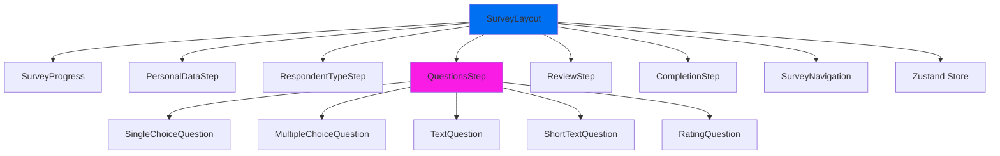
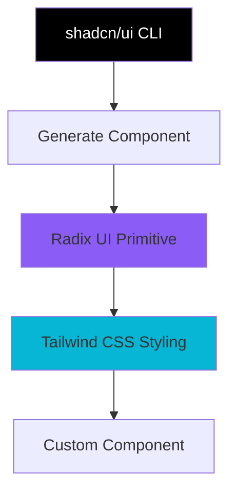
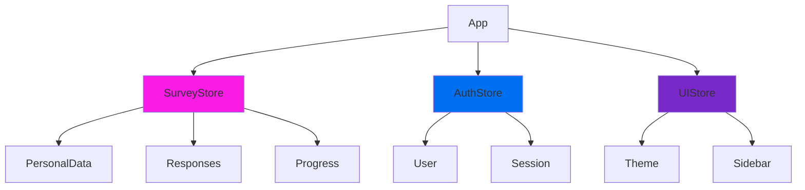

# Componente Frontend

Documentație completă a arhitecturii frontend pentru **primariaTa❤️\_**.

---

## 📋 Cuprins

1. [Prezentare Generală](#prezentare-generală)
2. [Structura Directoarelor](#structura-directoarelor)
3. [Componente Principale](#componente-principale)
4. [Design System](#design-system)
5. [Arhitectura Animațiilor](#arhitectura-animațiilor)
6. [State Management](#state-management)
7. [Custom Hooks](#custom-hooks)
8. [Performance Patterns](#performance-patterns)

---

## 🎯 Prezentare Generală

### Stack Frontend

- **Framework**: Next.js 15 (App Router)
- **UI Library**: React 19
- **Language**: TypeScript 5.7
- **Styling**: Tailwind CSS 4
- **Components**: shadcn/ui + Radix UI
- **Animations**: Framer Motion + Three.js
- **State**: Zustand (lightweight)

### Principii Arhitecturale

1. **Component Composition**: Componente mici, reutilizabile, composable
2. **Server-First**: Server Components by default, Client Components doar când necesar
3. **Type Safety**: TypeScript strict mode, Zod validation
4. **Accessibility**: WCAG 2.1 AA compliance
5. **Performance**: Code splitting, lazy loading, prefetching

---

## 📁 Structura Directoarelor

### Organizarea Completă

```
src/
├── app/                          # Next.js App Router (file-based routing)
│   ├── (auth)/                   # Auth route group
│   │   ├── login/
│   │   ├── register/
│   │   └── layout.tsx
│   ├── (dashboard)/              # Dashboard route group
│   │   ├── admin/
│   │   │   ├── page.tsx         # /admin
│   │   │   ├── survey/
│   │   │   │   ├── page.tsx     # /admin/survey
│   │   │   │   └── [id]/        # /admin/survey/[id]
│   │   │   └── layout.tsx
│   │   └── layout.tsx
│   ├── survey/                   # Public survey routes
│   │   ├── page.tsx             # /survey (start)
│   │   ├── [step]/              # /survey/personal-data, etc.
│   │   └── complete/
│   ├── primarii/                 # Multi-tenant routes
│   │   └── [slug]/
│   │       ├── page.tsx         # /primarii/bucuresti
│   │       ├── cereri/
│   │       └── sesizari/
│   ├── api/                      # API routes
│   │   ├── survey/
│   │   │   └── submit/
│   │   │       └── route.ts
│   │   ├── admin/
│   │   │   └── survey/
│   │   │       ├── stats/
│   │   │       └── responses/
│   │   └── localitati/
│   ├── layout.tsx                # Root layout (global)
│   ├── page.tsx                  # Homepage (/)
│   └── globals.css               # Global styles
│
├── components/                   # React components
│   ├── ui/                       # shadcn/ui primitives (auto-generated)
│   │   ├── button.tsx
│   │   ├── card.tsx
│   │   ├── input.tsx
│   │   ├── select.tsx
│   │   ├── dialog.tsx
│   │   ├── toast.tsx
│   │   └── ... (40+ components)
│   │
│   ├── survey/                   # Survey feature components
│   │   ├── steps/
│   │   │   ├── PersonalDataStep.tsx
│   │   │   ├── RespondentTypeStep.tsx
│   │   │   ├── QuestionsStep.tsx
│   │   │   ├── ReviewStep.tsx
│   │   │   └── CompletionStep.tsx
│   │   ├── questions/
│   │   │   ├── SingleChoiceQuestion.tsx
│   │   │   ├── MultipleChoiceQuestion.tsx
│   │   │   ├── TextQuestion.tsx
│   │   │   ├── ShortTextQuestion.tsx
│   │   │   └── RatingQuestion.tsx
│   │   ├── SurveyProgress.tsx
│   │   ├── SurveyNavigation.tsx
│   │   └── SurveyLayout.tsx
│   │
│   ├── admin/                    # Admin dashboard components
│   │   ├── MetricCard.tsx        # KPI card component
│   │   ├── SurveyCharts.tsx      # Recharts visualizations
│   │   ├── ResponsesTable.tsx    # TanStack Table
│   │   ├── ResponseDetails.tsx   # Modal cu detalii respondent
│   │   ├── ExportButton.tsx      # Export CSV/JSON
│   │   ├── LiveIndicator.tsx     # Real-time polling indicator
│   │   └── DashboardLayout.tsx
│   │
│   ├── landing/                  # Landing page components
│   │   ├── HeroSection.tsx       # Hero cu WebGL + typing
│   │   ├── AnimatedStats.tsx     # CountUp stats
│   │   ├── FeaturesGrid.tsx
│   │   ├── CTASection.tsx
│   │   └── Footer.tsx
│   │
│   ├── shared/                   # Componente partajate
│   │   ├── Header.tsx
│   │   ├── Sidebar.tsx
│   │   ├── Breadcrumbs.tsx
│   │   ├── LoadingSpinner.tsx
│   │   ├── ErrorBoundary.tsx
│   │   └── NotificationToast.tsx
│   │
│   └── effects/                  # WebGL effects
│       ├── PixelBlast.tsx        # Three.js effect
│       └── ParticleBackground.tsx
│
├── lib/                          # Utilities & configurations
│   ├── supabase/
│   │   ├── client.ts             # Browser client
│   │   ├── server.ts             # Server client
│   │   ├── middleware.ts         # Middleware client
│   │   └── service-role.ts       # Admin client
│   ├── utils.ts                  # Utility functions (cn, formatDate, etc.)
│   ├── validations.ts            # Zod schemas
│   ├── constants.ts              # App constants
│   └── api-client.ts             # Fetch wrapper
│
├── hooks/                        # Custom React hooks
│   ├── useAuth.ts                # Authentication hook
│   ├── useSurvey.ts              # Survey state hook
│   ├── useLocalStorage.ts        # LocalStorage hook
│   ├── useDebounce.ts            # Debounce hook
│   ├── useMediaQuery.ts          # Responsive hook
│   └── useRealtime.ts            # Supabase Realtime hook
│
├── types/                        # TypeScript definitions
│   ├── database.types.ts         # Supabase generated types
│   ├── survey.types.ts           # Survey-specific types
│   ├── api.types.ts              # API response types
│   └── common.types.ts           # Common types
│
├── store/                        # Zustand global state
│   ├── surveyStore.ts            # Survey progress state
│   ├── authStore.ts              # Auth state
│   └── uiStore.ts                # UI state (theme, sidebar)
│
└── styles/                       # Additional styles
    └── animations.css            # Custom animations
```

---

## 🧩 Componente Principale

### 1. Landing Page Components

#### HeroSection

**Scop**: Hero animat cu WebGL background și typing effect.

**Implementare**:

```tsx
// components/landing/HeroSection.tsx
"use client";

import { useEffect, useState } from "react";
import { PixelBlast } from "@/components/effects/PixelBlast";
import { Button } from "@/components/ui/button";
import Link from "next/link";

export function HeroSection() {
  const [typedText, setTypedText] = useState("");
  const fullText = "Primăria ta, la un click distanță ❤️";

  useEffect(() => {
    let index = 0;
    const timer = setInterval(() => {
      if (index < fullText.length) {
        setTypedText(fullText.slice(0, index + 1));
        index++;
      } else {
        clearInterval(timer);
      }
    }, 50); // 50ms per character

    return () => clearInterval(timer);
  }, []);

  return (
    <section className="relative flex min-h-screen items-center justify-center overflow-hidden">
      {/* WebGL Background */}
      <div className="absolute inset-0 z-0">
        <PixelBlast />
      </div>

      {/* Content */}
      <div className="relative z-10 mx-auto max-w-4xl px-4 text-center">
        <h1 className="mb-6 text-5xl font-bold text-white md:text-7xl">
          {typedText}
          <span className="animate-pulse">|</span>
        </h1>

        <p className="mb-8 text-xl text-white/80 md:text-2xl">
          Servicii digitale moderne pentru primăriile din România
        </p>

        <div className="flex justify-center gap-4">
          <Button asChild size="lg">
            <Link href="/survey">Participă la Sondaj</Link>
          </Button>
          <Button asChild variant="outline" size="lg">
            <Link href="/primarii">Explorează</Link>
          </Button>
        </div>
      </div>
    </section>
  );
}
```

**Optimizări**:

- WebGL background cu `will-change: transform` pentru GPU acceleration
- Typing animation cu cleanup pentru memory leaks
- Lazy loading PixelBlast component (dynamic import)

#### AnimatedStats

**Scop**: Statistici animate cu CountUp effect.

```tsx
// components/landing/AnimatedStats.tsx
"use client";

import { useInView } from "framer-motion";
import { useRef, useState, useEffect } from "react";

interface StatProps {
  value: number;
  label: string;
  suffix?: string;
}

function AnimatedStat({ value, label, suffix = "" }: StatProps) {
  const ref = useRef(null);
  const isInView = useInView(ref, { once: true });
  const [count, setCount] = useState(0);

  useEffect(() => {
    if (isInView) {
      let start = 0;
      const end = value;
      const duration = 2000; // 2 seconds
      const increment = end / (duration / 16); // 60fps

      const timer = setInterval(() => {
        start += increment;
        if (start >= end) {
          setCount(end);
          clearInterval(timer);
        } else {
          setCount(Math.floor(start));
        }
      }, 16);

      return () => clearInterval(timer);
    }
  }, [isInView, value]);

  return (
    <div ref={ref} className="text-center">
      <div className="mb-2 text-4xl font-bold text-primary md:text-6xl">
        {count.toLocaleString("ro-RO")}
        {suffix}
      </div>
      <div className="text-lg text-muted-foreground">{label}</div>
    </div>
  );
}

export function AnimatedStats() {
  return (
    <section className="bg-muted py-20">
      <div className="container mx-auto px-4">
        <div className="grid grid-cols-1 gap-8 md:grid-cols-3">
          <AnimatedStat value={3181} label="Localități" />
          <AnimatedStat value={100} label="Primării" suffix="+" />
          <AnimatedStat value={10000} label="Utilizatori" suffix="+" />
        </div>
      </div>
    </section>
  );
}
```

---

### 2. Survey Components

#### Arhitectura Survey



#### PersonalDataStep

```tsx
// components/survey/steps/PersonalDataStep.tsx
"use client";

import { useForm } from "react-hook-form";
import { zodResolver } from "@hookform/resolvers/zod";
import { z } from "zod";
import { Input } from "@/components/ui/input";
import { Button } from "@/components/ui/button";
import { useSurveyStore } from "@/store/surveyStore";

const schema = z.object({
  firstName: z.string().min(2, "Minim 2 caractere"),
  lastName: z.string().min(2, "Minim 2 caractere"),
  email: z.string().email("Email invalid").optional(),
  ageCategory: z.enum(["18-25", "26-35", "36-45", "46-60", "60+"]),
  county: z.string().min(1, "Selectează județul"),
  locality: z.string().min(1, "Selectează localitatea"),
});

type FormData = z.infer<typeof schema>;

export function PersonalDataStep() {
  const { personalData, setPersonalData, nextStep } = useSurveyStore();

  const {
    register,
    handleSubmit,
    formState: { errors },
  } = useForm<FormData>({
    resolver: zodResolver(schema),
    defaultValues: personalData,
  });

  const onSubmit = (data: FormData) => {
    setPersonalData(data);
    nextStep();
  };

  return (
    <form onSubmit={handleSubmit(onSubmit)} className="space-y-6">
      <div className="grid grid-cols-1 gap-4 md:grid-cols-2">
        <div>
          <label htmlFor="firstName">Prenume *</label>
          <Input id="firstName" {...register("firstName")} placeholder="Ion" />
          {errors.firstName && (
            <p className="mt-1 text-sm text-destructive">{errors.firstName.message}</p>
          )}
        </div>

        <div>
          <label htmlFor="lastName">Nume *</label>
          <Input id="lastName" {...register("lastName")} placeholder="Popescu" />
          {errors.lastName && (
            <p className="mt-1 text-sm text-destructive">{errors.lastName.message}</p>
          )}
        </div>
      </div>

      {/* ... alte câmpuri ... */}

      <Button type="submit" className="w-full">
        Continuă →
      </Button>
    </form>
  );
}
```

#### Question Components

**SingleChoiceQuestion**:

```tsx
// components/survey/questions/SingleChoiceQuestion.tsx
interface SingleChoiceQuestionProps {
  question: {
    id: string;
    text: string;
    options: Array<{ id: string; label: string }>;
  };
  value?: string;
  onChange: (value: string) => void;
}

export function SingleChoiceQuestion({ question, value, onChange }: SingleChoiceQuestionProps) {
  return (
    <div className="space-y-4">
      <h3 className="text-lg font-semibold">{question.text}</h3>

      <div className="space-y-2">
        {question.options.map((option) => (
          <label
            key={option.id}
            className={cn(
              "flex cursor-pointer items-center gap-3 rounded-lg border p-4 transition-colors",
              value === option.id
                ? "bg-primary/5 border-primary"
                : "hover:border-primary/50 border-border"
            )}
          >
            <input
              type="radio"
              name={question.id}
              value={option.id}
              checked={value === option.id}
              onChange={() => onChange(option.id)}
              className="sr-only"
            />
            <div
              className={cn(
                "flex h-5 w-5 items-center justify-center rounded-full border-2",
                value === option.id ? "border-primary" : "border-border"
              )}
            >
              {value === option.id && <div className="h-3 w-3 rounded-full bg-primary" />}
            </div>
            <span>{option.label}</span>
          </label>
        ))}
      </div>
    </div>
  );
}
```

---

### 3. Admin Dashboard Components

#### MetricCard

**Scop**: Card KPI cu animație și real-time updates.

```tsx
// components/admin/MetricCard.tsx
"use client";

import { Card, CardContent, CardHeader, CardTitle } from "@/components/ui/card";
import { LucideIcon } from "lucide-react";
import { motion } from "framer-motion";

interface MetricCardProps {
  title: string;
  value: number;
  icon: LucideIcon;
  trend?: {
    value: number;
    isPositive: boolean;
  };
  suffix?: string;
}

export function MetricCard({ title, value, icon: Icon, trend, suffix = "" }: MetricCardProps) {
  return (
    <Card>
      <CardHeader className="flex flex-row items-center justify-between pb-2">
        <CardTitle className="text-sm font-medium text-muted-foreground">{title}</CardTitle>
        <Icon className="h-4 w-4 text-muted-foreground" />
      </CardHeader>
      <CardContent>
        <motion.div
          initial={{ scale: 0.5, opacity: 0 }}
          animate={{ scale: 1, opacity: 1 }}
          transition={{ duration: 0.3 }}
          className="text-2xl font-bold"
        >
          {value.toLocaleString("ro-RO")}
          {suffix}
        </motion.div>

        {trend && (
          <p className={cn("mt-1 text-xs", trend.isPositive ? "text-green-600" : "text-red-600")}>
            {trend.isPositive ? "↑" : "↓"} {Math.abs(trend.value)}% față de ieri
          </p>
        )}
      </CardContent>
    </Card>
  );
}
```

#### SurveyCharts

**Scop**: Vizualizări cu Recharts (bar, pie, line charts).

```tsx
// components/admin/SurveyCharts.tsx
"use client";

import {
  BarChart,
  Bar,
  XAxis,
  YAxis,
  CartesianGrid,
  Tooltip,
  ResponsiveContainer,
  PieChart,
  Pie,
  Cell,
} from "recharts";
import { Card, CardContent, CardHeader, CardTitle } from "@/components/ui/card";

interface ChartData {
  name: string;
  value: number;
}

interface SurveyChartsProps {
  respondentTypeData: ChartData[];
  locationData: ChartData[];
}

const COLORS = ["#0088FE", "#00C49F", "#FFBB28", "#FF8042"];

export function SurveyCharts({ respondentTypeData, locationData }: SurveyChartsProps) {
  return (
    <div className="grid grid-cols-1 gap-6 lg:grid-cols-2">
      {/* Respondent Type Distribution */}
      <Card>
        <CardHeader>
          <CardTitle>Distribuție Respondenți</CardTitle>
        </CardHeader>
        <CardContent>
          <ResponsiveContainer width="100%" height={300}>
            <PieChart>
              <Pie
                data={respondentTypeData}
                cx="50%"
                cy="50%"
                labelLine={false}
                label={({ name, percent }) => `${name}: ${(percent * 100).toFixed(0)}%`}
                outerRadius={80}
                fill="#8884d8"
                dataKey="value"
              >
                {respondentTypeData.map((entry, index) => (
                  <Cell key={`cell-${index}`} fill={COLORS[index % COLORS.length]} />
                ))}
              </Pie>
              <Tooltip />
            </PieChart>
          </ResponsiveContainer>
        </CardContent>
      </Card>

      {/* Top 10 Locations */}
      <Card>
        <CardHeader>
          <CardTitle>Top 10 Localități</CardTitle>
        </CardHeader>
        <CardContent>
          <ResponsiveContainer width="100%" height={300}>
            <BarChart data={locationData}>
              <CartesianGrid strokeDasharray="3 3" />
              <XAxis dataKey="name" />
              <YAxis />
              <Tooltip />
              <Bar dataKey="value" fill="#0070f3" />
            </BarChart>
          </ResponsiveContainer>
        </CardContent>
      </Card>
    </div>
  );
}
```

---

## 🎨 Design System

### shadcn/ui + Radix UI

**Arhitectură**:



**Principii**:

1. **Unstyled Primitives**: Radix UI oferă funcționalitate fără styling
2. **Copy-Paste**: Componente copiate în proiect (nu dependency)
3. **Customizable**: Full control pe styling și behavior
4. **Accessible**: WCAG 2.1 AA din cutie
5. **Type-Safe**: TypeScript definitions complete

### Component Anatomy

**Button Example**:

```tsx
// components/ui/button.tsx (generat cu shadcn/ui CLI)
import * as React from "react";
import { Slot } from "@radix-ui/react-slot";
import { cva, type VariantProps } from "class-variance-authority";
import { cn } from "@/lib/utils";

const buttonVariants = cva(
  // Base styles
  "inline-flex items-center justify-center rounded-md text-sm font-medium transition-colors focus-visible:outline-none focus-visible:ring-2 focus-visible:ring-ring disabled:pointer-events-none disabled:opacity-50",
  {
    variants: {
      variant: {
        default: "bg-primary text-primary-foreground hover:bg-primary/90",
        destructive: "bg-destructive text-destructive-foreground hover:bg-destructive/90",
        outline: "border border-input bg-background hover:bg-accent hover:text-accent-foreground",
        secondary: "bg-secondary text-secondary-foreground hover:bg-secondary/80",
        ghost: "hover:bg-accent hover:text-accent-foreground",
        link: "text-primary underline-offset-4 hover:underline",
      },
      size: {
        default: "h-10 px-4 py-2",
        sm: "h-9 rounded-md px-3",
        lg: "h-11 rounded-md px-8",
        icon: "h-10 w-10",
      },
    },
    defaultVariants: {
      variant: "default",
      size: "default",
    },
  }
);

export interface ButtonProps
  extends React.ButtonHTMLAttributes<HTMLButtonElement>,
    VariantProps<typeof buttonVariants> {
  asChild?: boolean;
}

const Button = React.forwardRef<HTMLButtonElement, ButtonProps>(
  ({ className, variant, size, asChild = false, ...props }, ref) => {
    const Comp = asChild ? Slot : "button";
    return (
      <Comp className={cn(buttonVariants({ variant, size, className }))} ref={ref} {...props} />
    );
  }
);
Button.displayName = "Button";

export { Button, buttonVariants };
```

**Usage**:

```tsx
import { Button } from '@/components/ui/button';

// Variants
<Button>Default</Button>
<Button variant="destructive">Delete</Button>
<Button variant="outline" size="sm">Small Outline</Button>
<Button variant="ghost" size="icon">
  <Icon />
</Button>

// As child (pentru Link, etc.)
<Button asChild>
  <Link href="/survey">Go to Survey</Link>
</Button>
```

### Tailwind CSS Configuration

```typescript
// tailwind.config.ts
import type { Config } from "tailwindcss";

const config: Config = {
  darkMode: ["class"],
  content: [
    "./src/pages/**/*.{js,ts,jsx,tsx,mdx}",
    "./src/components/**/*.{js,ts,jsx,tsx,mdx}",
    "./src/app/**/*.{js,ts,jsx,tsx,mdx}",
  ],
  theme: {
    extend: {
      colors: {
        border: "hsl(var(--border))",
        input: "hsl(var(--input))",
        ring: "hsl(var(--ring))",
        background: "hsl(var(--background))",
        foreground: "hsl(var(--foreground))",
        primary: {
          DEFAULT: "hsl(var(--primary))",
          foreground: "hsl(var(--primary-foreground))",
        },
        // ... alte culori
      },
      borderRadius: {
        lg: "var(--radius)",
        md: "calc(var(--radius) - 2px)",
        sm: "calc(var(--radius) - 4px)",
      },
      keyframes: {
        "accordion-down": {
          from: { height: "0" },
          to: { height: "var(--radix-accordion-content-height)" },
        },
        "accordion-up": {
          from: { height: "var(--radix-accordion-content-height)" },
          to: { height: "0" },
        },
      },
      animation: {
        "accordion-down": "accordion-down 0.2s ease-out",
        "accordion-up": "accordion-up 0.2s ease-out",
      },
    },
  },
  plugins: [require("tailwindcss-animate")],
};

export default config;
```

---

## 🎬 Arhitectura Animațiilor

### 1. PixelBlast (WebGL cu Three.js)

**Scop**: Background hero animat cu particule interactive.

**Implementare**:

```tsx
// components/effects/PixelBlast.tsx
"use client";

import { useEffect, useRef } from "react";
import * as THREE from "three";
import { EffectComposer } from "three/examples/jsm/postprocessing/EffectComposer";
import { RenderPass } from "three/examples/jsm/postprocessing/RenderPass";
import { UnrealBloomPass } from "three/examples/jsm/postprocessing/UnrealBloomPass";

export function PixelBlast() {
  const containerRef = useRef<HTMLDivElement>(null);
  const cleanupRef = useRef<(() => void) | null>(null);

  useEffect(() => {
    if (!containerRef.current) return;

    // Scene setup
    const scene = new THREE.Scene();
    const camera = new THREE.PerspectiveCamera(
      75,
      window.innerWidth / window.innerHeight,
      0.1,
      1000
    );
    camera.position.z = 5;

    const renderer = new THREE.WebGLRenderer({ alpha: true });
    renderer.setSize(window.innerWidth, window.innerHeight);
    renderer.setPixelRatio(Math.min(window.devicePixelRatio, 2));
    containerRef.current.appendChild(renderer.domElement);

    // Particles
    const particlesGeometry = new THREE.BufferGeometry();
    const particlesCount = 5000;
    const posArray = new Float32Array(particlesCount * 3);

    for (let i = 0; i < particlesCount * 3; i++) {
      posArray[i] = (Math.random() - 0.5) * 10;
    }

    particlesGeometry.setAttribute("position", new THREE.BufferAttribute(posArray, 3));

    const particlesMaterial = new THREE.PointsMaterial({
      size: 0.005,
      color: "#0070f3",
      transparent: true,
      opacity: 0.8,
      blending: THREE.AdditiveBlending,
    });

    const particlesMesh = new THREE.Points(particlesGeometry, particlesMaterial);
    scene.add(particlesMesh);

    // Post-processing
    const composer = new EffectComposer(renderer);
    composer.addPass(new RenderPass(scene, camera));
    composer.addPass(
      new UnrealBloomPass(
        new THREE.Vector2(window.innerWidth, window.innerHeight),
        0.5, // strength
        0.4, // radius
        0.85 // threshold
      )
    );

    // Mouse interaction
    let mouseX = 0;
    let mouseY = 0;

    const handleMouseMove = (event: MouseEvent) => {
      mouseX = (event.clientX / window.innerWidth) * 2 - 1;
      mouseY = -(event.clientY / window.innerHeight) * 2 + 1;
    };

    window.addEventListener("mousemove", handleMouseMove);

    // Animation loop
    let animationFrameId: number;
    const animate = () => {
      animationFrameId = requestAnimationFrame(animate);

      // Rotate particles
      particlesMesh.rotation.x += 0.0005;
      particlesMesh.rotation.y += 0.0005;

      // Mouse interaction
      particlesMesh.position.x = mouseX * 0.5;
      particlesMesh.position.y = mouseY * 0.5;

      composer.render();
    };
    animate();

    // Resize handler
    const handleResize = () => {
      camera.aspect = window.innerWidth / window.innerHeight;
      camera.updateProjectionMatrix();
      renderer.setSize(window.innerWidth, window.innerHeight);
      composer.setSize(window.innerWidth, window.innerHeight);
    };
    window.addEventListener("resize", handleResize);

    // Cleanup function
    cleanupRef.current = () => {
      window.removeEventListener("mousemove", handleMouseMove);
      window.removeEventListener("resize", handleResize);
      cancelAnimationFrame(animationFrameId);

      // Dispose Three.js resources (IMPORTANT pentru memory leaks!)
      particlesGeometry.dispose();
      particlesMaterial.dispose();
      renderer.dispose();
      composer.dispose();

      if (containerRef.current?.contains(renderer.domElement)) {
        containerRef.current.removeChild(renderer.domElement);
      }
    };

    return cleanupRef.current;
  }, []);

  return (
    <div
      ref={containerRef}
      className="absolute inset-0 -z-10"
      style={{ willChange: "transform" }}
    />
  );
}
```

**Optimizări Performance**:

- `setPixelRatio(Math.min(devicePixelRatio, 2))`: Cap la 2x pentru retina displays
- `willChange: 'transform'`: GPU acceleration hint
- Comprehensive cleanup pentru memory leaks
- Dispose all Three.js resources pe unmount

### 2. Framer Motion Patterns

**Stagger Animations**:

```tsx
import { motion } from "framer-motion";

const container = {
  hidden: { opacity: 0 },
  show: {
    opacity: 1,
    transition: {
      staggerChildren: 0.1, // 100ms delay între children
    },
  },
};

const item = {
  hidden: { opacity: 0, y: 20 },
  show: { opacity: 1, y: 0 },
};

export function StaggeredList({ items }: { items: string[] }) {
  return (
    <motion.ul variants={container} initial="hidden" animate="show" className="space-y-2">
      {items.map((item, index) => (
        <motion.li key={index} variants={item}>
          {item}
        </motion.li>
      ))}
    </motion.ul>
  );
}
```

**Layout Animations**:

```tsx
import { motion, AnimatePresence } from "framer-motion";

export function TabContent({ activeTab }: { activeTab: string }) {
  return (
    <AnimatePresence mode="wait">
      <motion.div
        key={activeTab}
        initial={{ opacity: 0, x: -20 }}
        animate={{ opacity: 1, x: 0 }}
        exit={{ opacity: 0, x: 20 }}
        transition={{ duration: 0.2 }}
      >
        {/* Content */}
      </motion.div>
    </AnimatePresence>
  );
}
```

---

## 📦 State Management

### Zustand Store Architecture



**Survey Store**:

```typescript
// store/surveyStore.ts
import { create } from "zustand";
import { persist } from "zustand/middleware";

interface SurveyState {
  // Data
  personalData: PersonalData | null;
  respondentType: "citizen" | "official" | null;
  responses: Record<string, QuestionResponse>;

  // Progress
  currentStep: number;
  totalSteps: number;
  isCompleted: boolean;

  // Actions
  setPersonalData: (data: PersonalData) => void;
  setRespondentType: (type: "citizen" | "official") => void;
  setResponse: (questionId: string, response: QuestionResponse) => void;
  nextStep: () => void;
  previousStep: () => void;
  resetSurvey: () => void;
}

export const useSurveyStore = create<SurveyState>()(
  persist(
    (set) => ({
      // Initial state
      personalData: null,
      respondentType: null,
      responses: {},
      currentStep: 0,
      totalSteps: 5,
      isCompleted: false,

      // Actions
      setPersonalData: (data) => set({ personalData: data }),
      setRespondentType: (type) => set({ respondentType: type }),
      setResponse: (questionId, response) =>
        set((state) => ({
          responses: { ...state.responses, [questionId]: response },
        })),
      nextStep: () =>
        set((state) => ({
          currentStep: Math.min(state.currentStep + 1, state.totalSteps - 1),
        })),
      previousStep: () =>
        set((state) => ({
          currentStep: Math.max(state.currentStep - 1, 0),
        })),
      resetSurvey: () =>
        set({
          personalData: null,
          respondentType: null,
          responses: {},
          currentStep: 0,
          isCompleted: false,
        }),
    }),
    {
      name: "survey-storage", // LocalStorage key
      partialize: (state) => ({
        personalData: state.personalData,
        respondentType: state.respondentType,
        responses: state.responses,
        currentStep: state.currentStep,
      }), // Only persist these fields
    }
  )
);
```

---

## 🪝 Custom Hooks

### useRealtime Hook

**Scop**: Subscribe la Supabase Realtime pentru live updates.

```typescript
// hooks/useRealtime.ts
import { useEffect, useState } from "react";
import { createBrowserClient } from "@/lib/supabase/client";
import { RealtimeChannel } from "@supabase/supabase-js";

export function useRealtime<T>(table: string, filter?: { column: string; value: any }) {
  const [data, setData] = useState<T[]>([]);
  const [isLoading, setIsLoading] = useState(true);

  useEffect(() => {
    const supabase = createBrowserClient();
    let channel: RealtimeChannel;

    const setupRealtime = async () => {
      // Initial fetch
      let query = supabase.from(table).select("*");
      if (filter) {
        query = query.eq(filter.column, filter.value);
      }
      const { data: initialData } = await query;
      setData((initialData as T[]) || []);
      setIsLoading(false);

      // Subscribe to changes
      channel = supabase
        .channel(`realtime:${table}`)
        .on(
          "postgres_changes",
          {
            event: "*",
            schema: "public",
            table: table,
            filter: filter ? `${filter.column}=eq.${filter.value}` : undefined,
          },
          (payload) => {
            if (payload.eventType === "INSERT") {
              setData((prev) => [...prev, payload.new as T]);
            } else if (payload.eventType === "UPDATE") {
              setData((prev) =>
                prev.map((item: any) => (item.id === payload.new.id ? (payload.new as T) : item))
              );
            } else if (payload.eventType === "DELETE") {
              setData((prev) => prev.filter((item: any) => item.id !== payload.old.id));
            }
          }
        )
        .subscribe();
    };

    setupRealtime();

    return () => {
      channel?.unsubscribe();
    };
  }, [table, filter?.column, filter?.value]);

  return { data, isLoading };
}
```

---

## ⚡ Performance Patterns

### Code Splitting

```tsx
// Lazy loading heavy components
import dynamic from "next/dynamic";

const HeavyChart = dynamic(() => import("./HeavyChart"), {
  loading: () => <Skeleton className="h-[400px]" />,
  ssr: false, // Client-side only
});
```

### Memoization

```tsx
import { useMemo, useCallback } from "react";

function ExpensiveComponent({ data }: { data: Item[] }) {
  // Memoize expensive computation
  const filteredData = useMemo(() => {
    return data.filter((item) => item.isActive).sort((a, b) => a.priority - b.priority);
  }, [data]);

  // Memoize callback
  const handleClick = useCallback((id: string) => {
    console.log("Clicked:", id);
  }, []);

  return <div>{/* ... */}</div>;
}
```

---

**Versiune**: 1.0.0
**Ultima actualizare**: Octombrie 2025
**Autor**: Echipa Tehnică primariaTa❤️\_
