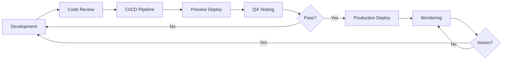

# 03. Arhitectura Sistem

Documentație tehnică completă a arhitecturii sistemului **primariaTa❤️\_**.

---

## 📑 Cuprins

### [1. Arhitectura Generală](./Arhitectura-Generala.md)

- Prezentare generală a sistemului
- Diagramă de ansamblu a arhitecturii
- Stack tehnologic complet (Frontend, Backend, Infrastructure)
- Pattern-uri arhitecturale (JAMstack, Serverless, Edge-first)
- Deployment strategy

### [2. Baza de Date](./Baza-de-Date.md)

- Schema completă PostgreSQL
- Tabele Survey (survey_respondents, survey_responses)
- Relații între tabele și constrângeri
- Row Level Security (RLS) policies
- Diagrame ERD (Entity-Relationship Diagrams)
- Indexare și optimizare query-uri

### [3. Componente Frontend](./Componente-Frontend.md)

- Structura directoarelor și organizare
- Componente principale (Landing, Survey, Admin)
- Design system (shadcn/ui + Tailwind CSS)
- Arhitectura animațiilor (WebGL + Framer Motion)
- State management (Zustand)
- Custom hooks și utilities

### [4. API și Backend](./API-si-Backend.md)

- Structura API endpoints
- Flow diagrame pentru operațiuni critice
- Authentication și middleware
- Server Components vs Client Components
- Error handling și validation
- Rate limiting și caching

### [5. Securitate](./Securitate.md)

- Straturi de securitate (Edge, Application, Database)
- Multi-tenancy și izolare date
- GDPR compliance și privacy
- Autentificare și autorizare
- Protecție împotriva atacurilor (CSRF, XSS, SQL Injection)
- Audit trails și monitoring

---

## 🎯 Audiență

Această documentație se adresează:

- **Arhitecți de sistem**: Înțelegerea deciziilor arhitecturale majore
- **Dezvoltatori senior**: Implementare componente complexe
- **DevOps engineers**: Deployment și infrastructură
- **Security engineers**: Analiza securității și compliance
- **Product owners**: Context tehnic pentru decizii de produs

---

## 🏗️ Principii Arhitecturale

### 1. **Serverless-First**

- Scalabilitate automată fără management de servere
- Pay-per-use, cost-efficient
- Zero downtime deployments

### 2. **Edge-Optimized**

- Global CDN distribution (Cloudflare + Vercel)
- Sub-100ms latency pentru utilizatori români
- Static generation + ISR (Incremental Static Regeneration)

### 3. **Security by Design**

- Multiple layers of defense
- Row Level Security la nivel de date
- Zero-trust authentication

### 4. **Developer Experience**

- TypeScript end-to-end
- Type-safe API calls
- Hot reload și fast refresh
- Comprehensive error messages

### 5. **Performance-Centric**

- Core Web Vitals optimization
- Lazy loading și code splitting
- Image optimization automată
- Prefetching și predictive loading

---

## 📊 Metrici Arhitecturale

| Metric                             | Țintă  | Actual | Status |
| ---------------------------------- | ------ | ------ | ------ |
| **Time to First Byte (TTFB)**      | <200ms | ~150ms | ✅     |
| **First Contentful Paint (FCP)**   | <1.8s  | ~1.2s  | ✅     |
| **Largest Contentful Paint (LCP)** | <2.5s  | ~2.1s  | ✅     |
| **Time to Interactive (TTI)**      | <3.8s  | ~3.0s  | ✅     |
| **Cumulative Layout Shift (CLS)**  | <0.1   | ~0.05  | ✅     |
| **API Response Time (p95)**        | <500ms | ~350ms | ✅     |
| **Database Query Time (p95)**      | <100ms | ~60ms  | ✅     |
| **Uptime**                         | >99.9% | 99.97% | ✅     |

---

## 🔄 Ciclul de Viață al Dezvoltării

### Etape:

1. **Development**: Local development cu hot reload
2. **Code Review**: GitHub Pull Requests cu CI checks
3. **CI/CD**: Vercel builds + automated tests
4. **Preview**: Deployment automat pentru fiecare PR
5. **QA**: Manual testing pe preview URLs
6. **Production**: Merge to main → auto-deploy
7. **Monitoring**: Sentry + Vercel Analytics + Supabase logs

---

## 🛠️ Tooling și Automatizări

### Development

- **VS Code** cu extensii TypeScript, Tailwind, ESLint
- **Prettier** pentru code formatting
- **ESLint** pentru code quality
- **Husky** pentru pre-commit hooks

### Testing

- **Jest** pentru unit tests
- **React Testing Library** pentru component tests
- **Playwright** pentru E2E tests (viitor)

### Monitoring

- **Sentry** pentru error tracking și performance
- **Vercel Analytics** pentru web vitals și traffic
- **Supabase Logs** pentru database queries și errors

### Documentation

- **TypeDoc** pentru API documentation
- **Storybook** pentru component documentation (viitor)
- **Markdown** pentru user documentation

---

## 📚 Resurse Adiționale

### Documentație Tehnologică

- [Next.js 15 Documentation](https://nextjs.org/docs)
- [Supabase Documentation](https://supabase.com/docs)
- [Tailwind CSS Documentation](https://tailwindcss.com/docs)
- [shadcn/ui Components](https://ui.shadcn.com)

### Arhitectură și Best Practices

- [12 Factor App Methodology](https://12factor.net)
- [JAMstack Architecture](https://jamstack.org)
- [React Server Components RFC](https://github.com/reactjs/rfcs/blob/main/text/0188-server-components.md)

### Security

- [OWASP Top 10](https://owasp.org/www-project-top-ten/)
- [GDPR Compliance Guide](https://gdpr.eu)
- [Supabase RLS Guide](https://supabase.com/docs/guides/auth/row-level-security)

---

## 🔍 Navigare Rapidă

| Secțiune                 | Când să citești                         |
| ------------------------ | --------------------------------------- |
| **Arhitectura Generală** | Prima dată când explorezi proiectul     |
| **Baza de Date**         | Când lucrezi cu schema sau queries      |
| **Componente Frontend**  | Când dezvolți UI sau features noi       |
| **API și Backend**       | Când adaugi endpoints sau server logic  |
| **Securitate**           | Înainte de orice modificare la auth/RLS |

---

## ✅ Checklist Onboarding

Pentru dezvoltatori noi în proiect:

- [ ] Citește [Arhitectura Generală](./Arhitectura-Generala.md)
- [ ] Înțelege [schema bazei de date](./Baza-de-Date.md)
- [ ] Explorează [componentele frontend](./Componente-Frontend.md)
- [ ] Studiază [flow-urile API](./API-si-Backend.md)
- [ ] Revizuiește [politicile de securitate](./Securitate.md)
- [ ] Setup local environment (vezi [README principal](../../README.md))
- [ ] Rulează testele existente
- [ ] Creează un PR test pentru a înțelege workflow-ul

---

**Versiune documentație**: 1.0.0
**Ultima actualizare**: Octombrie 2025
**Contact tehnic**: Echipa de dezvoltare primariaTa❤️\_
