# Securitate

Documentație completă a strategiei de securitate pentru **primariaTa❤️\_**.

---

## 📋 Cuprins

1. [Prezentare Generală](#prezentare-generală)
2. [Straturi de Securitate](#straturi-de-securitate)
3. [Multi-Tenancy și Izolare](#multi-tenancy-și-izolare)
4. [Autentificare și Autorizare](#autentificare-și-autorizare)
5. [Protecție Împotriva Atacurilor](#protecție-împotriva-atacurilor)
6. [GDPR Compliance](#gdpr-compliance)
7. [Audit și Monitoring](#audit-și-monitoring)

---

## 🎯 Prezentare Generală

### Principii de Securitate

**primariaTa❤️\_** implementează **Defense in Depth** (apărare în adâncime):


### Threat Model

**Amenințări Identificate**:

| Amenințare            | Probabilitate | Impact  | Mitigare                        |
| --------------------- | ------------- | ------- | ------------------------------- |
| **SQL Injection**     | Scăzută       | Critic  | Supabase parameterized queries  |
| **XSS**               | Medie         | Ridicat | React auto-escaping + CSP       |
| **CSRF**              | Medie         | Ridicat | CSRF tokens + SameSite cookies  |
| **DDoS**              | Medie         | Ridicat | Cloudflare DDoS protection      |
| **Brute Force**       | Ridicată      | Mediu   | Rate limiting + account lockout |
| **Data Leakage**      | Scăzută       | Critic  | RLS + multi-tenant isolation    |
| **Session Hijacking** | Scăzută       | Ridicat | Secure cookies + JWT expiry     |

---

## 🏰 Straturi de Securitate

### Layer 1: Edge Security (Cloudflare)

#### Web Application Firewall (WAF)

**Reguli Active**:

- OWASP Core Rule Set (CRS)
- SQL Injection protection
- XSS protection
- Remote Code Execution (RCE) blocking
- File inclusion attack prevention

**Configurare**:

```yaml
# Cloudflare WAF Rules (conceptual)
rules:
  - id: block_sql_injection
    pattern: "(union|select|insert|update|delete|drop|create|alter).*from"
    action: block
    sensitivity: high

  - id: block_xss
    pattern: "<script.*?>|javascript:|onerror=|onload="
    action: block
    sensitivity: high

  - id: rate_limit_api
    path: "/api/*"
    threshold: 100 requests / minute
    action: challenge
```

#### DDoS Protection

**Protecție Automată**:

- Layer 3/4: Volumetric attacks (SYN flood, UDP flood)
- Layer 7: Application attacks (HTTP flood)
- Automatic mitigation la detecție

**Capacity**:

- Absorbție: >100 Gbps
- Mitigare: <3 secunde

#### Rate Limiting

**Reguli Globale**:

```yaml
# Cloudflare Rate Limiting
api_endpoints:
  /api/survey/submit:
    limit: 5 requests / 10 minutes / IP
    action: block
    duration: 600 seconds

  /api/auth/login:
    limit: 5 requests / 15 minutes / IP
    action: challenge
    duration: 900 seconds

  /api/admin/*:
    limit: 100 requests / minute / IP
    action: block
    duration: 60 seconds
```

---

### Layer 2: Application Security (Next.js)

#### Middleware Authentication

**Implementare**:

```typescript
// middleware.ts
import { createServerClient } from "@supabase/ssr";
import { NextResponse, type NextRequest } from "next/server";

export async function middleware(request: NextRequest) {
  let response = NextResponse.next({
    request: {
      headers: request.headers,
    },
  });

  const supabase = createServerClient(
    process.env.NEXT_PUBLIC_SUPABASE_URL!,
    process.env.NEXT_PUBLIC_SUPABASE_ANON_KEY!,
    {
      cookies: {
        getAll() {
          return request.cookies.getAll();
        },
        setAll(cookiesToSet) {
          cookiesToSet.forEach(({ name, value }) => request.cookies.set(name, value));
          response = NextResponse.next({ request });
          cookiesToSet.forEach(({ name, value, options }) =>
            response.cookies.set(name, value, options)
          );
        },
      },
    }
  );

  // Refresh session
  const {
    data: { user },
    error,
  } = await supabase.auth.getUser();

  // Protected routes
  const protectedPaths = ["/admin", "/dashboard", "/primarii"];
  const isProtectedPath = protectedPaths.some((path) => request.nextUrl.pathname.startsWith(path));

  if (isProtectedPath && (!user || error)) {
    const redirectUrl = new URL("/login", request.url);
    redirectUrl.searchParams.set("redirectTo", request.nextUrl.pathname);
    return NextResponse.redirect(redirectUrl);
  }

  // Check role for admin routes
  if (request.nextUrl.pathname.startsWith("/admin")) {
    const { data: profile } = await supabase
      .from("utilizatori")
      .select("rol")
      .eq("id", user?.id)
      .single();

    if (!profile || !["admin", "super_admin"].includes(profile.rol)) {
      return NextResponse.redirect(new URL("/unauthorized", request.url));
    }
  }

  return response;
}

export const config = {
  matcher: ["/((?!_next/static|_next/image|favicon.ico|.*\\.(?:svg|png|jpg|jpeg|gif|webp)$).*)"],
};
```

#### Input Validation (Zod)

**Schema Example**:

```typescript
// lib/validations.ts
import { z } from "zod";

// Sanitization helpers
const sanitizeString = (str: string) => str.trim().replace(/[<>]/g, ""); // Remove < > pentru XSS basic

const emailSchema = z.string().email("Email invalid").transform(sanitizeString);

const nameSchema = z
  .string()
  .min(2, "Minim 2 caractere")
  .max(100, "Maxim 100 caractere")
  .regex(/^[a-zA-ZăâîșțĂÂÎȘȚ\s-]+$/, "Doar litere, spații și cratimă")
  .transform(sanitizeString);

export const surveySubmitSchema = z.object({
  personalData: z.object({
    firstName: nameSchema,
    lastName: nameSchema,
    email: emailSchema.optional(),
    ageCategory: z.enum(["18-25", "26-35", "36-45", "46-60", "60+"]),
    county: z.string().min(1),
    locality: z.string().min(1),
  }),
  respondentType: z.enum(["citizen", "official"]),
  department: z.string().max(200).transform(sanitizeString).optional(),
  responses: z
    .array(
      z.object({
        questionId: z.string().regex(/^q\d+_[a-z_]+$/), // Format: q1_digital_services
        questionType: z.enum(["single_choice", "multiple_choice", "text", "short_text", "rating"]),
        answerText: z
          .string()
          .max(5000, "Maxim 5000 caractere")
          .transform(sanitizeString)
          .optional(),
        answerChoices: z.array(z.string()).max(10).optional(),
        answerRating: z.number().int().min(1).max(5).optional(),
      })
    )
    .min(1, "Minim un răspuns obligatoriu"),
});
```

**API Route Validation**:

```typescript
// app/api/survey/submit/route.ts
import { surveySubmitSchema } from "@/lib/validations";
import { z } from "zod";

export async function POST(request: NextRequest) {
  try {
    const body = await request.json();

    // Validate and sanitize
    const validatedData = surveySubmitSchema.parse(body);

    // Continue with validated data...
  } catch (error) {
    if (error instanceof z.ZodError) {
      return NextResponse.json(
        {
          success: false,
          error: "Date invalide",
          details: error.errors.map((e) => ({
            field: e.path.join("."),
            message: e.message,
          })),
        },
        { status: 400 }
      );
    }

    return NextResponse.json({ success: false, error: "Server error" }, { status: 500 });
  }
}
```

#### CSRF Protection

**Next.js Native Protection**:

- Server Actions: Built-in CSRF tokens
- API Routes: Origin header verification

**Manual Verification**:

```typescript
// app/api/admin/delete/route.ts
export async function DELETE(request: NextRequest) {
  // Verify origin
  const origin = request.headers.get("origin");
  const host = request.headers.get("host");

  if (origin && !origin.includes(host || "")) {
    return NextResponse.json({ error: "Forbidden" }, { status: 403 });
  }

  // Verify referer
  const referer = request.headers.get("referer");
  if (referer && !referer.startsWith(`https://${host}`)) {
    return NextResponse.json({ error: "Forbidden" }, { status: 403 });
  }

  // Continue with request...
}
```

#### Content Security Policy (CSP)

**Headers Configuration**:

```typescript
// next.config.js
const securityHeaders = [
  {
    key: "Content-Security-Policy",
    value: [
      "default-src 'self'",
      "script-src 'self' 'unsafe-eval' 'unsafe-inline' https://vercel.live",
      "style-src 'self' 'unsafe-inline'",
      "img-src 'self' data: https:",
      "font-src 'self' data:",
      "connect-src 'self' https://*.supabase.co wss://*.supabase.co",
      "frame-ancestors 'none'",
    ].join("; "),
  },
  {
    key: "X-Frame-Options",
    value: "DENY",
  },
  {
    key: "X-Content-Type-Options",
    value: "nosniff",
  },
  {
    key: "Referrer-Policy",
    value: "strict-origin-when-cross-origin",
  },
  {
    key: "Permissions-Policy",
    value: "camera=(), microphone=(), geolocation=()",
  },
];

module.exports = {
  async headers() {
    return [
      {
        source: "/:path*",
        headers: securityHeaders,
      },
    ];
  },
};
```

---

### Layer 3: Database Security (Supabase)

#### Row Level Security (RLS)

**Multi-Tenant Isolation**:

```sql
-- Enable RLS
ALTER TABLE cereri ENABLE ROW LEVEL SECURITY;

-- Policy: Utilizatorii văd doar cererile din propria primărie
CREATE POLICY "tenant_isolation_cereri"
ON cereri
FOR SELECT
TO authenticated
USING (
    primarie_id = (auth.jwt() ->> 'primarie_id')::uuid
);

-- Policy: Utilizatorii pot insera cereri doar în propria primărie
CREATE POLICY "tenant_insert_cereri"
ON cereri
FOR INSERT
TO authenticated
WITH CHECK (
    primarie_id = (auth.jwt() ->> 'primarie_id')::uuid
);

-- Policy: Super admins pot vedea toate cererile
CREATE POLICY "super_admin_cereri"
ON cereri
FOR ALL
TO authenticated
USING (
    (auth.jwt() ->> 'role') = 'super_admin'
);
```

**Survey Public Access (cu protecție)**:

```sql
-- Survey respondents: Public insert, admin select
CREATE POLICY "public_insert_survey"
ON survey_respondents
FOR INSERT
TO anon
WITH CHECK (true);

CREATE POLICY "admin_select_survey"
ON survey_respondents
FOR SELECT
TO authenticated
USING (
    (auth.jwt() ->> 'role') IN ('admin', 'super_admin')
);

-- Survey responses: Cascade with respondent
CREATE POLICY "public_insert_response"
ON survey_responses
FOR INSERT
TO anon
WITH CHECK (
    -- Verifică că respondent_id există și nu e completat deja
    EXISTS (
        SELECT 1 FROM survey_respondents
        WHERE id = respondent_id
        AND is_completed = false
    )
);
```

**Testare RLS**:

```sql
-- Test 1: Verificare izolare tenant
SET LOCAL jwt.claims.primarie_id = 'uuid-primarie-1';
SELECT COUNT(*) FROM cereri; -- Ar trebui să returneze doar cereri primarie-1

SET LOCAL jwt.claims.primarie_id = 'uuid-primarie-2';
SELECT COUNT(*) FROM cereri; -- Ar trebui să returneze doar cereri primarie-2

-- Test 2: Verificare super admin access
SET LOCAL jwt.claims.role = 'super_admin';
SELECT COUNT(*) FROM cereri; -- Ar trebui să returneze toate cererile
```

#### Encryption

**Encryption at Rest**:

- PostgreSQL: AES-256 encryption pentru toate datele
- Supabase Storage: AES-256 pentru fișiere

**Encryption in Transit**:

- TLS 1.3 pentru toate conexiunile database
- Certificate pinning pentru API calls

**Sensitive Data Hashing**:

```sql
-- Funcție pentru hash-uri sigure (bcrypt-like)
CREATE EXTENSION IF NOT EXISTS pgcrypto;

-- Hash password (nu stocăm plain text)
CREATE OR REPLACE FUNCTION hash_password(password TEXT)
RETURNS TEXT AS $$
BEGIN
    RETURN crypt(password, gen_salt('bf', 10)); -- Bcrypt cu 10 rounds
END;
$$ LANGUAGE plpgsql SECURITY DEFINER;

-- Verify password
CREATE OR REPLACE FUNCTION verify_password(password TEXT, hash TEXT)
RETURNS BOOLEAN AS $$
BEGIN
    RETURN hash = crypt(password, hash);
END;
$$ LANGUAGE plpgsql SECURITY DEFINER;
```

#### Connection Security

**Supabase Pooler**:

```typescript
// Connection cu SSL enforcement
const supabase = createClient(
  process.env.NEXT_PUBLIC_SUPABASE_URL!,
  process.env.SUPABASE_SERVICE_ROLE_KEY!,
  {
    db: {
      schema: "public",
    },
    auth: {
      persistSession: false,
    },
    global: {
      headers: {
        "X-Client-Info": "primariata-web",
      },
    },
  }
);
```

---

## 🔐 Multi-Tenancy și Izolare

### Arhitectura Multi-Tenant

```mermaid
graph TB
    subgraph "Tenant 1 - Primăria București"
        U1[User 1] --> T1Data[(Date Tenant 1)]
    end

    subgraph "Tenant 2 - Primăria Cluj"
        U2[User 2] --> T2Data[(Date Tenant 2)]
    end

    subgraph "Shared Infrastructure"
        DB[(PostgreSQL Shared)]
        RLS[Row Level Security]
    end

    T1Data --> RLS
    T2Data --> RLS
    RLS --> DB

    U1 -.->|❌ No Access| T2Data
    U2 -.->|❌ No Access| T1Data

    style T1Data fill:#4285f4
    style T2Data fill:#ea4335
    style RLS fill:#34a853
```



### Strategie de Izolare

**Nivel 1: Application Level**

```typescript
// Middleware verifică primarie_id din JWT
const {
  data: { user },
} = await supabase.auth.getUser();
const claims = user?.app_metadata;
const premarieId = claims?.primarie_id;

if (!premarieId) {
  return NextResponse.redirect("/unauthorized");
}
```

**Nivel 2: Database Level (RLS)**

```sql
-- Policy enforcement automat
CREATE POLICY "tenant_isolation"
ON cereri
FOR ALL
TO authenticated
USING (primarie_id = (auth.jwt() ->> 'primarie_id')::uuid)
WITH CHECK (primarie_id = (auth.jwt() ->> 'primarie_id')::uuid);
```

**Nivel 3: Storage Level**

```typescript
// Supabase Storage buckets cu RLS
const { data, error } = await supabase.storage
  .from("documente")
  .upload(`${premarieId}/${fileName}`, file, {
    cacheControl: "3600",
    upsert: false,
  });
```

### Cross-Tenant Attack Prevention

**Scenarii Blocate**:

1. **Direct ID Manipulation**:

```typescript
// ❌ Attacker încearcă să acceseze cererea altei primării
GET /api/cereri/uuid-cerere-primarie-2

// ✅ RLS policy blochează automat
SELECT * FROM cereri WHERE id = 'uuid-cerere-primarie-2'
-- Returns: 0 rows (RLS filter: primarie_id != user.primarie_id)
```

2. **Bulk Query Attack**:

```typescript
// ❌ Attacker încearcă să selecteze toate cererile
SELECT * FROM cereri

// ✅ RLS filtrează automat
-- Returns: Doar cereri din primarie_id = user.primarie_id
```

3. **Storage Path Traversal**:

```typescript
// ❌ Attacker încearcă să acceseze fișiere din alt tenant
const { data } = await supabase.storage.from("documente").download("../primarie-2/document.pdf");

// ✅ Supabase Storage RLS + path validation blochează
```

---

## 🛡️ Autentificare și Autorizare

### Flux de Autentificare

```mermaid
sequenceDiagram
    participant U as User
    participant F as Frontend
    participant A as Supabase Auth
    participant DB as Database

    U->>F: Login cu email/password
    F->>A: signInWithPassword()
    A->>DB: Verifică credențiale
    DB-->>A: User data
    A->>A: Generează JWT (access + refresh)
    A-->>F: Return tokens + session
    F->>F: Store în httpOnly cookies
    F-->>U: Redirect to dashboard

    Note over F,A: JWT expires în 1h

    F->>A: Request cu expired JWT
    A->>A: Verifică refresh token
    A->>A: Generează new JWT
    A-->>F: New access token
    F->>F: Update cookies
    F-->>U: Continue session
```



### JWT Structure

```json
{
  "aud": "authenticated",
  "exp": 1705939200,
  "iat": 1705935600,
  "iss": "https://xxx.supabase.co/auth/v1",
  "sub": "user-uuid",
  "email": "ion.popescu@example.com",
  "phone": "",
  "app_metadata": {
    "provider": "email",
    "primarie_id": "primarie-uuid",
    "role": "user"
  },
  "user_metadata": {
    "firstName": "Ion",
    "lastName": "Popescu"
  },
  "role": "authenticated"
}
```

### Role-Based Access Control (RBAC)

**Ierarhia Rolurilor**:

```yaml
roles:
  super_admin:
    permissions:
      - "*" # All access
    description: Platform administrators

  admin:
    permissions:
      - read:all_within_primarie
      - write:all_within_primarie
      - delete:own_primarie_data
      - manage:users_within_primarie
    description: Primărie administrators

  functionar:
    permissions:
      - read:assigned_cereri
      - write:assigned_cereri
      - comment:cereri
    description: Primărie employees

  cetatean:
    permissions:
      - read:own_cereri
      - write:own_cereri
      - submit:cereri
    description: Citizens
```

**Implementation**:

```typescript
// lib/auth/permissions.ts
export enum Permission {
  ReadAllCereri = "read:all_cereri",
  WriteAllCereri = "write:all_cereri",
  DeleteCereri = "delete:cereri",
  ManageUsers = "manage:users",
}

export enum Role {
  SuperAdmin = "super_admin",
  Admin = "admin",
  Functionar = "functionar",
  Cetatean = "cetatean",
}

const rolePermissions: Record<Role, Permission[]> = {
  [Role.SuperAdmin]: Object.values(Permission),
  [Role.Admin]: [Permission.ReadAllCereri, Permission.WriteAllCereri, Permission.ManageUsers],
  [Role.Functionar]: [Permission.ReadAllCereri, Permission.WriteAllCereri],
  [Role.Cetatean]: [],
};

export function hasPermission(role: Role, permission: Permission): boolean {
  return rolePermissions[role]?.includes(permission) || false;
}
```

**Middleware Check**:

```typescript
// middleware.ts
const {
  data: { user },
} = await supabase.auth.getUser();
const role = user?.app_metadata?.role as Role;

if (request.nextUrl.pathname.startsWith("/admin/users")) {
  if (!hasPermission(role, Permission.ManageUsers)) {
    return NextResponse.redirect(new URL("/unauthorized", request.url));
  }
}
```

---

## 🚨 Protecție Împotriva Atacurilor

### SQL Injection Prevention

**Supabase Parameterized Queries** (implicit sigure):

```typescript
// ✅ Sigur: Parameterized query
const { data } = await supabase.from("cereri").select("*").eq("email", userEmail); // Escaped automat

// ❌ Nesigur: Raw SQL (NU folosi!)
// NEVER: const query = `SELECT * FROM cereri WHERE email = '${userEmail}'`;
```

### XSS Prevention

**React Auto-Escaping**:

```tsx
// ✅ Sigur: React escapes automat
<div>{userInput}</div>

// ❌ Nesigur: dangerouslySetInnerHTML
<div dangerouslySetInnerHTML={{ __html: userInput }} />

// ✅ Sigur cu sanitization
import DOMPurify from 'dompurify';
<div dangerouslySetInnerHTML={{ __html: DOMPurify.sanitize(userInput) }} />
```

**Content Security Policy** (blocare inline scripts):

```
script-src 'self'; # Doar scripts de pe same origin
```

### CSRF Prevention

**SameSite Cookies**:

```typescript
// lib/supabase/server.ts
cookies: {
  options: {
    httpOnly: true,
    secure: true,
    sameSite: 'lax', // Prevent CSRF
    maxAge: 60 * 60 * 24 * 7, // 1 week
    path: '/',
  },
}
```

### Clickjacking Prevention

**X-Frame-Options Header**:

```
X-Frame-Options: DENY
```

Previne site-ul de a fi încărcat în `<iframe>`.

---

## 📜 GDPR Compliance

### Data Privacy Principles


### User Rights Implementation

#### 1. Right to Access (Art. 15)

**API Endpoint**:

```typescript
// app/api/user/data/route.ts
export async function GET(request: NextRequest) {
  const supabase = await createServerClient();
  const {
    data: { user },
  } = await supabase.auth.getUser();

  if (!user) {
    return NextResponse.json({ error: "Unauthorized" }, { status: 401 });
  }

  // Collect all user data
  const [profile, cereri, documente] = await Promise.all([
    supabase.from("utilizatori").select("*").eq("id", user.id).single(),
    supabase.from("cereri").select("*").eq("utilizator_id", user.id),
    supabase.from("documente").select("*").eq("utilizator_id", user.id),
  ]);

  return NextResponse.json({
    profile: profile.data,
    cereri: cereri.data,
    documente: documente.data,
    exportedAt: new Date().toISOString(),
  });
}
```

#### 2. Right to be Forgotten (Art. 17)

**Delete Endpoint**:

```typescript
// app/api/user/delete/route.ts
export async function DELETE(request: NextRequest) {
  const supabase = await createServiceRoleClient();
  const {
    data: { user },
  } = await createServerClient().then((c) => c.auth.getUser());

  if (!user) {
    return NextResponse.json({ error: "Unauthorized" }, { status: 401 });
  }

  // Soft delete sau hard delete
  const { data: body } = await request.json();
  const hardDelete = body?.hardDelete === true;

  if (hardDelete) {
    // Hard delete: Remove ALL data
    await Promise.all([
      supabase.from("documente").delete().eq("utilizator_id", user.id),
      supabase.from("cereri").delete().eq("utilizator_id", user.id),
      supabase.from("utilizatori").delete().eq("id", user.id),
      supabase.auth.admin.deleteUser(user.id),
    ]);
  } else {
    // Soft delete: Anonymize data
    await supabase
      .from("utilizatori")
      .update({
        email: `deleted_${user.id}@anonymized.local`,
        nume: "Utilizator Șters",
        deleted_at: new Date().toISOString(),
      })
      .eq("id", user.id);
  }

  return NextResponse.json({ success: true, method: hardDelete ? "hard" : "soft" });
}
```

#### 3. Data Portability (Art. 20)

**Export în format machine-readable (JSON)**:

```typescript
// app/api/user/export/route.ts
export async function GET(request: NextRequest) {
  // ... (similar cu GET /api/user/data, dar cu format specific)

  const exportData = {
    version: "1.0",
    exportedAt: new Date().toISOString(),
    user: {
      id: user.id,
      email: user.email,
      profile: profile.data,
    },
    data: {
      cereri: cereri.data,
      documente: documente.data,
    },
  };

  return new NextResponse(JSON.stringify(exportData, null, 2), {
    headers: {
      "Content-Type": "application/json",
      "Content-Disposition": `attachment; filename="primariata_data_${user.id}.json"`,
    },
  });
}
```

### Privacy Policy și Consent

**Cookie Consent Banner** (viitor):

```tsx
"use client";

export function CookieConsent() {
  const [show, setShow] = useState(true);

  const acceptAll = () => {
    localStorage.setItem("cookie-consent", "all");
    setShow(false);
  };

  const acceptEssential = () => {
    localStorage.setItem("cookie-consent", "essential");
    setShow(false);
  };

  if (!show) return null;

  return (
    <div className="fixed bottom-0 left-0 right-0 z-50 border-t bg-background p-4">
      <div className="container mx-auto flex items-center justify-between">
        <p className="text-sm">
          Folosim cookies pentru a îmbunătăți experiența ta.{" "}
          <Link href="/privacy" className="underline">
            Vezi politica de confidențialitate
          </Link>
        </p>
        <div className="flex gap-2">
          <Button variant="outline" onClick={acceptEssential}>
            Doar esențiale
          </Button>
          <Button onClick={acceptAll}>Acceptă toate</Button>
        </div>
      </div>
    </div>
  );
}
```

### Data Retention Policy

```yaml
retention_policy:
  survey_responses:
    duration: 2 years
    after_expiry: anonymize # Remove PII, keep aggregated data

  cereri:
    duration: 5 years # Legal requirement
    after_expiry: archive # Move to cold storage

  audit_logs:
    duration: 1 year
    after_expiry: delete

  sessions:
    duration: 7 days
    after_expiry: delete
```

---

## 📊 Audit și Monitoring

### Audit Logs

**Schema**:

```sql
CREATE TABLE audit_logs (
    id UUID PRIMARY KEY DEFAULT uuid_generate_v4(),
    user_id UUID REFERENCES utilizatori(id),
    action VARCHAR(50) NOT NULL, -- 'CREATE', 'READ', 'UPDATE', 'DELETE'
    resource_type VARCHAR(50) NOT NULL, -- 'cerere', 'document', etc.
    resource_id UUID,
    ip_address INET,
    user_agent TEXT,
    details JSONB,
    created_at TIMESTAMP WITH TIME ZONE DEFAULT NOW()
);

CREATE INDEX idx_audit_logs_user_id ON audit_logs(user_id);
CREATE INDEX idx_audit_logs_created_at ON audit_logs(created_at DESC);
CREATE INDEX idx_audit_logs_action ON audit_logs(action);
```

**Trigger pentru audit automat**:

```sql
CREATE OR REPLACE FUNCTION audit_trigger()
RETURNS TRIGGER AS $$
BEGIN
    INSERT INTO audit_logs (user_id, action, resource_type, resource_id, details)
    VALUES (
        auth.uid(),
        TG_OP,
        TG_TABLE_NAME,
        NEW.id,
        jsonb_build_object('old', to_jsonb(OLD), 'new', to_jsonb(NEW))
    );
    RETURN NEW;
END;
$$ LANGUAGE plpgsql SECURITY DEFINER;

-- Aplică pe tabele critice
CREATE TRIGGER audit_cereri
AFTER INSERT OR UPDATE OR DELETE ON cereri
FOR EACH ROW EXECUTE FUNCTION audit_trigger();
```

### Sentry Error Tracking

#### Status Implementare: ✅ COMPLETE

**Versiune**: @sentry/nextjs@10.21.0

**Fișiere Configurare**:

- `sentry.server.config.ts` - Server-side error tracking
- `sentry.edge.config.ts` - Edge runtime error tracking
- `app/global-error.tsx` - Global error boundary cu Sentry
- `components/error-boundary.tsx` - Component error boundary

#### Configurare Server (`sentry.server.config.ts`)

```typescript
import * as Sentry from "@sentry/nextjs";

Sentry.init({
  dsn: process.env.NEXT_PUBLIC_SENTRY_DSN,
  tracesSampleRate: 1, // 100% sampling în dezvoltare
  debug: false,
  environment: process.env.NODE_ENV,

  // Ignoră erori comune de infrastructură
  ignoreErrors: ["ENOENT", "ENOTFOUND", "Connection terminated unexpectedly", "Connection refused"],

  // Filtrare erori în development
  beforeSend(event, hint) {
    if (process.env.NODE_ENV === "development") {
      console.error(hint.originalException || hint.syntheticException);
      return null; // Nu trimite la Sentry în development
    }
    return event;
  },
});
```

#### Configurare Edge (`sentry.edge.config.ts`)

```typescript
import * as Sentry from "@sentry/nextjs";

Sentry.init({
  dsn: process.env.NEXT_PUBLIC_SENTRY_DSN,
  tracesSampleRate: 1,
  debug: false,
  environment: process.env.NODE_ENV,
});
```

#### Usage în Cod

**Global Error Boundary**:

```typescript
// app/global-error.tsx
'use client';

import * as Sentry from '@sentry/nextjs';
import { useEffect } from 'react';

export default function GlobalError({
  error,
  reset,
}: {
  error: Error & { digest?: string };
  reset: () => void;
}) {
  useEffect(() => {
    // Log error la Sentry
    Sentry.captureException(error);
  }, [error]);

  return (
    <html>
      <body>
        <h2>Something went wrong!</h2>
        <button onClick={() => reset()}>Try again</button>
      </body>
    </html>
  );
}
```

**Component Error Boundary**:

```typescript
// components/error-boundary.tsx
'use client';

import * as Sentry from '@sentry/nextjs';
import { Component, ReactNode } from 'react';

export class ErrorBoundary extends Component<
  { children: ReactNode },
  { hasError: boolean }
> {
  constructor(props: { children: ReactNode }) {
    super(props);
    this.state = { hasError: false };
  }

  static getDerivedStateFromError() {
    return { hasError: true };
  }

  componentDidCatch(error: Error, errorInfo: React.ErrorInfo) {
    Sentry.captureException(error, {
      contexts: { react: { componentStack: errorInfo.componentStack } },
    });
  }

  render() {
    if (this.state.hasError) {
      return <div>Something went wrong</div>;
    }
    return this.props.children;
  }
}
```

#### Testing

Endpoint de test: `/test-sentry` - Generează eroare test pentru verificare Sentry

#### Monitorizare Disponibilă

**Dashboard Sentry** (https://sentry.io):

- ✅ Real-time error tracking cu stack traces complete
- ✅ Performance monitoring (Web Vitals)
- ✅ Release tracking și source maps
- ✅ User feedback și session replay (opțional)
- ✅ Alerting via email/Slack pentru erori critice

**Metrici Monitorizate**:

- Error rate (% requests cu erori)
- Error frequency (număr erori/oră)
- Affected users (câți utilizatori întâmpină erori)
- Performance metrics (LCP, FID, CLS)
- Transaction throughput (requests/second)

### Structured Application Logging

#### Status: 🟡 RECOMANDAT (M3 - Planificat noiembrie 2025)

**Motivație**:

- Complementează Sentry (erori) cu application-level events (info, warn, debug)
- Permite analiza detailed behavior și debugging complex issues
- Essential pentru compliance și forensics

**Recomandare Implementare**:

```typescript
// lib/logger.ts
import pino from "pino";

export const logger = pino({
  level: process.env.LOG_LEVEL || "info",
  transport: {
    target: "pino-pretty",
    options: {
      colorize: true,
      translateTime: "yyyy-mm-dd HH:MM:ss",
      ignore: "pid,hostname",
    },
  },
  // Production: Send to log aggregation service (Datadog, LogDNA, Axiom)
  ...(process.env.NODE_ENV === "production" && {
    transport: {
      target: "@axiomhq/pino",
      options: {
        dataset: process.env.AXIOM_DATASET,
        token: process.env.AXIOM_TOKEN,
      },
    },
  }),
});

// Usage în aplicație
logger.info({ userId: user.id, action: "login" }, "User logged in");
logger.warn({ cerereId, reason: "missing_doc" }, "Document validation failed");
logger.error({ error: err.message, stack: err.stack }, "Database query failed");
```

**Context Enrichment**:

```typescript
// middleware.ts - Adaugă request context la toate logs
export function middleware(request: NextRequest) {
  const requestId = crypto.randomUUID();

  // Attach logger cu context
  const logger = baseLogger.child({
    requestId,
    url: request.nextUrl.pathname,
    method: request.method,
    userAgent: request.headers.get("user-agent"),
    ip: request.ip,
  });

  request.logger = logger; // Disponibil în toate route handlers

  return NextResponse.next();
}
```

**Log Levels și Use Cases**:

```yaml
log_levels:
  error: "Erori aplicație, excepții, failures critice"
  warn: "Situații neașteptate dar non-blocking (documente lipsă, validări)"
  info: "Business events (login, logout, cerere creată, status update)"
  debug: "Detailed flow pentru debugging (query parameters, state changes)"
  trace: "Ultra-detailed pentru development only"
```

**Beneficii**:

- ✅ Debugging production issues fără deploy
- ✅ Performance monitoring (slow queries, API latency)
- ✅ User behavior analytics (ce features sunt folosite)
- ✅ Security forensics (suspicious activity patterns)
- ✅ Compliance și audit trail

### Audit Logs pentru Compliance

#### Status: 🟡 PLANIFICAT (M4 - mid-noiembrie 2025)

**Scop**: Track all critical user actions pentru compliance GDPR și legal requirements

**Schema Database** (din PRD):

```sql
CREATE TABLE audit_logs (
    id UUID PRIMARY KEY DEFAULT uuid_generate_v4(),
    user_id UUID REFERENCES utilizatori(id),
    primarie_id UUID REFERENCES primarii(id), -- Multi-tenant isolation
    action VARCHAR(50) NOT NULL, -- 'CREATE', 'READ', 'UPDATE', 'DELETE'
    resource_type VARCHAR(50) NOT NULL, -- 'cerere', 'document', 'user', etc.
    resource_id UUID,
    ip_address INET,
    user_agent TEXT,
    details JSONB, -- Flexible pentru additional context
    created_at TIMESTAMP WITH TIME ZONE DEFAULT NOW()
);

CREATE INDEX idx_audit_logs_user_id ON audit_logs(user_id);
CREATE INDEX idx_audit_logs_primarie_id ON audit_logs(primarie_id);
CREATE INDEX idx_audit_logs_created_at ON audit_logs(created_at DESC);
CREATE INDEX idx_audit_logs_action ON audit_logs(action);
CREATE INDEX idx_audit_logs_resource ON audit_logs(resource_type, resource_id);
```

**Trigger-Based Automatic Audit**:

```sql
-- Trigger automat pentru tabele critice (cereri, documente, utilizatori)
CREATE OR REPLACE FUNCTION audit_trigger()
RETURNS TRIGGER AS $$
BEGIN
    INSERT INTO audit_logs (
        user_id,
        primarie_id,
        action,
        resource_type,
        resource_id,
        details
    )
    VALUES (
        auth.uid(),
        COALESCE(NEW.primarie_id, OLD.primarie_id),
        TG_OP,
        TG_TABLE_NAME,
        COALESCE(NEW.id, OLD.id),
        jsonb_build_object(
            'old', CASE WHEN TG_OP = 'DELETE' THEN to_jsonb(OLD) ELSE NULL END,
            'new', CASE WHEN TG_OP != 'DELETE' THEN to_jsonb(NEW) ELSE NULL END
        )
    );
    RETURN COALESCE(NEW, OLD);
END;
$$ LANGUAGE plpgsql SECURITY DEFINER;

-- Aplică pe tabele critice
CREATE TRIGGER audit_cereri
AFTER INSERT OR UPDATE OR DELETE ON cereri
FOR EACH ROW EXECUTE FUNCTION audit_trigger();

CREATE TRIGGER audit_documente
AFTER INSERT OR UPDATE OR DELETE ON documente
FOR EACH ROW EXECUTE FUNCTION audit_trigger();

CREATE TRIGGER audit_utilizatori
AFTER UPDATE OR DELETE ON utilizatori
FOR EACH ROW EXECUTE FUNCTION audit_trigger();
```

**Application-Level Audit pentru Non-Database Actions**:

```typescript
// lib/audit.ts
export async function logAuditEvent({
  userId,
  primarieId,
  action,
  resourceType,
  resourceId,
  ipAddress,
  userAgent,
  details,
}: AuditEventParams) {
  await supabase.from("audit_logs").insert({
    user_id: userId,
    primarie_id: primarieId,
    action,
    resource_type: resourceType,
    resource_id: resourceId,
    ip_address: ipAddress,
    user_agent: userAgent,
    details,
  });
}

// Usage în API routes
export async function POST(request: NextRequest) {
  // ... action implementation ...

  // Log audit event
  await logAuditEvent({
    userId: user.id,
    primarieId: user.primarie_id,
    action: "EXPORT",
    resourceType: "cereri",
    resourceId: null,
    ipAddress: request.ip,
    userAgent: request.headers.get("user-agent"),
    details: { format: "xlsx", count: results.length },
  });
}
```

**Retention Policy**:

```yaml
audit_logs:
  retention: 1 year # Legal minimum pentru GDPR
  archive_after: 6 months # Move to cold storage (cheaper)
  purge_after: 1 year # Complete deletion
```

**Use Cases**:

- ✅ Compliance audits (GDPR Art. 30 - Records of processing)
- ✅ Security investigations (who accessed what, when)
- ✅ Dispute resolution (prove actions were/weren't taken)
- ✅ Performance analysis (which features are used most)

### Anomaly Detection (Viitor)

**Metrici monitorizate**:

- Login failure rate (>5 failed attempts)
- API request spike (>1000 req/min)
- Database query time (>1s)
- Error rate (>5% of requests)

**Alert Triggers**:

```yaml
alerts:
  - name: high_login_failures
    condition: login_failures > 10 / 5min
    action: send_email + block_ip

  - name: api_spike
    condition: requests > 1000 / 1min
    action: send_slack_notification

  - name: database_slow_queries
    condition: avg_query_time > 1000ms / 5min
    action: send_slack_notification
```

---

## 🔒 Security Checklist

### Pre-Deployment

- [ ] RLS enabled pe toate tabelele multi-tenant
- [ ] Toate API routes au authentication check
- [ ] Input validation cu Zod pe toate endpoints
- [ ] CSRF protection activă
- [ ] CSP headers configurate
- [ ] Rate limiting configurat pe endpoints critice
- [ ] Secrets în environment variables (nu în cod)
- [ ] HTTPS enforced (redirect HTTP → HTTPS)
- [ ] Cookie security flags (httpOnly, secure, sameSite)
- [ ] Error messages nu expun informații sensibile

### Post-Deployment

- [ ] Sentry error tracking monitorizat
- [ ] Audit logs verificate săptămânal
- [ ] Backup database automated (daily)
- [ ] Security patches applied monthly
- [ ] Penetration testing annual
- [ ] GDPR compliance audit annual
- [ ] Access logs reviewed quarterly

---

**Versiune**: 1.0.0
**Ultima actualizare**: Octombrie 2025
**Autor**: Echipa Tehnică primariaTa❤️\_
