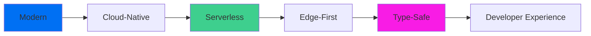

# 🛠️ Stack Tehnologic - primariaTa❤️\_

**Versiune**: 1.0
**Data actualizare**: 30 octombrie 2025 (An universitar 2025-2026)
**Status**: Documentație oficială

---

## 📋 Cuprins

1. [Prezentare Generală](#prezentare-generală)
2. [Frontend Stack](#frontend-stack)
3. [Backend Stack](#backend-stack)
4. [Database & Storage](#database--storage)
5. [Authentication & Security](#authentication--security)
6. [UI & Design System](#ui--design-system)
7. [State Management](#state-management)
8. [Testing & Quality](#testing--quality)
9. [DevOps & Infrastructure](#devops--infrastructure)
10. [Monitoring & Logging](#monitoring--logging)

---

## 🎯 Prezentare Generală

**primariaTa❤️\_** folosește un stack tehnologic modern, cloud-native și scalabil, optimizat pentru aplicații web performante și sigure.

### Filosofie Tehnică



**Principii de Selecție**:

- ✅ **Production-Ready**: Tehnologii mature și stabile
- ✅ **Type-Safety**: TypeScript end-to-end pentru reducerea bug-urilor
- ✅ **Developer Experience**: Tooling excelent și documentație comprehensivă
- ✅ **Performance**: Edge-first deployment și optimizări automate
- ✅ **Scalabilitate**: Serverless pentru scaling automat
- ✅ **Cost-Efficiency**: Pay-per-use fără costuri fixe mari

---

## 🎨 Frontend Stack

### Core Framework

**Next.js 15.5.6** - React Meta-Framework

- **App Router**: Noul routing system cu Server Components
- **React 19.1.0**: Ultimele features (Server Components, Actions, Suspense)
- **TypeScript 5.x**: Type-safety și IntelliSense complet

**Motivație Alegere**:

- ✅ SSR (Server-Side Rendering) pentru SEO și performance
- ✅ ISR (Incremental Static Regeneration) pentru pagini statice cu date dinamice
- ✅ Edge Runtime support pentru latență minimă
- ✅ Built-in optimizări: Image, Font, Script optimization
- ✅ File-based routing și convention-over-configuration

**Versiuni și Compatibilitate**:

```json
{
  "next": "15.5.6",
  "react": "19.1.0",
  "react-dom": "19.1.0",
  "typescript": "^5.0.0"
}
```

### Build & Development Tools

**Turbopack** (built-in Next.js 15)

- Rust-based bundler pentru build 10x mai rapid decât Webpack
- Hot Module Replacement (HMR) instant
- Optimizări automate pentru production

**ESLint & Prettier**

- Code quality și formatting automat
- Custom rules pentru best practices Next.js

---

## ⚙️ Backend Stack

### API Layer

**Next.js API Routes** (Serverless Functions)

- Route handlers în `/app/api/`
- Edge Runtime pentru API-uri simple (latență <50ms)
- Node.js Runtime pentru API-uri complexe

**Supabase Backend-as-a-Service**

- PostgreSQL database management
- Authentication services
- Storage management
- Real-time subscriptions
- Edge Functions (Deno runtime)

**Motivație**:

- ✅ Zero infrastructure management
- ✅ Auto-scaling la nivel de funcție
- ✅ Pay-per-request pricing model
- ✅ Type-safe API contracts cu TypeScript
- ✅ Built-in middleware support

**Example API Route**:

```typescript
// app/api/cereri/route.ts
import { createServerClient } from "@/lib/supabase/server";
import { NextRequest, NextResponse } from "next/server";

export async function GET(request: NextRequest) {
  const supabase = await createServerClient();

  const { data, error } = await supabase
    .from("cereri")
    .select("*")
    .order("created_at", { ascending: false });

  if (error) {
    return NextResponse.json({ error: error.message }, { status: 500 });
  }

  return NextResponse.json({ data });
}
```

---

## 🗄️ Database & Storage

### Primary Database

**PostgreSQL 15** (Supabase Cloud)

- **Location**: Frankfurt, Germany (EU region pentru GDPR compliance)
- **Features**:
  - Row Level Security (RLS) pentru multi-tenancy
  - JSONB support pentru date semi-structurate
  - Full-text search nativ
  - PostGIS pentru geo-queries (viitor)

**Schema Management**:

- Migration-based workflow cu Supabase CLI
- Version control pentru schema changes
- Automated backups daily

**Current Schema**:

- 13 tables (utilizatori, primarii, cereri, documente, audit_logs, etc.)
- 8 migrations applied
- RLS policies pe toate tabelele multi-tenant

### File Storage

**Supabase Storage**

- S3-compatible object storage
- RLS pentru access control
- CDN pentru serving rapid
- Image transformation API

**Buckets**:

```yaml
documente:
  public: false
  file_size_limit: 10MB
  allowed_mime_types: ["application/pdf", "image/*"]

avatars:
  public: true
  file_size_limit: 2MB
  allowed_mime_types: ["image/jpeg", "image/png", "image/webp"]
```

---

## 🛡️ Authentication & Security

### Authentication

**Supabase Auth**

- Email + Password authentication
- Google OAuth 2.0 (Gmail sign-in)
- JWT-based sessions (access + refresh tokens)
- Magic link support (viitor)

**Session Management**:

- Access token: 1 hour expiry
- Refresh token: 7 days expiry
- Automatic token refresh în background
- Secure httpOnly cookies

### Security Stack

**Cloudflare** (Edge Layer)

- WAF (Web Application Firewall)
- DDoS protection
- Rate limiting
- Bot protection

**Application Layer**:

- CSRF protection (SameSite cookies)
- XSS prevention (React auto-escaping + CSP)
- SQL Injection prevention (Supabase parameterized queries)
- Input validation (Zod schemas)

---

## 🎨 UI & Design System

### Styling Framework

**Tailwind CSS 4.x**

- Utility-first CSS framework
- JIT (Just-in-Time) compiler pentru build size redus
- Custom design tokens pentru brand consistency

**shadcn/ui + Radix UI**

- Unstyled accessible components (Radix UI primitives)
- Pre-styled cu Tailwind (shadcn/ui)
- Copy-paste components (nu npm dependency)

**Motivație**:

- ✅ Accessibility built-in (WCAG 2.1 AA)
- ✅ Keyboard navigation support
- ✅ Focus management automat
- ✅ Customizable fără să break accessibility

**Component Example**:

```tsx
import { Button } from "@/components/ui/button";
import { Dialog, DialogContent, DialogTrigger } from "@/components/ui/dialog";

export function MyComponent() {
  return (
    <Dialog>
      <DialogTrigger asChild>
        <Button variant="outline">Deschide Dialog</Button>
      </DialogTrigger>
      <DialogContent>
        <p>Content accesibil, keyboard navigable</p>
      </DialogContent>
    </Dialog>
  );
}
```

### Animation Library

**Framer Motion 12.23.24**

- Declarative animations pentru React
- Gesture support (drag, tap, hover)
- Layout animations automate
- Performance optimizat (60fps)

**Three.js + React Three Fiber**

- WebGL animations pentru landing page
- Globe visualization cu 13,851 localități
- GPU-accelerated rendering

---

## 🔄 State Management

### Client State

**Zustand** (lightweight state management)

- Minimalist API (<1KB gzipped)
- No boilerplate ca Redux
- TypeScript-first design

**Usage Example**:

```typescript
// stores/user-store.ts
import { create } from "zustand";

interface UserStore {
  user: User | null;
  setUser: (user: User) => void;
}

export const useUserStore = create<UserStore>((set) => ({
  user: null,
  setUser: (user) => set({ user }),
}));
```

### Server State

**TanStack Query (React Query) v5.90.5**

- Server state management și caching
- Automatic background refetching
- Optimistic updates support
- Infinite queries pentru pagination

**Benefits**:

- ✅ Reduce API calls (intelligent caching)
- ✅ Background refetch pentru data freshness
- ✅ Loading/error states built-in
- ✅ Devtools pentru debugging

**Usage Example**:

```typescript
import { useQuery } from '@tanstack/react-query';

export function CereriList() {
  const { data, isLoading, error } = useQuery({
    queryKey: ['cereri'],
    queryFn: async () => {
      const res = await fetch('/api/cereri');
      return res.json();
    },
    refetchInterval: 30_000, // Refetch every 30s
  });

  if (isLoading) return <Skeleton />;
  if (error) return <Error />;

  return <List data={data} />;
}
```

---

## ✅ Testing & Quality

### Testing Stack

**Unit & Integration Tests**:

- **Jest** - Test runner și assertions
- **React Testing Library** - Component testing (user-centric)
- **Testing Library User Event** - Simulate user interactions

**End-to-End Tests**:

- **Playwright** - E2E testing cross-browser
- **@playwright/test** - Test runner cu retry logic

**Visual Regression** (viitor):

- Playwright Screenshots
- Chromatic (Storybook integration)

### Code Quality Tools

**Static Analysis**:

```yaml
tools:
  eslint: "Code quality și best practices"
  prettier: "Code formatting automat"
  typescript: "Type checking și IntelliSense"
  husky: "Git hooks pentru pre-commit checks"
  lint-staged: "Run linters doar pe staged files"
```

**CI Quality Gates**:

- Type checking (tsc --noEmit)
- Linting (eslint)
- Unit tests (jest)
- Build verification (next build)

---

## 🚀 DevOps & Infrastructure

### Hosting & Deployment

**Vercel** (Production & Preview)

- **Production**: https://primariata.work
- **Staging**: Preview deployments pe fiecare PR
- Auto-deploy pe push la `main`

**Vercel Features**:

- ✅ Edge Network global (300+ locations)
- ✅ Automatic HTTPS și SSL certificates
- ✅ DDoS protection built-in
- ✅ Image optimization API
- ✅ Analytics și Web Vitals monitoring

### CI/CD Pipeline

**GitHub Actions**

```yaml
workflow:
  trigger: Push to main or PR
  steps:
    - Install dependencies (pnpm)
    - Type check (tsc)
    - Lint (eslint)
    - Run tests (jest)
    - Build (next build)
    - Deploy to Vercel
```

**Deployment Environments**:

```yaml
production:
  url: https://primariata.work
  branch: main
  auto_deploy: true

staging:
  url: https://primariata-staging.vercel.app
  branch: develop
  auto_deploy: true

preview:
  url: https://primariata-pr-{number}.vercel.app
  branch: feature/*
  auto_deploy: true (per PR)
```

### Infrastructure as Code

**Supabase Migrations**:

```bash
# Create migration
supabase migration new add_audit_logs

# Apply migrations
supabase db push

# View migration history
supabase migration list
```

---

## 📊 Monitoring & Logging

### Error Tracking: Sentry

#### Status: ✅ IMPLEMENTAT

**Versiune**: @sentry/nextjs@10.21.0

**Capabilities**:

- ✅ Real-time error tracking cu stack traces complete
- ✅ Performance monitoring (Web Vitals: LCP, FID, CLS)
- ✅ Release tracking și source maps pentru debugging
- ✅ User context (email, ID, primarie_id) pentru error correlation
- ✅ Breadcrumbs pentru error reproduction
- ✅ Alerting via email/Slack pentru erori critice

**Configuration Files**:

```yaml
files:
  - sentry.server.config.ts # Server-side tracking
  - sentry.edge.config.ts # Edge runtime tracking
  - app/global-error.tsx # Global error boundary
  - components/error-boundary.tsx # Component-level boundaries
```

**Sentry Configuration**:

```typescript
// sentry.server.config.ts
Sentry.init({
  dsn: process.env.NEXT_PUBLIC_SENTRY_DSN,
  environment: process.env.NODE_ENV,
  tracesSampleRate: 1, // 100% în development, 10% în production

  // Filter sensitive data
  beforeSend(event) {
    if (process.env.NODE_ENV === "development") {
      return null; // Nu trimite în development
    }
    return event;
  },

  // Ignore common infrastructure errors
  ignoreErrors: ["ENOENT", "ENOTFOUND", "Connection terminated unexpectedly"],
});
```

**Usage în Cod**:

```typescript
// Automatic tracking via error boundaries
try {
  await riskyOperation();
} catch (error) {
  Sentry.captureException(error, {
    tags: { module: "cereri", action: "create" },
    user: { id: user.id, email: user.email },
    extra: { cerereData: sanitizedData },
  });
  throw error;
}
```

**Sentry Dashboard**:

- **Error Tracking**: Issues, stack traces, affected users
- **Performance**: Transaction times, slow queries, API latency
- **Releases**: Track deployments și error trends per release
- **Alerts**: Email/Slack notifications pentru error spikes

**Testing**: Endpoint `/test-sentry` pentru verificare integrare

---

### Performance Monitoring: Vercel Analytics

#### Status: ✅ IMPLEMENTAT

**Features**:

- Real User Monitoring (RUM)
- Core Web Vitals tracking (LCP, FID, CLS, TTFB)
- Page load times per route
- Visitor analytics (traffic, geography)

**Dashboard Metrics**:

```yaml
core_web_vitals:
  LCP: < 2.5s (Good)
  FID: < 100ms (Good)
  CLS: < 0.1 (Good)

performance:
  Time to First Byte (TTFB): < 600ms
  First Contentful Paint (FCP): < 1.8s
  Total Blocking Time (TBT): < 200ms
```

---

### Application Logging (Planned)

#### Status: 🟡 RECOMANDAT (M3 - Noiembrie 2025)

**Motivație**:

- Complementează Sentry (erori) cu application-level events
- Essential pentru debugging production issues
- Security forensics și compliance audit trail

**Recommended Stack**: Pino + Axiom

**Implementation Plan**:

```typescript
// lib/logger.ts (viitor)
import pino from "pino";

export const logger = pino({
  level: process.env.LOG_LEVEL || "info",
  transport: {
    target: "@axiomhq/pino",
    options: {
      dataset: process.env.AXIOM_DATASET,
      token: process.env.AXIOM_TOKEN,
    },
  },
});

// Usage
logger.info({ userId, action: "login" }, "User logged in");
logger.warn({ cerereId, reason: "missing_doc" }, "Validation failed");
logger.error({ error, stack }, "Database query failed");
```

**Log Aggregation Services** (opțiuni):

- **Axiom** - Modern, affordable, fast search
- **Datadog** - Enterprise-grade, comprehensive
- **LogDNA** - Simple, good pricing
- **Betterstack** - Excellent UX, fast setup

**Use Cases**:

- ✅ Debugging production issues fără deploy
- ✅ Performance monitoring (slow queries)
- ✅ User behavior analytics
- ✅ Security forensics (suspicious patterns)

---

### Audit Logs (Planned)

#### Status: 🟡 PLANIFICAT (M4 - Mid-noiembrie 2025)

**Purpose**: GDPR compliance și security forensics

**Database Schema**:

```sql
CREATE TABLE audit_logs (
    id UUID PRIMARY KEY,
    user_id UUID REFERENCES utilizatori(id),
    primarie_id UUID REFERENCES primarii(id),
    action VARCHAR(50) NOT NULL,      -- CREATE, READ, UPDATE, DELETE
    resource_type VARCHAR(50) NOT NULL, -- cerere, document, user
    resource_id UUID,
    ip_address INET,
    user_agent TEXT,
    details JSONB,
    created_at TIMESTAMP DEFAULT NOW()
);
```

**Automatic Audit via Triggers**:

```sql
-- Database trigger pentru audit automat
CREATE TRIGGER audit_cereri
AFTER INSERT OR UPDATE OR DELETE ON cereri
FOR EACH ROW EXECUTE FUNCTION audit_trigger();
```

**Retention Policy**:

- 1 year retention (GDPR minimum)
- Archive after 6 months (cold storage)
- Automatic purge after 1 year

**Use Cases**:

- ✅ Compliance audits (GDPR Art. 30)
- ✅ Security investigations
- ✅ Dispute resolution
- ✅ Performance analysis

---

## 📦 Dependency Management

### Package Manager

**pnpm 9.x**

- Faster than npm/yarn (30-50% speed improvement)
- Disk space efficient (symlink-based storage)
- Strict dependency resolution

**Key Dependencies**:

```json
{
  "dependencies": {
    "next": "15.5.6",
    "react": "19.1.0",
    "@supabase/supabase-js": "^2.75.1",
    "@tanstack/react-query": "^5.90.5",
    "framer-motion": "^12.23.24",
    "react-hook-form": "^7.65.0",
    "zod": "^4.1.12",
    "@sentry/nextjs": "^10.21.0",
    "zustand": "^5.0.0"
  },
  "devDependencies": {
    "typescript": "^5.0.0",
    "@playwright/test": "^1.50.0",
    "jest": "^29.7.0",
    "@testing-library/react": "^16.0.0"
  }
}
```

**Update Strategy**:

- Minor updates: Weekly (automated Dependabot)
- Major updates: Monthly (manual review)
- Security patches: Immediate

---

## 🎓 Developer Tools

### Recommended VS Code Extensions

```json
{
  "recommendations": [
    "dbaeumer.vscode-eslint",
    "esbenp.prettier-vscode",
    "bradlc.vscode-tailwindcss",
    "ms-playwright.playwright",
    "supabase.supabase-vscode",
    "unifiedjs.vscode-mdx",
    "usernamehw.errorlens"
  ]
}
```

### CLI Tools

```bash
# Package manager
pnpm --version

# Database migrations
supabase --version

# GitHub operations
gh --version

# Deployment
vercel --version

# TypeScript execution
tsx --version
```

---

## 📊 Performance Benchmarks

### Current Metrics (October 2025)

**Lighthouse Scores**:

```yaml
performance: 95/100
accessibility: 100/100
best_practices: 100/100
seo: 100/100
```

**Core Web Vitals**:

```yaml
LCP: 1.2s (Good) # Target: < 2.5s
FID: 45ms (Good) # Target: < 100ms
CLS: 0.05 (Good) # Target: < 0.1
```

**Bundle Sizes**:

```yaml
First Load JS:
  - Landing: 85 KB
  - Dashboard: 120 KB
  - Admin: 145 KB

Images: Optimized via Vercel Image API (WebP, lazy-loading)
Fonts: Self-hosted pentru GDPR compliance
```

---

## 🔗 Referințe Externe

### Documentație Oficială

- **Next.js**: https://nextjs.org/docs
- **React**: https://react.dev
- **Supabase**: https://supabase.com/docs
- **Tailwind CSS**: https://tailwindcss.com/docs
- **Playwright**: https://playwright.dev
- **Sentry**: https://docs.sentry.io/platforms/javascript/guides/nextjs/
- **Vercel**: https://vercel.com/docs

### Ghiduri Interne

- `.docs/02-technical-specs/` - Specificații tehnice detaliate (EN)
- `ARCHITECTURE.md` - Arhitectură aplicație (EN)
- `GETTING_STARTED.md` - Setup rapid dezvoltare (EN/RO)
- `CONTRIBUTING.md` - Ghid contribuții (EN)

---

## 📈 Technology Roadmap

### Short-Term (Q4 2025)

- [ ] Structured logging cu Pino + Axiom (M3)
- [ ] Audit logs implementation (M4)
- [ ] Playwright E2E test suite completion (M5)
- [ ] Performance optimization (M5)

### Mid-Term (Q1 2026)

- [ ] Real-time notifications (Supabase Realtime)
- [ ] Advanced analytics dashboard
- [ ] Mobile app (React Native sau Progressive Web App)
- [ ] Multi-language support (i18n)

### Long-Term (Q2 2026+)

- [ ] AI-powered document processing
- [ ] Integration cu GPeC (Ghișeul.ro)
- [ ] Integration cu certSIGN pentru semnătură digitală
- [ ] Advanced workflow automation

---

**Versiune**: 1.0.0
**Ultima actualizare**: 30 octombrie 2025
**Autor**: Echipa Tehnică primariaTa❤️\_

**Navigare**: [← README](README.md) | [Arhitectura →](../03-Arhitectura/README.md) | [📚 Index Documentație](../README.md)
