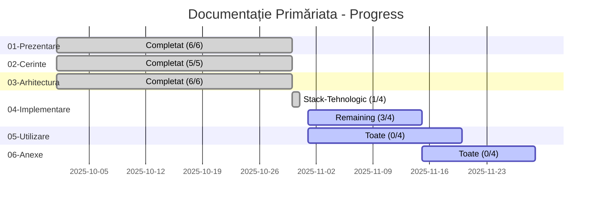

# 📚 Documentație Oficială - primariaTa❤️\_

**Platformă SaaS white-label pentru digitalizarea completă a primăriilor din România**

[🚀 Demo Live](https://primariata.work) • [📖 Prezentare](./01-Prezentare/) • [🏗️ Arhitectură](./03-Arhitectura/) • [💻 Implementare](./04-Implementare/)

---

## 🎯 Despre Proiect

**primariaTa❤️\_** transformă modul în care cetățenii interacționează cu primăriile locale prin digitalizarea completă a proceselor administrative.

### Caracteristici Principale

<table>
<tr>
<td width="50%">

**🌐 Platform White-Label**

- Adaptabilă pentru orice primărie
- Branding personalizabil
- Multi-tenant architecture

**☁️ 100% Cloud-Native**

- Zero infrastructură locală
- Auto-scaling serverless
- Edge deployment global

</td>
<td width="50%">

**🔒 Securitate Maximă**

- GDPR compliance
- Multi-factor authentication
- Row Level Security (RLS)

**📱 Experiență Modernă**

- UI intuitivă și accesibilă
- Responsive design
- Suport 24/7

</td>
</tr>
</table>

---

## 📂 Navigare Documentație

### 🗂️ Structură Completă

<table>
<tr>
<td width="33%" valign="top">

### 📄 [01-Prezentare](./01-Prezentare/)

Viziunea și contextul proiectului

- **[📖 Overview](./01-Prezentare/)** - Introducere generală
- **[🎯 Viziune & Misiune](./01-Prezentare/Viziune-si-Misiune.md)** - Ce ne propunem
- **[🎪 Obiective](./01-Prezentare/Obiective-si-Scopuri.md)** - Ținte măsurabile
- **[🌍 Context](./01-Prezentare/Contextul-Proiectului.md)** - De ce acest proiect
- **[👥 Echipa](./01-Prezentare/Echipa-si-Roluri.md)** - Cine suntem
- **[📊 Status](./01-Prezentare/Status-Proiect.md)** - Progres actual

**Status**: ✅ 100% Complet (6/6 documente)

</td>
<td width="33%" valign="top">

### 📋 [02-Cerinte](./02-Cerinte/)

Specificații funcționale și tehnice

- **[📖 Overview](./02-Cerinte/)** - Introducere cerințe
- **[⚙️ Funcționale](./02-Cerinte/Cerinte-Functionale.md)** - Ce face platforma
- **[🔧 Nefuncționale](./02-Cerinte/Cerinte-Nefunctionale.md)** - Performance, securitate
- **[📝 Cazuri Utilizare](./02-Cerinte/Cazuri-de-Utilizare.md)** - Scenarii detaliate
- **[👤 User Stories](./02-Cerinte/User-Stories.md)** - Perspective utilizatori

**Status**: ✅ 100% Complet (5/5 documente)

</td>
<td width="33%" valign="top">

### 🏗️ [03-Arhitectura](./03-Arhitectura/)

Design sistem și infrastructură

- **[📖 Overview](./03-Arhitectura/)** - Introducere arhitectură
- **[🏛️ Generală](./03-Arhitectura/Arhitectura-Generala.md)** - Design overview
- **[🗄️ Bază de Date](./03-Arhitectura/Baza-de-Date.md)** - Schema PostgreSQL
- **[🔌 API & Backend](./03-Arhitectura/API-si-Backend.md)** - Endpoints, routes
- **[🎨 Frontend](./03-Arhitectura/Componente-Frontend.md)** - UI components
- **[🔒 Securitate](./03-Arhitectura/Securitate.md)** - Security, Sentry, audit

**Status**: ✅ 100% Complet (6/6 documente)

</td>
</tr>
<tr>
<td width="33%" valign="top">

### 💻 [04-Implementare](./04-Implementare/)

Stack tehnologic și development

- **[📖 Overview](./04-Implementare/)** - Introducere implementare
- **[🛠️ Stack Tehnologic](./04-Implementare/Stack-Tehnologic.md)** - Next.js, React, Supabase
- **[📊 Research Analysis](./04-Implementare/Research-Analysis.md)** - ✅ AI Dashboard (M7)
- **[👥 User Dashboards](./04-Implementare/)** - 🔄 În lucru (M8 ~50%)
- **[🏛️ Admin Dashboards](./04-Implementare/)** - 🔄 În lucru (M9 ~10%)
- **[⚙️ Setup Development](./04-Implementare/)** - ⏳ În lucru (M6)
- **[🔄 Workflow](./04-Implementare/)** - ⏳ În lucru (M6)
- **[🧪 Testare](./04-Implementare/)** - ⏳ În lucru (M6)

**Status**: 🟡 40% (2/5 documente)
**Deadline M6**: 29 noiembrie 2025

</td>
<td width="33%" valign="top">

### 📖 [05-Utilizare](./05-Utilizare/)

Ghiduri pentru utilizatori

- **[📖 Overview](./05-Utilizare/)** - Introducere utilizare
- **[📊 Research Dashboard](./05-Utilizare/Research-Dashboard.md)** - ✅ Ghid AI Analysis (M7)
- **[👤 Ghid Cetățean](./05-Utilizare/)** - ⏳ Planificat (M8)
- **[👔 Ghid Funcționar](./05-Utilizare/)** - ⏳ Planificat (M9)
- **[🏛️ Ghid Admin Primărie](./05-Utilizare/)** - ⏳ Planificat (M9)
- **[🌍 Ghid Super-Admin](./05-Utilizare/)** - ⏳ Planificat (M9)
- **[❓ FAQ](./05-Utilizare/)** - ⏳ În lucru (M6)

**Status**: 🟡 20% (1/5 documente)
**Deadline M6**: 29 noiembrie 2025

</td>
<td width="33%" valign="top">

### 📎 [06-Anexe](./06-Anexe/)

Materiale suplimentare

- **[📖 Overview](./06-Anexe/)** - Introducere anexe
- **[📚 Glossar](./06-Anexe/)** - ⏳ În lucru (M6)
- **[🔗 Referințe](./06-Anexe/)** - ⏳ În lucru (M6)
- **[👥 Contributori](./06-Anexe/)** - ⏳ În lucru (M6)
- **[⚖️ Licență](./06-Anexe/)** - ⏳ În lucru (M6)

**Status**: 🔴 0% (0/4 documente)
**Deadline M6**: 29 noiembrie 2025

</td>
</tr>
</table>

---

## 📊 Status Documentare

### Progress General: 20/27 documente (74%)

| Categorie           | Completare | Status         | Files     | Deadline        |
| ------------------- | ---------- | -------------- | --------- | --------------- |
| **01-Prezentare**   | 100%       | ✅ COMPLETE    | 6/6       | ✅ Done         |
| **02-Cerinte**      | 100%       | ✅ COMPLETE    | 5/5       | ✅ Done         |
| **03-Arhitectura**  | 100%       | ✅ COMPLETE    | 6/6       | ✅ Done         |
| **04-Implementare** | 40%        | 🟡 PARȚIAL     | 2/5       | 29 Nov 2025     |
| **05-Utilizare**    | 20%        | 🟡 PARȚIAL     | 1/5       | 29 Nov 2025     |
| **06-Anexe**        | 0%         | 🔴 TODO        | 0/4       | 29 Nov 2025     |
| **TOTAL**           | **74%**    | 🟡 IN PROGRESS | **20/27** | **29 Nov 2025** |

---

## 🎓 Pentru Profesori și Comisie Evaluare

### 📖 Parcurs Recomandat de Lectură

<table>
<tr>
<td width="33%" align="center">

### 🚀 Start Rapid (15 min)

**1. Viziune Generală**

- [Viziune & Misiune](./01-Prezentare/Viziune-si-Misiune.md) (3 min)
- [Obiective](./01-Prezentare/Obiective-si-Scopuri.md) (3 min)
- [Status Proiect](./01-Prezentare/Status-Proiect.md) (3 min)

**2. Demo Live**

- [primariata.work](https://primariata.work) (5 min)

</td>
<td width="33%" align="center">

### 🔍 Aprofundare Tehnică (45 min)

**3. Cerințe Sistem**

- [Cerințe Funcționale](./02-Cerinte/Cerinte-Functionale.md) (10 min)
- [Cazuri de Utilizare](./02-Cerinte/Cazuri-de-Utilizare.md) (10 min)

**4. Arhitectură**

- [Design General](./03-Arhitectura/Arhitectura-Generala.md) (15 min)
- [Stack Tehnologic](./04-Implementare/Stack-Tehnologic.md) (10 min)

</td>
<td width="33%" align="center">

### 🏆 Evaluare Completă (2h)

**5. Documentație Detaliată**

- [Bază de Date](./03-Arhitectura/Baza-de-Date.md) (20 min)
- [API & Backend](./03-Arhitectura/API-si-Backend.md) (20 min)
- [Securitate](./03-Arhitectura/Securitate.md) (20 min)

**6. Testing și Demo**

- Testing manual features (30 min)
- Q&A cu echipa (30 min)

</td>
</tr>
</table>

---

## 🎯 Context Academic

<table>
<tr>
<td width="50%">

### 🏫 Universitatea Română-Americană

**Facultate**: Informatică Managerială
**Curs**: Programarea Aplicațiilor Web
**An universitar**: 2025-2026
**Profesor coordonator**: Andrei Luchici

**Tip proiect**: Aplicație web full-stack
**Echipă**: 2 persoane (Bubu & Dudu Dev Team)

</td>
<td width="50%">

### 👥 Echipa Dezvoltare

**Octavian Mihai** - Full-Stack Developer
📧 mihai.g.octavian24@stud.rau.ro
💼 Frontend, Backend, DevOps, UI/UX, Docs Tehnică

**Bianca-Maria Abbasi Pazeyazd** - Frontend Developer
📧 abbasipazeyazd.h.biancamaria24@stud.rau.ro
💼 Design UI/UX, Frontend, QA, Docs Oficială

</td>
</tr>
</table>

---

## 🛠️ Stack Tehnologic Highlights

<table>
<tr>
<td width="25%" align="center">

### Frontend

</td>
<td width="25%" align="center">

### Backend

</td>
<td width="25%" align="center">

### DevOps

</td>
<td width="25%" align="center">

### Testing

</td>
</tr>
</table>

**Detalii complete**: [Stack Tehnologic →](./04-Implementare/Stack-Tehnologic.md)

---

## 🔗 Link-uri Utile

### 🌐 Resources

### 📖 Documentație Complementară

- **[README.md](../README.md)** - Project overview (root)
- **[ARCHITECTURE.md](../ARCHITECTURE.md)** - Arhitectură tehnică (EN)
- **[CONTRIBUTING.md](../CONTRIBUTING.md)** - Ghid contribuții (EN)
- **[DEVELOPMENT_GUIDE.md](../DEVELOPMENT_GUIDE.md)** - Setup dezvoltare (EN)
- **[DOCUMENTATION_INDEX.md](../DOCUMENTATION_INDEX.md)** - Index complet documentație

### 🛠️ Developer Resources

- **Technical Specs**: `.docs/` (gitignored, EN) - 1.2MB, 29 files
- **API Documentation**: [API & Backend](./03-Arhitectura/API-si-Backend.md)
- **Database Schema**: [Bază de Date](./03-Arhitectura/Baza-de-Date.md)
- **Security Guidelines**: [Securitate](./03-Arhitectura/Securitate.md)

---

## 🤝 Contribuții

Documentația este în dezvoltare activă. Pentru contribuții:

1. **Raportează probleme**: [GitHub Issues](https://github.com/mihaigoctavian24/primariata.work/issues) cu tag `documentation`
2. **Sugerează îmbunătățiri**: Pull request cu modificări
3. **Contactează echipa**: Vezi secțiunea [Contact](#-contact)

**Ghid complet**: [CONTRIBUTING.md](../CONTRIBUTING.md)

---

## 📧 Contact

<table>
<tr>
<td width="50%">

### 📨 Întrebări Documentație

**Documentație Oficială (RO)**:
📧 Bianca-Maria Abbasi Pazeyazd
[abbasipazeyazd.h.biancamaria24@stud.rau.ro](mailto:abbasipazeyazd.h.biancamaria24@stud.rau.ro)

**Documentație Tehnică (EN)**:
📧 Octavian Mihai
[mihai.g.octavian24@stud.rau.ro](mailto:mihai.g.octavian24@stud.rau.ro)

</td>
<td width="50%">

### 🎓 Coordonare Academică

**Profesor Coordonator**:
📧 Andrei Luchici
[andrei.luchici@rau.ro](mailto:andrei.luchici@rau.ro)

**Universitatea Română-Americană**
Facultatea de Informatică Managerială
Programarea Aplicațiilor Web (2025-2026)

</td>
</tr>
</table>

**Subject email**: `[Primăriata] Întrebare despre documentație`

---

## 📜 Licență și Copyright

**Copyright**: © 2025-2026 Bubu & Dudu Dev Team
**Licență Cod**: MIT License

**Detalii complete**: [Licență →](./06-Anexe/) (disponibil în M6)

---

### 🌟 Mulțumim pentru interes!

**primariaTa❤️\_** - Digitalizăm România, o primărie odată

---

**Versiune documentație**: 1.0 (72% completă)
**Ultima actualizare**: 30 octombrie 2025
**Următoarea actualizare**: M6 Documentation (29 noiembrie 2025)

---

`Made with ❤️ by Bubu & Dudu Dev Team`

[⬆️ Înapoi sus](#-documentație-oficială---primariata️_)

